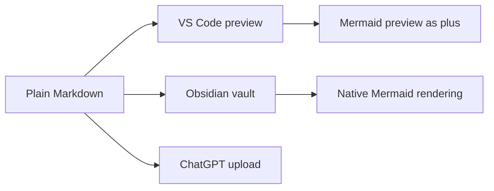

# Docs governance, audience en visual language

## Doel

Deze laag maakt expliciet voor wie een document bedoeld is, hoe het gelezen
moet worden en wanneer visuele verrijking waarde toevoegt.

```text
╔══════════════════════════════════════════════════════════════════╗
║ BUDIO DOCS TERMINAL                                             ║
╠══════════════════════════════════════════════════════════════════╣
║ MODE        docs-governance                                     ║
║ RULE        serious first, nerdy enough                         ║
║ RENDER      plain Markdown baseline, richer in Obsidian/VS Code ║
║ BOUNDARY    no IP-copy, no gimmick overload                     ║
╚══════════════════════════════════════════════════════════════════╝
```

## Metadata-contract

Nieuwe of actieve handmatige docs krijgen frontmatter wanneer ze onderdeel zijn
van projectwaarheid, planning, research, ideas, setup of workflow.

Vaste velden:

| Veld | Waarden | Betekenis |
| --- | --- | --- |
| `title` | vrije titel | Menselijke titel voor vault, bundler en uploadcontext. |
| `audience` | `human`, `agent`, `both` | Primaire lezer: gebruiker/founder, agent/AI, of allebei. |
| `doc_type` | vrije korte categorie | Bijvoorbeeld `hub`, `strategy`, `planning`, `research`, `workflow`, `setup`. |
| `source_role` | `canonical`, `operational`, `reference`, `generated`, `archive` | Waarheidsrol van het document. |
| `visual_profile` | `plain`, `budio-terminal`, `diagram-first` | Hoe rijk de Markdown visueel mag zijn. |
| `upload_bundle` | uploadbestandsnaam of `none` | In welke generated uploadcontext het document terecht hoort. |

## Audience-regels

- `human`: uitleg, strategie, planning, roadmap, ideeën en besliscontext voor mensen.
- `agent`: uitvoeringsregels, skills, checklists en technische workflow voor agents.
- `both`: docs die mensen en agents allebei nodig hebben als gedeelde waarheid.

Regel: als een document vooral een agent moet sturen, voeg geen extra sfeerlaag
toe. Als een document een mens moet meenemen in strategie of planning, mag het
wel visueel meer karakter krijgen.

## Budio Terminal visual profile

De Budio Terminal-stijl is een interne docs-smaaklaag, geen productdesignsystem.
Hij is geinspireerd door retro terminals en mission-control interfaces, maar
kopieert geen bestaande serie, game of IP.

Gebruik:

- terminalpanelen met `text` codeblocks voor status, sequencing en prioriteit
- Mermaid-diagrammen voor flow, dependencies en roadmapstructuur
- compacte radar/mission-control blokken voor menselijke oriëntatie
- normale Markdown als basis, zodat lezen zonder plugin altijd werkt

Niet gebruiken:

- animatie als harde afhankelijkheid
- HTML/CSS die in ChatGPT, GitHub of Obsidian slecht degradeert
- gimmicks die de inhoud overheersen
- productcopy richting app-eindgebruikers

## Portable rendering



Baseline:

- elk document blijft leesbaar als ruwe Markdown
- Mermaid is handig voor preview, maar de omliggende tekst moet de boodschap ook dragen
- uploadbundels blijven `.md`-bestanden zonder assets of runtime-afhankelijkheden

## Folderstructuur-regel

We doen nu geen brede foldermigratie. Metadata en bundling lossen de verwarring
goedkoper en veiliger op.

Een mogelijke folderherziening krijgt pas vervolg na bewijs uit deze fase.
Daarvoor bestaat de blocked task:
`docs/project/25-tasks/open/docs-folderstructuur-en-visual-language-herbeoordeling-na-metadatafase.md`.
