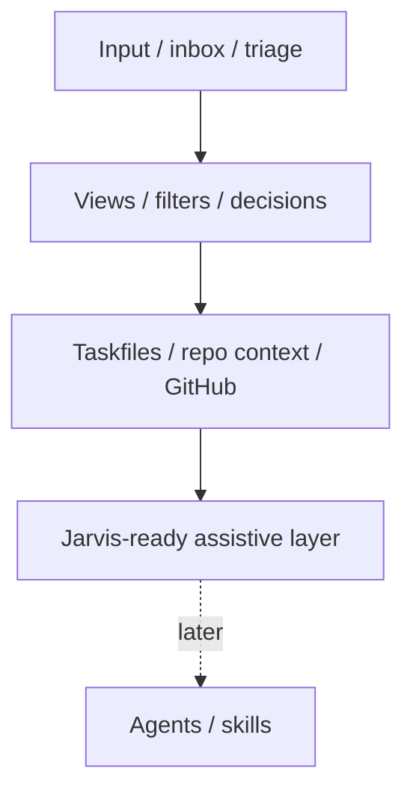

# Linear-geinspireerde Budio Workspace structuurlaag

## Status

candidate

## Type

platform-architecture

## Horizon

next

## Korte samenvatting

Gebruik Linear als referentiemodel voor een rustige, keyboard-first en context-first structuurlaag in Budio Workspace: eerst intake, triage, custom views, preview en integratieritme; pas daarna een bredere Jarvis-laag.

```text
╔════════════════════════════════════════════════════════════╗
║ BUDIO WORKSPACE STRUCTURE LAYER                           ║
╠════════════════════════════════════════════════════════════╣
║ LEARN FROM   Linear clarity, speed, views, triage         ║
║ COPY         principles, not product surface              ║
║ BUILD FIRST  structure before agents                      ║
║ HOLD BACK    enterprise breadth, cycles, agent-first ops  ║
╚════════════════════════════════════════════════════════════╝
```



## Probleem

Budio Workspace groeit nu vanuit meerdere goede richtingen tegelijk:

- taskflow en board/list uitvoering
- plugin-polish en dagelijkse focus
- strategische decision-board ideeën
- runtime bridge- en modular-workspace ideeën
- Jarvis als latere internal-only assistive laag

Maar er ontbreekt nog één samenhangend idee dat uitlegt welke werkstructuur onder dit alles moet liggen. Zonder die structuur blijft de kans bestaan dat we losse features bouwen zonder sterke intake, duidelijke views, stabiele routing of elegante dagelijkse workflow.

## Waarom interessant

Linear is relevant als referentie omdat het niet alleen een issue tracker is, maar een sterk samenhangend werksysteem rond:

- context
- intake
- routing
- views
- keyboard-first interactie
- rustige, elegante informatiepresentatie

Dat sluit aan op wat Budio Workspace nu nodig heeft: niet eerst meer agentische complexiteit, maar eerst een betere structuurlaag waarop Jarvis later veilig en nuttig kan landen.

## Korte beoordeling van Linear als referentie

Linear is sterk als referentie voor Budio Workspace, niet omdat we “zoals Linear” moeten worden, maar omdat het product laat zien hoe veel workflowkracht uit een kleine set coherente patronen kan komen.

Sterke punten voor onze context:

1. **Context-first boven losse taken**
   - In `linear.app/next` positioneert Linear zich als systeem dat context omzet in execution: feedback, plannen, specs, beslissingen en code vormen samen de werklaag.
   - Dat lijkt sterk op de richting die wij voor Budio Workspace zoeken: niet alleen taakbeheer, maar een omgeving waar docs, keuzes, taken en later agents op dezelfde contextlaag landen.

2. **Minder overhead, meer ritme**
   - De kernboodschap uit hun Start Guide en `next`-verhaal is dat teams zonder veel overhead moeten kunnen plannen, volgen en leveren.
   - Dat sluit goed aan op onze cheap-first en rustiger workflowfilosofie.

3. **Uitstekende informatie-architectuur**
   - Custom views, triage, peek, display options, filters, search en view-favorieten zijn geen losse features maar één werkmodel.
   - Daardoor voelt Linear snel, consistent en intuïtief.

4. **Elegant en ingetogen UX**
   - Linear’s look and feel is simpel, rustig en compact.
   - Dat is relevant voor Budio Workspace, waar we een founder- en bouwomgeving willen die licht, snel en niet-dashboarderig aanvoelt.

## Wat Budio Workspace concreet kan leren en kopieren

### 1. Context-first in plaats van alleen task-tracking

Linear’s `next`-richting laat zien dat het werk niet moet starten bij een kaartje, maar bij context die kan worden omgezet in uitvoering.

Voor Budio Workspace betekent dat:

- taskfiles blijven belangrijk, maar niet als enige werklaag
- ideeën, beslissingen, docs, research en execution moeten als samenhangende context vindbaar zijn
- de plugin moet helpen om context te **lezen, routeren en verankeren**, niet alleen taken te verplaatsen

### 2. Een echte inbox/triage-laag voor nieuwe input

Linear gebruikt Triage als aparte inbox voor werk dat nog niet in de normale flow hoort. Volgens hun docs kan Triage issues reviewen, routeren, prioriteren en via regels automatisch verrijken of doorzetten.

Voor Budio Workspace is dat direct toepasbaar als interne intake-laag voor:

- nieuwe user requests
- losse ideeën
- research-input
- follow-ups uit reviews of tests
- integratie-events uit GitHub of Slack

Goedkope vertaling:

- eerst een expliciete `inbox/triage`-view in de plugin
- daarna simpele routing naar task, idea, review of later
- nog geen zware enterprise-rules-engine

### 3. Duurzame custom views als primaire werkvorm

Linear’s Custom Views-docs laten zien dat duurzame filtered views een centrale workflowlaag zijn: save, share, favorite, team-level of workspace-level.

Voor Budio Workspace is dit waarschijnlijk belangrijker dan nog meer board-logica.

Wat we kunnen overnemen:

- saved views als eerste-klas object in de plugin
- views voor `Mijn focus`, `Review`, `Ideeën`, `Blocked`, `Recent veranderd`, `Jarvis later`
- persoonlijke defaults bovenop gedeelde workspace-defaults
- favoriete views in de linker rail

Dit sluit goed aan op ons bestaande board/list-spoor, maar maakt het systeem veel minder afhankelijk van één vaste weergave.

### 4. Peek/preview zonder context-switch

Linear’s Peek maakt het mogelijk om details te zien zonder de lijstcontext te verliezen. Dat is een klein patroon met grote workflowwaarde.

Voor Budio Workspace is dit bijna ideaal:

- preview van task/idea/details zonder de huidige view te verlaten
- snelle inspectie van samenvatting, checklist, links en status
- later ook preview van gerelateerde docs of GitHub-status

Dit past beter bij onze plugin dan steeds agressiever openen/sluiten van volledige detailmodi.

### 5. Keyboard-first navigatie en snelle acties

Linear’s docs leggen veel nadruk op `/` search, open-jumps, list/board toggles, view-openers en quick navigation.

Voor Budio Workspace is dat toepasbaar als:

- snelle globale search/open
- open recent
- open saved view
- quick create task/idea
- preview toggle
- switch tussen board/list/review/intake

De winst zit niet alleen in snelheid, maar in het gevoel dat de tool intuïtief en direct werkt.

### 6. Persoonlijke voorkeuren bovenop gedeelde defaults

Linear’s display options en custom views combineren workspace-defaults met persoonlijke preferences.

Dat model past goed bij Budio Workspace:

- workspace bepaalt een logische standaardstructuur
- gebruiker kan zijn eigen focusviews, sortering of voorkeursstartscherm kiezen
- persoonlijke voorkeuren mogen niet de onderliggende gedeelde werkwaarheid vervangen

### 7. Integraties als workflowversnellers, niet als doel op zich

Linear’s Slack, GitHub en Asks flows laten zien dat integraties vooral sterk zijn wanneer ze bestaande werkstromen direct in de hoofdworkflow laten landen.

Voor Budio Workspace zijn vooral relevant:

- **GitHub**: linked PR/status/review-signalen rond bestaande taken
- **Slack**: links, notificaties en later intake van requests
- **Asks-principe**: intake uit chat/mail/form naar een triage-laag

De les is niet “zoveel mogelijk integraties bouwen”, maar:

- alleen integraties toevoegen die intake, routing of execution concreet versnellen
- integraties laten landen in één duidelijke inbox/triage/contextlaag

## Wat we bewust niet nu moeten kopieren

### 1. Geen volle enterprise-breedte

Linear ondersteunt veel teams, plannen, use cases en enterprise-oppervlak. Budio Workspace hoeft dat nu niet te evenaren.

Niet nu nodig:

- brede org-administration
- uitgebreide customer-support suite
- multi-team procescomplexiteit als uitgangspunt

### 2. Geen zware cycle- of sprintrituelen als default

Linear’s cycle-model is sterk voor teams die cadence en capacity willen structureren, maar voor Budio Workspace is dat nu te zwaar als default.

We kunnen wel leren van:

- ritme
- capacity-bewustzijn
- automatische rollover als concept

Maar we moeten niet meteen een zware sprintmachine bouwen.

### 3. Geen agent-first uitvoering voor de structuurlaag stabiel is

Linear beweegt in `linear.app/next` duidelijk richting agents, skills en automations. Voor ons is dit inspirerend, maar ook een waarschuwing:

- zonder sterke contextlaag worden agents ruis
- zonder intake- en viewstructuur wordt automation te vroeg te complex

Jarvis blijft dus toekomstspoor. De juiste volgorde voor Budio Workspace is:

1. structuur
2. intake
3. views
4. preview
5. integratieritme
6. pas daarna assistive Jarvis-lagen

## Budio-relevantie-selectie

### Wel overnemen

- context-first in plaats van losse task-tracking
- triage/inbox voor nieuwe input
- duurzame custom views
- keyboard-first navigatie en quick actions
- peek/preview zonder context-switch
- gedeelde defaults plus persoonlijke view preferences
- Slack/GitHub-koppeling als workflowversnellers
- simpele, rustige, elegante visual language

### Gedeeltelijk en gefaseerd overnemen

- projectlaag boven tasks
- review- en delivery-statussen
- intake via Slack, mail of forms voor interne founder/team workflows

### Niet nu overnemen

- volle enterprise-breedte
- zware cycle/sprint-rituelen als default
- brede customer-support suite
- agent-first uitvoering voordat de structuurlaag stabiel is

## Concrete vertaling naar Budio Workspace

### 1. Intake

De eerste laag wordt een expliciete intake/triage-omgeving voor:

- ideeën
- taken
- research-input
- reviewpunten
- integratie-signalen

Doel:

- nieuwe input komt eerst in een rustige inbox
- daarna wordt pas beslist: task, idea, review, later, of afwijzen

### 2. Organize

De tweede laag organiseert werk via:

- saved views
- filters
- persoonlijke favorieten
- workspace-default views
- review lane
- decision views
- lichte project- of thema-overzichten

Doel:

- minder context-switching
- sneller prioriteren
- beter onderscheid tussen intake, beslissen en uitvoeren

### 3. Execute

De derde laag koppelt views en intake aan echte uitvoering:

- taskfiles
- repo-context
- GitHub-status
- later Jarvis skills/agents

Doel:

- de plugin blijft een uitvoeringslaag
- maar voelt minder als los taskboard en meer als context-naar-execution systeem

## Toekomstige Workspace-concepten

Dit idee vraagt nog geen runtime-API of schemawijziging, maar maakt wel duidelijk welke concepten later waarschijnlijk nodig zijn:

- `inbox/triage`
- `saved views`
- `decision view`
- `peek/detail preview`
- `integration events`
- `Jarvis-ready context layer`

Deze termen zijn hier bewust conceptueel. Ze zijn nog geen build-contract.

## Look and feel richting voor Budio Workspace

De look and feel van Linear is relevant voor ons, vooral door wat het **niet** doet:

- weinig chrome
- geen zware dashboardmassa
- subtiele hiërarchie
- hoge informatiedichtheid zonder visuele stress
- snelle navigatie zonder agressieve UI

Voor Budio Workspace vertaalt dat zich idealiter naar:

- simpel
- elegant
- intuïtief
- keyboard-first
- preview-first
- rustige typografie
- compacte, duidelijke statushiërarchie

Belangrijke guardrail:

dit moet een **lichte structuurlaag** blijven, geen generiek productivity-dashboard.

## Waarom dit Jarvis helpt zonder Jarvis nu al te verbreden

Jarvis blijft volgens onze canonieke docs internal-only en toekomstgericht. Dat betekent niet dat we nu niets hoeven te doen.

Juist het omgekeerde:

- Jarvis heeft straks een betere contextlaag nodig
- saved views, triage, preview en integratie-events maken latere assistive flows betrouwbaarder
- een goede structuurlaag voorkomt dat Jarvis een los AI-paneel zonder workflowfundering wordt

Dus:

- **nu**: structuur
- **later**: assistive intelligence bovenop die structuur

## Relatie met huidige docs

- sluit aan op `docs/project/20-planning/50-budio-workspace-plugin-focus.md`
- ondersteunt de plugin als actieve uitvoeringslaag zonder publieke app-scope te verbreden
- versterkt `40-platform-and-architecture/20-vscode-project-copilot-plugin.md`
- verbindt `40-platform-and-architecture/30-budio-modular-intelligence-workspace.md`
- geeft een cheap-first tussenstap vóór `40-platform-and-architecture/40-vscode-plugin-with-budio-runtime-bridge.md`
- raakt inhoudelijk aan `40-platform-and-architecture/70-budio-workspace-plugin-decision-board.md`, maar is breder dan alleen beslisviews

## Bronnen

### Officiële Linear-bronnen

- `https://linear.app/next`
- `https://linear.app/docs/start-guide`
- `https://linear.app/docs/custom-views`
- `https://linear.app/docs/triage`
- `https://linear.app/docs/configuring-workflows`
- `https://linear.app/docs/search`
- `https://linear.app/docs/peek`
- `https://linear.app/docs/display-options`
- `https://linear.app/docs/projects`
- `https://linear.app/docs/use-cycles`
- `https://linear.app/docs/linear-asks`
- `https://linear.app/docs/slack`
- `https://linear.app/docs/github-integration`

### Relevante Budio-bronnen

- `docs/project/master-project.md`
- `docs/project/product-vision-mvp.md`
- `docs/project/current-status.md`
- `docs/project/open-points.md`
- `docs/dev/idea-lifecycle-workflow.md`
- `docs/project/20-planning/50-budio-workspace-plugin-focus.md`
- `docs/project/40-ideas/40-platform-and-architecture/20-vscode-project-copilot-plugin.md`
- `docs/project/40-ideas/40-platform-and-architecture/30-budio-modular-intelligence-workspace.md`
- `docs/project/40-ideas/40-platform-and-architecture/40-vscode-plugin-with-budio-runtime-bridge.md`
- `docs/project/40-ideas/40-platform-and-architecture/70-budio-workspace-plugin-decision-board.md`

## Open vragen

- Welke minimale intake-ervaring is de beste eerste stap: aparte inbox-view of intake als speciale saved view?
- Wanneer wordt een projectlaag boven tasks echt nodig, en wanneer is dat nog te vroeg?
- Welke GitHub- en Slack-signalen zijn voor Budio Workspace werkelijk de eerste 20% met de meeste waarde?
- Welke previewvorm voelt het best: side peek, hover preview, of quick-look modal?

## Gefaseerde vervolgrichting

### Phase 1 — Structuur en views

- intake onderscheiden van execution
- saved views toevoegen
- favorites/defaults/logische review views
- preview/peek-concept kiezen

### Phase 2 — Intake en integraties

- GitHub-status in views/detail
- Slack- of andere intakekanalen voor interne requests
- lichte routing van nieuwe input naar task/idea/review

### Phase 3 — Jarvis-compatible assistive layer

- assistive suggesties bovenop triage en views
- skills/agentflows pas nadat de contextlaag stabiel is
- geen autonome werklaag zonder duidelijke human review

## Volgende stap

Vertaal dit idee later naar één smalle plugin-candidate:

- ofwel `saved views + favorites + default start view`
- ofwel `inbox/triage + review routing`

Begin niet met een brede agent- of automationlaag.
