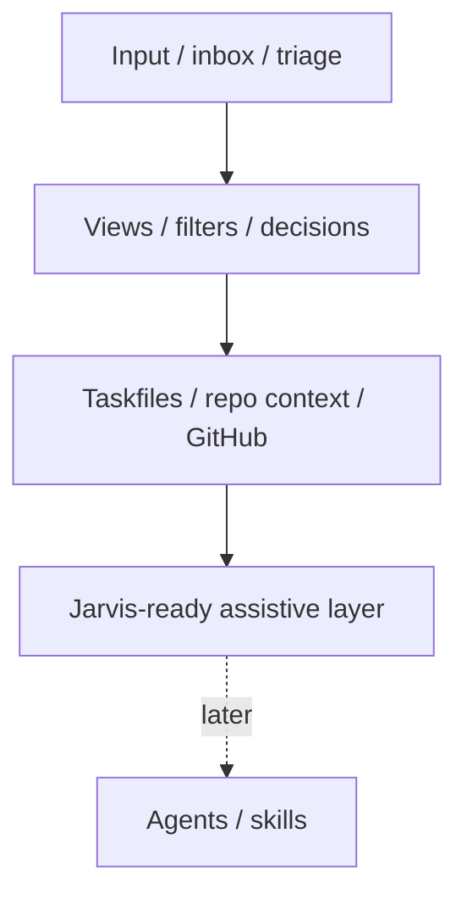

# DO NOT EDIT - GENERATED FILE

# Budio Ideas and Opportunity Map

Build Timestamp (UTC): 2026-04-28T23:46:55.838Z
Source Commit: 6a2a8ce

Doel: primaire ideebundle met opportunity-map voor triage, sequencing en planherijking.
Dit bestand is niet leidend; de handmatig onderhouden bronbestanden blijven leidend.

## Bronbestanden (vaste volgorde)
- docs/project/40-ideas/60-personal-research/README.md
- docs/project/40-ideas/README.md
- docs/project/40-ideas/00-ideas-inbox.md
- docs/project/40-ideas/10-product/20-budio-brainstorm-workspace-for-builders.md
- docs/project/40-ideas/10-product/30-conversation-aware-ingest-and-interpretation.md
- docs/project/40-ideas/10-product/40-trust-and-security-charter.md
- docs/project/40-ideas/10-product/50-structured-export-and-obsidian-archive.md
- docs/project/40-ideas/10-product/60-capture-ux-benchmark-implementatiekansen-wispr-notebooklm.md
- docs/project/40-ideas/10-product/admin-founder-meeting-capture.md
- docs/project/40-ideas/30-ai-and-aiqs/40-aiqs-modular-flow-control-plane.md
- docs/project/40-ideas/30-ai-and-aiqs/50-source-aware-routing-and-evaluation.md
- docs/project/40-ideas/30-ai-and-aiqs/60-knowledge-hub-aiqs-foundation.md
- docs/project/40-ideas/40-platform-and-architecture/10-lean-project-operating-system-for-repo.md
- docs/project/40-ideas/40-platform-and-architecture/100-linear-geinspireerde-budio-workspace-structuurlaag.md
- docs/project/40-ideas/40-platform-and-architecture/110-budio-workspace-command-room-linear-codex-local-first.md
- docs/project/40-ideas/40-platform-and-architecture/20-vscode-project-copilot-plugin.md
- docs/project/40-ideas/40-platform-and-architecture/30-budio-modular-intelligence-workspace.md
- docs/project/40-ideas/40-platform-and-architecture/40-vscode-plugin-with-budio-runtime-bridge.md
- docs/project/40-ideas/40-platform-and-architecture/50-security-posture-and-continuous-hardening.md
- docs/project/40-ideas/40-platform-and-architecture/60-budio-pro-markdown-workspace-and-obsidian-export.md
- docs/project/40-ideas/40-platform-and-architecture/70-budio-workspace-plugin-decision-board.md
- docs/project/40-ideas/40-platform-and-architecture/80-jarvis-internal-research-lane.md
- docs/project/40-ideas/40-platform-and-architecture/90-resend-local-dev-en-lifecycle-automations.md
- docs/project/40-ideas/60-personal-research/hme-me-local-first-research.md

## Leesregel
- Ideas zijn voorstelruimte en niet automatisch actieve planning of canonieke productwaarheid.
- Promotie naar actieve uitvoering loopt via `docs/project/20-planning/**` en expliciete decisions.

---

## README

---
title: Personal research ideas
audience: human
doc_type: hub
source_role: reference
visual_profile: budio-terminal
upload_bundle: 20-budio-strategy-research-and-ideas.md
---

# Personal research ideas

Deze map bevat persoonlijke researchsporen die Budio als lokale bouwomgeving
gebruiken, maar niet automatisch onderdeel zijn van de Vandaag MVP of actieve
productplanning.

## Regels

- Echte persoonlijke, medische of gevoelige data blijft buiten Git.
- Researchsporen in deze map zijn voorstel- en experimenteerruimte.
- Promotie naar productplanning of canonieke status vraagt een aparte beslissing.

## Ideas

- HME-ME Research - local-first medisch beeld- en dossieronderzoek

---

## README

---
title: Ideas workspace
audience: human
doc_type: hub
source_role: reference
visual_profile: budio-terminal
upload_bundle: 20-budio-strategy-research-and-ideas.md
---

# Ideas workspace (gestructureerde ideecapture)

## Doel

Deze map is de voorstelruimte voor nieuwe ideeën.

Belangrijk:

- ideas zijn **niet** automatisch canonieke productwaarheid
- ideas zijn **niet** automatisch actieve planning

## Werkwijze

1. Snelle inval in `00-ideas-inbox.md`.
2. Triage: verwijderen, parkeren of promoveren.
3. Promotie = één idee per file in passende categorie.

## Categorieën

- `10-product/`
- `20-ui-ux/`
- `30-ai-and-aiqs/`
- `40-platform-and-architecture/`
- `50-growth-and-business/`

## Statuswaarden

- `idea`
- `candidate`
- `later`
- `planned`
- `rejected`
- `superseded`

## Relatie met andere docs

- Actieve focus: `docs/project/20-planning/20-active-phase.md`.
- Open gaps/risico’s: `docs/project/open-points.md`.
- Codewaarheid: `docs/project/current-status.md`.

## Obsidian graph hubs

- Project hub
- Strategy hub
- Planning hub
- Research hub
- Ideas inbox

## Belangrijke idea nodes

- 10-product/20-budio-brainstorm-workspace-for-builders
- 10-product/30-conversation-aware-ingest-and-interpretation
- 10-product/50-structured-export-and-obsidian-archive
- 30-ai-and-aiqs/40-aiqs-modular-flow-control-plane
- 30-ai-and-aiqs/50-source-aware-routing-and-evaluation
- 40-platform-and-architecture/50-security-posture-and-continuous-hardening
- 40-platform-and-architecture/60-budio-pro-markdown-workspace-and-obsidian-export

## Template (kopiëren per idee)

```md
# [Idee titel]

## Status
idea

## Type
product | ui-ux | ai-aiqs | platform-architecture | growth-business | internal-tooling

## Horizon
now | next | later | unknown

## Korte samenvatting

## Probleem

## Waarom interessant

## Relatie met huidige docs

## Mogelijke impact
- ui
- services
- supabase
- aiqs
- docs

## Open vragen

## Volgende stap

## Promotiecriteria
- Wanneer wordt dit een epic?
- Wanneer wordt dit een task?
- Wat moet eerst worden uitgezocht?

## Spec-readiness bij promotie
- Welke user outcome hoort hierbij?
- Welke happy en non-happy flows zijn nu al bekend?
- Welke UX/copy guardrails gelden?
- Welke data/IO of systeemimpact is waarschijnlijk?
```

---

## Ideas Inbox

# Ideas inbox (snelle capture)

## Doel

Lage-frictie plek om nieuwe ideeën direct vast te leggen zonder contextverlies.

## Gebruik

- Korte bullets of ruwe notities zijn toegestaan.
- Inbox-items zijn tijdelijk en moeten later worden getriaged.

## Triage-uitkomsten

- promoveren naar één idee-file
- parkeren als `later`
- verwijderen als niet relevant

## Inbox

- [2026-04-19] VS Code plugin die repo + Budio productiecontext combineert via MCP/API.
- [2026-04-19] AIQS opdelen in flow-families met eigen contracts/evals i.p.v. één generieke laag.
- [2026-04-19] Budio brainstorm/workspace module voor builders/kleine teams als mogelijk productspoor.
- [2026-04-19] Conversation-aware ingest en interpretation layer (WhatsApp/iMessage/Telegram/mail/transcript), gepromoveerd naar 10-product/30-conversation-aware-ingest-and-interpretation.
- [2026-04-19] Source-aware AIQS routing en evaluation (source type als first-class metadata), gepromoveerd naar 30-ai-and-aiqs/50-source-aware-routing-and-evaluation.
- [2026-04-19] Security posture + continuous hardening (RLS, secrets, pentest, AI-pentest alternatief voor Aikido), gepromoveerd naar 40-platform-and-architecture/50-security-posture-and-continuous-hardening.
- [2026-04-19] Trust & security charter voor gebruikers (web + app transparantie "Nico-proof"), gepromoveerd naar 10-product/40-trust-and-security-charter.
- [2026-04-19] Budio Pro markdown workspace + Obsidian export als later integratiespoor, gepromoveerd naar 40-platform-and-architecture/60-budio-pro-markdown-workspace-and-obsidian-export.
- [2026-04-20] Jarvis internal research lane (founder-only), gepromoveerd naar 40-platform-and-architecture/80-jarvis-internal-research-lane als epic-candidate (geen bouwtaak).
- [2026-04-20] Knowledge Hub + AIQS foundation (PDF/audio/foto), gepromoveerd naar 30-ai-and-aiqs/60-knowledge-hub-aiqs-foundation als epic-candidate (Q3+).
- [2026-04-20] Inspiratie (Wispr Flow screenshots): user-configureerbare auto-cleanup + schrijfstijlprofielen classificeren onder Budio app + AIQS-compatibele ideas (niet Jarvis by default).
- [2026-04-21] Capture UX benchmark implementatiekansen (Wispr Flow + NotebookLM), gepromoveerd naar 10-product/60-capture-ux-benchmark-implementatiekansen-wispr-notebooklm als epic-candidate (research-first, na AIQS-live).
- [2026-04-22] ChatGPT Project uploads slimmer begeleiden/automatiseren zodat handmatige uploadfrictie lager wordt (nu alleen idee, niet uitwerken/bouwen).
- [2026-04-22] Uploadbundels voor ChatGPT Projects verder slim combineren zodat de primaire aanbevolen handmatige uploadset klein blijft (nu alleen idee, niet uitwerken/bouwen).
- [2026-04-22] Session/multi-user/OpenAI-contextbeleid voor Budio als later onderzoeksspoor: contextafbakening per gebruiker, session reuse wel/niet, wat wel/niet meegaat naar OpenAI, runtime-context versus canonieke opslag (nu alleen idee, niet uitwerken/bouwen).
- [2026-04-24] Resend local dev/testflow + lifecycle automations/triggers (o.a. welkom na eerste aanmelding), gepromoveerd naar 40-platform-and-architecture/90-resend-local-dev-en-lifecycle-automations.

---

## Budio Brainstorm Workspace For Builders

# Budio brainstorm workspace voor builders

## Status

idea

## Type

product

## Horizon

later

## Korte samenvatting

Mogelijke productmodule waarin solo builders/kleine teams ideeën kunnen vastleggen, structureren en vertalen naar uitvoerbare projectflow.

## Probleem

Creatieve ideeën ontstaan snel en raken versnipperd; zonder structuur gaat focus en uitvoering verloren.

## Waarom interessant

Past bij capture-first principe, maar toegepast op product-/bouwcontext in plaats van alleen dagboekcontext.

## Relatie met huidige docs

- Buiten huidige MVP-scope; nu alleen als ideespoor.
- Sluit inhoudelijk aan op modular workspace en plugin-bridge ideeën.

## Mogelijke impact

- product
- ui
- aiqs
- services
- docs

## Open vragen

- Is dit een aparte doelgroepmodule of een extensie op bestaande kern?
- Welke minimale MVP van zo’n brainstormflow is valideerbaar?

## Volgende stap

Value proposition en eerste workflow-hypothese uitwerken zonder huidige MVP-focus te verstoren.

---

## Conversation Aware Ingest And Interpretation

# Conversation-aware ingest and interpretation

## Status

idea

## Type

product

## Horizon

next

## Korte samenvatting

Budio moet conversatie- en berichtfragmenten (zoals WhatsApp, iMessage, Telegram, Slack, e-mail, meeting-transcripts) niet behandelen als platte dagboektekst, maar als een herkenbaar inputtype dat source-aware wordt geïnterpreteerd, verwerkt en weergegeven.

Het idee is niet “WhatsApp integratie”, maar een bredere capability:
**conversation-aware ingest + interpretation layer**, waar WhatsApp later één van meerdere bronnen kan zijn.

## Probleem

Vandaag kopieert de gebruiker soms stukken chatconversatie in een nieuw moment.
De AI-verwerking (entry_cleanup) behandelt dat dan als gewone dagboektekst, wat leidt tot:

- verwarring tussen eigen stem en andermans stem
- onterechte samenvatting van andermans inhoud alsof het eigen reflectie is
- verlies van thread- en tijdstructuur
- risico op hallucineren van intenties en emoties
- visueel geen duidelijk onderscheid tussen conversatie en note/dagboek

## Waarom interessant

- Sluit direct aan op bestaande capture + import infrastructuur (text capture, ChatGPT markdown import, background tasks).
- Past bij Budio’s capture-first principe, maar breidt het uit naar conversational sources zonder platform-lock-in.
- Versterkt het strategische verschil tussen “Budio verwerkt elke ruwe capture goed” vs. “Budio is alleen een typ/spreek dagboek”.
- AIQS krijgt hier een sterk nieuw evaluatiedomein bij (source-type correctheid, stem-attributie, inhoudelijke grens).
- Minimaliseert platformrisico: copy/paste + structured import werken los van officiële WhatsApp/Meta APIs.

## Productvisie (fasegewijs)

### Fase 1 — Manual conversation paste ingest

- Nieuw inputtype / capture-flag: `conversation_text`.
- Gebruiker plakt een chat/gespreksfragment in (of via een dedicated “Conversatie toevoegen” pad).
- Budio detecteert conversational structuur (naam + timestamp + bericht, afzenderwissels).
- UI toont expliciet: dit is een gesprek/fragment, niet een eigen dagboeknotitie.
- Verwerking behandelt eigen vs. andermans stem expliciet gescheiden.

### Fase 2 — Structured conversation import

- `.txt`/`.md` import voor chatthreads en threads uit andere bronnen (WhatsApp export, Telegram export, e-mailthread, meeting-transcript).
- Parser herkent patronen zoals `naam – tijd: bericht`, `[tijd] naam: bericht`, threadgroepen.
- Integratie met bestaande import/background-task infrastructuur.
- Eventueel OCR op screenshots als latere uitbreiding.

### Fase 3 — Source adapters

- Optionele adapters voor:
  - WhatsApp chat-export (`.txt`/`.zip`)
  - Telegram export
  - iMessage export
  - E-mail thread ingest
- Alle adapters produceren dezelfde interne `conversation_text` structuur.

### Fase 4 — Connector experiments (alleen als onderbouwd)

- Officiële WhatsApp Business/Cloud API voor business-spoor (niet bruikbaar voor persoonlijke privéchats).
- Onofficiële WhatsApp Web bridge (`whatsapp-web.js` / Baileys) uitsluitend als geïsoleerd research/prototype, niet als productfundering.
- Expliciete risk-assessment per adapter (ban-risico, privacy, juridisch, operationeel).

## WhatsApp opties — privé minimaal vs. maximaal

Context: het idee ontstond vanuit de vraag “kan ik mijn eigen app koppelen met WhatsApp om conversaties uit te lezen?”.
De volgende uitsplitsing is leidend voor latere beslissingen:

### Privé minimaal (aanbevolen startpunt)

- Copy/paste + structured parsing + source-aware interpretation.
- Geen API, geen Meta-afhankelijkheid, geen ban-risico.
- Werkt voor WhatsApp, Signal, Telegram, iMessage, Slack, e-mail, etc.
- Snelste, veiligste en breedste basis.

### Privé maximaal (alleen experiment)

- Onofficieel via `whatsapp-web.js` / Baileys als gekoppeld apparaat.
- Technisch krachtig (real-time read, send, media, groepscontext).
- Fragiel bij WhatsApp updates, kans op nummerban, tegen ToS.
- Niet geschikt als fundament voor roadmap of product.

### Business officieel

- WhatsApp Cloud API via Meta for Developers.
- Stabiel en officieel ondersteund, webhook-gedreven.
- Kan alleen berichten zien naar het business-nummer; niet bruikbaar om eigen persoonlijke privéchats uit te lezen.
- Relevant voor later business-spoor, niet voor de huidige persoonlijke use-case.

## AI-gedragingen die nodig zijn

1. Herkennen of input conversational is (vs. note/dagboek/audio-transcript).
2. Herkennen hoeveel sprekers er zijn en afzenderwissels.
3. Onderscheid eigen stem vs. andermans stem.
4. Bepalen wat als dagboek-/moment-relevant geldt voor de gebruiker.
5. Output anders structureren dan bij note-input (geen valse samenvatting van andermans inhoud als eigen reflectie).
6. Geen hallucinatie van emoties/intenties toegekend aan gespreksdeelnemers.

## Relatie met AIQS

- Nieuwe task of family-richting (voorstel): `conversation_ingest_classification`, `conversation_cleanup`, `conversation_to_entry`, `conversation_summary`.
- Of, klein startpunt: `entry_cleanup` uitbreiden met expliciete source-type input, zonder de bestaande contract-first editor stil te laten groeien.
- AIQS moet expliciet kunnen evalueren:
  - classificatie conversation vs. note (consistent?)
  - stem-attributie correct?
  - hallucinatie van emoties/intenties?
  - onterechte samenvatting als eigen reflectie?
  - Budio-conforme, rustige output?

## Visuele weergave

- Conversatie-input wordt in de app zichtbaar anders weergegeven dan note-input.
- Minimaal: duidelijke markering dat dit een gespreksbron is, met optionele weergave van thread/structuur.
- Geen zware nieuwe UI-surfaces; volgt clean-first guardrails.
- Maximaal (later): collapsible thread view met duidelijk onderscheid eigen stem vs. andermans stem.

## Relatie met huidige docs

- Strekt bestaande import/capture-infrastructuur uit (`services/import/*`, `process-entry`, `user_background_tasks`).
- Raakt `ai-quality-studio.md` en `content-processing-rules.md` voor source-aware contracten en grensgedrag.
- Buiten huidige MVP-scope; past bij research richting sterkere capture→output brug.
- Niet in `current-status.md` als feature opnemen tot expliciet gepland en gebouwd.

## Mogelijke impact

- product
- ui
- aiqs
- services
- supabase
- docs

## Open vragen

- Introduceren we `conversation_text` als nieuw source type naast `text`/`audio`, of als sub-type?
- Blijft AIQS op één `entry_cleanup` family met source-aware routing, of opent dit een dedicated family?
- Hoe behandelt de app meerdere afzenders in de visuele weergave zonder feature/UI creep?
- Welke minimale parser-patronen dekken 80% van privé use-cases zonder platformspecifiek te worden?
- Wat is het minimaal acceptabele privacy-model als later ooit een adapter/connector wordt toegevoegd?

## Volgende stap

- Detail-spec voor fase 1 (manual conversation paste) met expliciete input/output contracten en AIQS-testcases, zonder nu runtime-werk te starten.
- Parallel: AIQS-idea `50-source-aware-routing-and-evaluation.md` uitwerken als governance-spoor.

---

## Trust And Security Charter

# Trust and security charter (gebruikerscommunicatie)

## Status

idea

## Type

product

## Horizon

next

## Korte samenvatting

Budio moet niet alleen technisch veilig zijn, maar dat ook aantoonbaar, begrijpelijk en prominent communiceren via een product-facing **Trust & Security Charter** in web en app. Doel: de angst rond "dagboek + cloud + AI" expliciet wegnemen voor ook de kritische gebruiker.

Dit is de gebruikers- en communicatiekant van het platform-idee `40-ideas/40-platform-and-architecture/50-security-posture-and-continuous-hardening.md`.

## Probleem

- Gebruikers associëren dagboek + AI + cloud met hoog risico (datalek, AI-training, cloud-compromise).
- Zelfs als techniek goed staat, zonder zichtbare uitleg bouwt Budio geen vertrouwen.
- Generieke "privacybeleid" pagina's lezen niemand; ze creëren geen gevoel van controle.
- Vergelijkbare journaling-apps falen vaak op transparantie rond AI-gebruik en data-retentie.

## Waarom interessant

- Vertrouwen is voor een dagboekapp het belangrijkste product, niet alleen een feature.
- Charter-achtige transparantie is goedkoop te bouwen maar zwaar in conversie-effect en retentie.
- Sluit direct aan op de research-richting `private/regulated` als premium differentiator.
- Biedt een repeteerbaar communicatieframe voor later (landingspages, pricing pages, in-app onboarding, menu).
- Helpt bij acquisitie van de kritische gebruiker ("Nico-proof"): iemand die pas instapt als hij snapt waarom hij het kan vertrouwen.

## Productvisie

### Principes (publiek leesbaar)

Drie korte beloftes:

1. **Jouw ogen alleen**
   - Wat wij zien en wat wij niet zien.
   - Hoe toegang beperkt is (RLS, server-side rollen, allowlist).
   - Waar encryptie zit (in rust, in transit), en wat E2EE wel/niet betekent in de huidige fase.

2. **AI zonder oordeel**
   - AI wordt gebruikt om je te helpen, niet om jou te analyseren of door te verkopen.
   - OpenAI zero-retention / no-training setting expliciet bevestigd.
   - Geen verkoop, geen advertentiegebruik, geen third-party tracking pixels.

3. **Open kaart**
   - Welke providers we gebruiken: Supabase (data), Vercel (hosting), OpenAI (AI).
   - Waarom we die kiezen en welke standaarden zij hanteren.
   - Wat jij altijd zelf kan: export, verwijder alles, wachtwoord wijzigen, sessies beëindigen.

### Charter-opbouw (werkvorm)

- 1 korte landingsvariant (pricing/product pagina, 3 beloftes).
- 1 dieper charter-document (FAQ-stijl: "Wat als Supabase wordt gehackt?", "Traint OpenAI op mijn data?", "Kan Budio mijn teksten lezen?").
- 1 versie in-app: korte hero-kaart + link naar volledige versie.

### Transparantie-elementen

- Versiedatum + changelog van het charter zelf.
- Publieke `security.txt` met contactpad.
- Duidelijke scheiding: wat geldt vandaag, wat is roadmap (bijv. E2EE).
- Expliciete keuze-indicatoren: wat kan de gebruiker zelf aanzetten (MFA, audio-retentie, export, delete-all)?

## UX-plek in product

- **Web**: prominente section op landing + dedicated `/trust` of `/security` route.
- **App**: in onboarding (optioneel kort blokje) en in settings-hub als eigen rij ("Privacy & Security"), aansluitend bij bestaande settings IA (`app/settings.tsx`).
- Geen zware modals, geen dark patterns; clean-first, past binnen bestaande spacing/typografie-guardrails.

## Copy-richting

Volgt `docs/project/copy-instructions.md`:

- Kort, direct, menselijk.
- Geen marketingjargon, geen AI-coach-taal.
- Concreet ("we bewaren geen audio tenzij jij dat aanzet") i.p.v. abstract ("state of the art privacy").
- Vertaalbaar naar Nederlands en Engels zonder betekenisverlies.

## Relatie met huidige code-realiteit

- Past bij bestaande "exit/controle"-features: export, import, delete-all (1.2D aanwezig).
- Past bij bestaande admin-only boundary (geen end-user admin controls).
- Past bij bestaande `user_preferences` voor audio-opslag keuze.
- Nog niet aanwezig: dedicated trust/security UI-pad, copy-set, landing-section, `security.txt`.

## Relatie met AIQS

- AIQS blijft admin-only; charter beschrijft *niet* AIQS als gebruikersfeature.
- Charter bevestigt wel: "de AI-instellingen en prompts worden beheerd volgens interne kwaliteitscontroles" zonder internals te tonen.
- Source-aware routing (conversaties) maakt expliciete charter-zinnen extra waardevol (stem-attributie, geen andermans data gebruikt om gebruiker te profileren).

## Mogelijke impact

- product
- ui
- docs
- copy
- marketing/landing
- infra (security.txt en disclosure pad)

## Open vragen

- Starten we met landing-only charter, of gelijk ook in-app?
- Wie is juridisch eindverantwoordelijk voor de charter-teksten (solo of met externe legal review)?
- Koppelen we de charter aan een publiek changelog (datumgestuurd) of alleen aan releases?
- Hoeveel transparantie over concrete technische keuzes (providers, headers, policies) is nuttig voor gebruikers zonder te veel attack surface te onthullen?
- Willen we een expliciete "roadmap naar E2EE" opnemen, of pas wanneer er commitment is op bouw?

## Volgende stap

- Concept-charter in 1 pager uitwerken op basis van drie beloftes.
- Concept copy-set valideren tegen `copy-instructions.md` en `ui-modals.md` guardrails.
- Plek in web + settings IA visueel schetsen (zonder nu te bouwen).
- Besluiten over scope: landing-only eerste versie vs. landing + app gelijk.

---

## Structured Export And Obsidian Archive

# Structured export and Obsidian archive package

## Status

candidate

## Type

product

## Horizon

next

## Korte samenvatting

Breid de huidige export uit met een tweede pad naast single-file markdown: een server-side structured export job die een Obsidian-compatibel archief oplevert met logische mapstructuur (jaar/maand/week/dag/moment), wiki-link clusters en optionele audio-export wanneer audio-opslag actief is en bestanden beschikbaar zijn.

## Probleem

- De huidige export levert één markdownbestand; dat is goed voor snel bewaren, maar beperkt voor kennisopbouw en hergebruik in Obsidian.
- Er is nog geen export die hiërarchie en node-clusters expliciet maakt (jaar > maand > week > dag > moment).
- Audio-opnames kunnen nu in de app bewaard worden, maar er is geen consistente manier om die in export mee te nemen als bronmateriaal.
- Multi-file export client-side is kwetsbaar en minder schaalbaar; het past beter in server-side background verwerking.

## Waarom interessant

- Sluit direct aan op bestaande exportflow, user preferences en `user_background_tasks` patroon.
- Versterkt de commerciële brug van capture naar herbruikbare output zonder productverbreding naar nieuwe formaten.
- Geeft gebruikers een toekomstvaste, overdraagbare knowledge-export met duidelijke structuur.
- Houdt markdown-first uitgangspunt intact en blijft compatible met huidige workflows.

## Productvisie

### Pad 1 — Huidige single-file export blijft

- Bestaande “alles in één markdownbestand” blijft beschikbaar als snelle standaard.

### Pad 2 — Structured export (nieuw)

- Exportvorm met opties:
  - momenten
  - dagen
  - weken
  - maanden
  - audio meenemen (optioneel)
- Output:
  - één `.md` als netto output 1 bestand is
  - `.zip` als output meerdere bestanden bevat

### Obsidian-compatibele opbouw

- Root `README.md` met overzicht, selectie, tellingen en warnings.
- Mappen per jaar/maand/week/dag/moment met consistente bestandsnamen.
- Wiki-link netwerken tussen notities zodat graph-clusters zichtbaar worden.

## Voorstel outputstructuur

```text
budio-export-YYYYMMDD-HHmm.zip
  README.md
  00-overzicht/
    README.md
  2026/
    README.md
    2026-04-april/
      README.md
      maanden/
        2026-04-april-maandoverzicht.md
      weken/
        2026-W16-20260413-tm-20260419-weekoverzicht.md
      dagen/
        2026-04-19-zaterdag/
          README.md
          20260419-dag.md
          momenten/
            20260419-0831-spraak-korte-slug.md
            20260419-1412-tekst-korte-slug.md
          audio/
            20260419-0831-spraak-korte-slug.m4a
```

## Relatie met huidige code-realiteit

- Export nu: client-side in `app/settings-export.tsx` + `services/export.ts`.
- Background-task patroon bestaat al in importflow (`user_background_tasks`).
- Audio metadata bestaat al op `entries_raw` (`audio_storage_path`, `audio_mime_type`, etc.) en opslag via private `entry-audio` bucket.
- Nog niet aanwezig: dedicated server-side export function, export artifact bucket en structured zip packaging.

## Architectuurvoorstel (richting)

- Structured export als server-side edge function met background-task updates.
- Hergebruik `user_background_tasks` met `task_type = archive_export`.
- Artifact opslaan in private export bucket (bijv. `user-exports`) met user-scoped pad.
- Download via signed URL / artifact reference.

## Scope (wel / niet)

### Wel

- Markdown-only output.
- Structured map + bestandsnaamconventies.
- Optionele audio-export als bestanden aanwezig zijn.
- Root README + relinkbare note-hiërarchie.

### Niet (in deze ronde)

- Geen pdf/html/json/docx export.
- Geen directe vault sync of lokale Obsidian pad-koppeling.
- Geen file-manager productlaag in app.
- Geen audio-transcoding pipeline.

## Mogelijke impact

- product
- ui
- services
- supabase
- docs

## Open vragen

- Welke zip-library is het meest robuust in Supabase Edge/Deno runtime?
- Hoe lang bewaren we export artifacts in storage (retentie/cleanup)?
- Hoe tonen we warnings (bijv. ontbrekende audio bestanden) in UI en README consistent?
- Welke minimale linkset levert de beste Obsidian graph zonder overlinking?

## Volgende stap

- Als afgebakende multi-file implementatieronde plannen:
  1. task/result contract uitbreiden
  2. server-side export job bouwen
  3. structured markdown generator + zip
  4. app export-ui met mode/checkboxes + status/download

---

## Capture Ux Benchmark Implementatiekansen Wispr Notebooklm

# Capture UX benchmark implementatiekansen (Wispr Flow + NotebookLM learnings)

## Status

candidate

## Type

product

## Horizon

next

## Korte samenvatting

Epic-candidate om na AIQS-live gericht benchmark-learnings (Wispr capture-executie + NotebookLM source-trust) te vertalen naar Budio app + AIQS implementatiekansen.

## Probleem

We zien sterke patronen bij Wispr Flow en NotebookLM, maar zonder expliciete benchmarkbeslissingen ontstaat risico op:

- ad-hoc featurekeuzes
- scope-ruis
- te snelle taakpromotie zonder heldere fit/risico-afweging

## Waarom interessant

- Versterkt Budio's capture-ervaring zonder de AIQS-kwaliteitslaag los te laten.
- Maakt expliciet wat we wel/niet overnemen van concurrenten.
- Houdt de roadmap scherp: inspiratie naar besluitbaar kader i.p.v. losse ideeen.

## Relatie met huidige docs

- Sluit aan op planning `Next` na AIQS-live.
- Leunt op research-brief `30-research/70-wisprflow-notebooklm-benchmark-na-aiqs-live.md`.
- Houdt classificatie in ideas-laag tot promotiecriteria zijn gehaald.

## Epic-candidate

- Ja, dit is een epic-candidate (pre-task).
- Promotie naar taak pas na benchmark sprint + expliciet user-besluit.

## Mogelijke impact

- product
- aiqs
- ui
- docs

## Open vragen

- Welke patronen moeten als eerste naar concrete task-candidates (cleanup-levels, style-profielen, dictionary/snippets)?
- Welke AIQS-evaluatiecriteria zijn minimaal verplicht voor promotie?
- Welke patronen markeren we definitief als niet-onze-markt?

## Volgende stap

Voer na AIQS-live een timeboxed competitor benchmark sprint uit met decision matrix (`kopieren / aanpassen / niet-onze-markt`) en leg promotiecriteria vast per patroon.

---

## Admin Founder Meeting Capture

# Admin/founder meeting capture

## Status

promoted-to-epic

## Type

product

## Horizon

now

## Korte samenvatting

Een aparte admin/founder lane voor lange overlegopnames, buiten de bestaande dagboekcapture. De eerste versie is audio-safe: opnemen, lokaal veiligstellen, uploaden, terugvinden, afspelen en downloaden. Transcriptie, speakerlabels en inzichten volgen pas daarna.

## Probleem

Lange founder/admin gesprekken passen niet goed in de huidige dagboekflow. Ze hebben een ander gebruikspatroon: langere duur, hogere kans op browser- of netwerkonderbreking, ander privacygevoel en een archiefbehoefte die los staat van dagelijkse momenten.

Als we dit in de bestaande captureflow proppen, maken we de dagboekervaring zwaarder en vergroten we het risico dat audio-opslag, transcriptie en samenvatting elkaar blokkeren.

## Waarom interessant

- Founder/admin gesprekken zijn rijk aan besluiten, open vragen, actiepunten en productrichting.
- Audioverlies is hier duurder dan bij korte dagboekinput, dus local-first recovery is v1-waardig.
- De flow is een goede praktijktest voor de nieuwe Budio Workspace hierarchy-laag.

## Scopegrens

- Wel: admin-only web recording, lokale failsafe, private upload, overzicht, detail, playback en download.
- Wel later: upload/import van bestaand audiobestand naar hetzelfde archief.
- Niet in v1: transcript-first, live assistant, meeting bot, calendar-integratie, team sharing of publieke Pro UI.
- Niet doen: bestaande dagboekcapture functioneel aanpassen.

## Productrichting

De UI blijft sober en Budio-eigen. Hergebruik bestaande capture-, moment-, dag-, selectie-, header- en footerpatronen. Copy blijft kort:

- `Gespreksopname`
- `Start opname`
- `Audio wordt veilig opgeslagen`
- `Transcript mislukt. De audio is bewaard.`

## Privacy en consent

De flow moet expliciet tonen dat het om een gespreksopname gaat en dat de gebruiker verantwoordelijk is voor toestemming. Audio-opslag is de succesdefinitie van v1; transcriptie en inzichten zijn aanvullende verwerking en mogen audio nooit blokkeren.

## Relatie met huidige docs

- Epic: `docs/project/24-epics/admin-founder-meeting-capture.md`
- Tasklaag: `docs/project/25-tasks/open/admin-founder-meeting-capture-*.md`
- Researchbronnen: `/Users/pieterflikweert/Downloads/Meeting Capture 1.md` en `/Users/pieterflikweert/Downloads/Meeting Capture 2.md`

## Volgende stap

Maak de epic + taskbundel aan en gebruik die als eerste echte test van `Epic -> Task -> Subtask/dependency` in de Budio Workspace plugin.

---

## Aiqs Modular Flow Control Plane

# AIQS modular flow control plane

## Status

idea

## Type

ai-aiqs

## Horizon

next

## Korte samenvatting

Breid AIQS uit van task-first admin-governance naar flow-family control plane met module-specifieke contracts, evaluatie en routing.

## Probleem

Eén uniforme AI-tasklaag dekt niet goed de verschillende domeinen (dagboek, code/projectflow, podcast/coaches).

## Waarom interessant

Hogere kwaliteitscontrole per domein en minder ruis in prompts, evaluaties en releasebesluiten.

## Relatie met huidige docs

- Bouwt voort op `docs/project/ai-quality-studio.md`.
- Sluit aan op future-state research en modular workspace idee.

## Mogelijke impact

- aiqs
- services
- supabase
- docs

## Open vragen

- Welke flow-families worden canoniek als eerste ondersteund?
- Hoe houd je shared governance zonder flow-specifieke flexibiliteit te verliezen?

## Volgende stap

Pilot op één extra flow-family naast journal-flow met aparte contracts en evaluatiecriteria.

---

## Source Aware Routing And Evaluation

# Source-aware routing and evaluation

## Status

idea

## Type

ai-aiqs

## Horizon

next

## Korte samenvatting

Maak AIQS-bewust van **source type** (note, voice-transcript, conversation, import), zodat promptrouting, contracten en evaluaties expliciet verschillen per input en niet langer stil in één generieke `entry_cleanup`-laag worden afgehandeld.

## Probleem

Vandaag behandelt AIQS input primair taak-gedreven (bijv. `entry_cleanup`) zonder formeel onderscheid in source type.
Dat werkt voor “dagboek tekst/audio”, maar breekt voor bronnen als chat/conversatie, waar:

- meerdere sprekers bestaan
- eigen stem vs. andermans stem gescheiden moet blijven
- hallucinatierisico op intenties/emoties veel hoger is
- contract “title/body/summary_short” niet per definitie klopt

Dit is een directe consequentie van het productidee `40-ideas/10-product/30-conversation-aware-ingest-and-interpretation.md`.

## Waarom interessant

- Versterkt AIQS als control plane in plaats van task-only governance.
- Voorkomt dat `entry_cleanup` stilzwijgend een overloaded generieke AI-laag wordt.
- Levert expliciete, testbare evaluatiedomeinen voor nieuwe bronnen (zoals conversation).
- Houdt contract-first principes expliciet per source/task i.p.v. impliciet “werkt ook wel voor chat”.
- Maakt latere commerciële tiering (per source/type usage) mogelijk zonder achteraf te refactoren.

## Voorgestelde richting

### 1. Source type als eerste-klas metadata

- Input source types: `note_text`, `voice_transcript`, `conversation_text`, `imported_text`.
- Source type reist mee door `process-entry`, entry-normalization en AIQS-testbedding.
- Source type is zichtbaar in AIQS baseline import en testruns.

### 2. Task- en family-scheiding per source

Opties:

- **Klein startpunt**: huidige `entry_cleanup` blijft, maar krijgt source-aware instructies en expliciete evaluatiecontract per source.
- **Structureel startpunt**: aparte task(s) voor conversation-verwerking, bijv.:
  - `conversation_ingest_classification`
  - `conversation_cleanup`
  - `conversation_to_entry`
  - `conversation_summary`
- **Family richting**: eigen AIQS family `conversation_handling` naast huidige `moments`.

### 3. Evaluatiecriteria per source

AIQS moet per source kunnen toetsen:

- classificatie source type consistent?
- stem-attributie correct (eigen vs. andermans stem)?
- geen hallucinatie van emoties/intenties?
- geen onterechte samenvatting van andermans inhoud als eigen reflectie?
- contractconformiteit per task (title/body/summary_short of een alternatief conversation-contract)?
- rustige, Budio-conforme output zonder coach/advies drift?

### 4. Compare-laag

Compare-view laat expliciet zien:

- welke source type de run behandelt
- hoe kandidaatversie scoort op source-specifieke criteria
- verschillen t.o.v. runtime-basis voor dezelfde source

## Relatie met huidige code-realiteit

- `services/ai-quality-studio/readmodel.ts` definieert tasks en families incl. `entry_cleanup` → natuurlijke plek voor source-aware uitbreiding.
- `services/import/chatgpt-markdown*.ts` levert al structured message-objects (speaker, timestamp) die later als `conversation_text` baseline kunnen dienen.
- `supabase/functions/admin-ai-quality-studio/*` is de juiste server-laag voor source-aware acties zonder client-side uitbreiding.
- `server-contracts/ai/*` is de juiste plek voor nieuwe contracttypes als conversation een eigen contract krijgt.

## Relatie met AIQS-governance (canoniek)

- Blijft admin-only en server-side (`docs/project/ai-quality-studio.md`).
- Blijft contract-first, task-first, evidence-first.
- Geen brede chat/agent UI; alleen gerichte evaluatie en compare.
- Runtime blijft source-of-truth tot expliciet gecontroleerd gemigreerd.

## Mogelijke impact

- aiqs
- services
- supabase
- docs
- product (indirect via conversation-aware ingest)

## Open vragen

- Wel of geen aparte family voor conversation, of eerst source-aware uitbreiding binnen `entry_cleanup`?
- Krijgt `conversation_text` een eigen response-contract i.p.v. `title/body/summary_short`, of juist een genormaliseerde variant?
- Moet source type invloed hebben op routing/model/kosten (bijv. zwaardere model voor chat-interpretatie)?
- Hoe representeren we stem-attributie in de output zonder UI/feature creep?
- Welke minimale set evaluatiecases dekt de kern voor MVP-waardige conversation-support?

## Volgende stap

- Detail-spec voor source type metadata door de keten (capture → process-entry → normalized → AIQS testbed).
- Kleine AIQS-contractschets voor `conversation_*` tasks en/of source-aware `entry_cleanup` extensie, zonder runtime-werk te starten.
- Expliciete evaluatiecasesuggestie voor compare-runs (chat eigen stem, chat andermans stem, mixed thread, single speaker note).

---

## Knowledge Hub Aiqs Foundation

# Knowledge Hub + AIQS foundation (source ingest + citations)

## Status

candidate

## Type

ai-aiqs

## Horizon

later

## Korte samenvatting

Leg Knowledge Hub + AIQS vast als high-prio epic-candidate voor brongebaseerde ingest (PDF/audio/foto), grounding en citations, met start na Q2 2026.

## Probleem

Knowledge Hub is strategisch essentieel, maar nog niet klaar als uitvoerbare bouwtaak in dit kwartaal. Te vroege taakpromotie maakt planning instabiel en verdringt actieve fasewerkzaamheden.

## Waarom interessant

- Versterkt AIQS als kennis-hart dat bijna elk project raakt.
- Maakt brongebonden outputkwaliteit meetbaar en schaalbaar.
- Ondersteunt de publieke wedge op builders/podcasters wanneer fasevolgorde dat toelaat.

## Relatie met huidige docs

- Blijft high-prio richting in planning (`Next`), maar niet als actieve Q2-bouwscope.
- Moet aansluiten op AIQS-governance en source-aware evaluatie.

## Epic-candidate

- Ja, dit is een epic-candidate (pre-task).
- Promotie naar taak pas na expliciet kwartaalbesluit en concrete flowdefinitie.

## Mogelijke impact

- aiqs
- services
- docs
- platform-architecture

## Open vragen

- Wat is de minimale Knowledge Hub v1-definitie voor promotie naar taak?
- Welke volgorde krijgt source ingest (PDF/audio/foto) bij start na Q2?
- Welke AIQS-evaluatiecriteria zijn verplicht voor eerste bouwfase?

## Volgende stap

Definieer een compacte promotiechecklist (entry criteria + acceptatiecriteria) voor Q3-start, zonder nu al taskuitvoering te openen.

---

## Lean Project Operating System For Repo

# Lean project operating system voor repo-uitvoering

## Status

candidate

## Type

platform-architecture

## Horizon

now

## Korte samenvatting

Structureer `docs/project/**` als lean operating system met expliciete lagen voor strategy, planning, status, productwaarheid en ideeën.

## Probleem

Strategie, planning, status en ideeën stonden verspreid, waardoor focus en traceerbaarheid onder druk staan.

## Waarom interessant

Minder context-switching, betere uitvoerdiscipline, eenvoudiger automatisering (o.a. VS Code plugin).

## Relatie met huidige docs

- Raakt `docs/project/README.md` en alle planning/ideas docs.
- Versterkt bestaande canonieke docs zonder scope-inhoud te herschrijven.

## Mogelijke impact

- docs

## Open vragen

- Welke minimale metadata-standaard is nodig voor plugin-readability?

## Volgende stap

Operating system in docs doorzetten en bundelstrategie hierop refactoren.

---

## Linear Geinspireerde Budio Workspace Structuurlaag

---
title: Linear-geinspireerde Budio Workspace structuurlaag
audience: human
doc_type: idea
source_role: reference
visual_profile: budio-terminal
upload_bundle: 20-budio-strategy-research-and-ideas.md
---

# Linear-geinspireerde Budio Workspace structuurlaag

## Status

candidate

## Type

platform-architecture

## Horizon

next

## Korte samenvatting

Gebruik Linear als referentiemodel voor een rustige, keyboard-first en context-first structuurlaag in Budio Workspace: eerst intake, triage, custom views, preview en integratieritme; pas daarna een bredere Jarvis-laag.

```text
╔════════════════════════════════════════════════════════════╗
║ BUDIO WORKSPACE STRUCTURE LAYER                           ║
╠════════════════════════════════════════════════════════════╣
║ LEARN FROM   Linear clarity, speed, views, triage         ║
║ COPY         principles, not product surface              ║
║ BUILD FIRST  structure before agents                      ║
║ HOLD BACK    enterprise breadth, cycles, agent-first ops  ║
╚════════════════════════════════════════════════════════════╝
```



## Probleem

Budio Workspace groeit nu vanuit meerdere goede richtingen tegelijk:

- taskflow en board/list uitvoering
- plugin-polish en dagelijkse focus
- strategische decision-board ideeën
- runtime bridge- en modular-workspace ideeën
- Jarvis als latere internal-only assistive laag

Maar er ontbreekt nog één samenhangend idee dat uitlegt welke werkstructuur onder dit alles moet liggen. Zonder die structuur blijft de kans bestaan dat we losse features bouwen zonder sterke intake, duidelijke views, stabiele routing of elegante dagelijkse workflow.

## Waarom interessant

Linear is relevant als referentie omdat het niet alleen een issue tracker is, maar een sterk samenhangend werksysteem rond:

- context
- intake
- routing
- views
- keyboard-first interactie
- rustige, elegante informatiepresentatie

Dat sluit aan op wat Budio Workspace nu nodig heeft: niet eerst meer agentische complexiteit, maar eerst een betere structuurlaag waarop Jarvis later veilig en nuttig kan landen.

## Korte beoordeling van Linear als referentie

Linear is sterk als referentie voor Budio Workspace, niet omdat we “zoals Linear” moeten worden, maar omdat het product laat zien hoe veel workflowkracht uit een kleine set coherente patronen kan komen.

Sterke punten voor onze context:

1. **Context-first boven losse taken**
   - In `linear.app/next` positioneert Linear zich als systeem dat context omzet in execution: feedback, plannen, specs, beslissingen en code vormen samen de werklaag.
   - Dat lijkt sterk op de richting die wij voor Budio Workspace zoeken: niet alleen taakbeheer, maar een omgeving waar docs, keuzes, taken en later agents op dezelfde contextlaag landen.

2. **Minder overhead, meer ritme**
   - De kernboodschap uit hun Start Guide en `next`-verhaal is dat teams zonder veel overhead moeten kunnen plannen, volgen en leveren.
   - Dat sluit goed aan op onze cheap-first en rustiger workflowfilosofie.

3. **Uitstekende informatie-architectuur**
   - Custom views, triage, peek, display options, filters, search en view-favorieten zijn geen losse features maar één werkmodel.
   - Daardoor voelt Linear snel, consistent en intuïtief.

4. **Elegant en ingetogen UX**
   - Linear’s look and feel is simpel, rustig en compact.
   - Dat is relevant voor Budio Workspace, waar we een founder- en bouwomgeving willen die licht, snel en niet-dashboarderig aanvoelt.

## Wat Budio Workspace concreet kan leren en kopieren

### 1. Context-first in plaats van alleen task-tracking

Linear’s `next`-richting laat zien dat het werk niet moet starten bij een kaartje, maar bij context die kan worden omgezet in uitvoering.

Voor Budio Workspace betekent dat:

- taskfiles blijven belangrijk, maar niet als enige werklaag
- ideeën, beslissingen, docs, research en execution moeten als samenhangende context vindbaar zijn
- de plugin moet helpen om context te **lezen, routeren en verankeren**, niet alleen taken te verplaatsen

### 2. Een echte inbox/triage-laag voor nieuwe input

Linear gebruikt Triage als aparte inbox voor werk dat nog niet in de normale flow hoort. Volgens hun docs kan Triage issues reviewen, routeren, prioriteren en via regels automatisch verrijken of doorzetten.

Voor Budio Workspace is dat direct toepasbaar als interne intake-laag voor:

- nieuwe user requests
- losse ideeën
- research-input
- follow-ups uit reviews of tests
- integratie-events uit GitHub of Slack

Goedkope vertaling:

- eerst een expliciete `inbox/triage`-view in de plugin
- daarna simpele routing naar task, idea, review of later
- nog geen zware enterprise-rules-engine

### 3. Duurzame custom views als primaire werkvorm

Linear’s Custom Views-docs laten zien dat duurzame filtered views een centrale workflowlaag zijn: save, share, favorite, team-level of workspace-level.

Voor Budio Workspace is dit waarschijnlijk belangrijker dan nog meer board-logica.

Wat we kunnen overnemen:

- saved views als eerste-klas object in de plugin
- views voor `Mijn focus`, `Review`, `Ideeën`, `Blocked`, `Recent veranderd`, `Jarvis later`
- persoonlijke defaults bovenop gedeelde workspace-defaults
- favoriete views in de linker rail

Dit sluit goed aan op ons bestaande board/list-spoor, maar maakt het systeem veel minder afhankelijk van één vaste weergave.

### 4. Peek/preview zonder context-switch

Linear’s Peek maakt het mogelijk om details te zien zonder de lijstcontext te verliezen. Dat is een klein patroon met grote workflowwaarde.

Voor Budio Workspace is dit bijna ideaal:

- preview van task/idea/details zonder de huidige view te verlaten
- snelle inspectie van samenvatting, checklist, links en status
- later ook preview van gerelateerde docs of GitHub-status

Dit past beter bij onze plugin dan steeds agressiever openen/sluiten van volledige detailmodi.

### 5. Keyboard-first navigatie en snelle acties

Linear’s docs leggen veel nadruk op `/` search, open-jumps, list/board toggles, view-openers en quick navigation.

Voor Budio Workspace is dat toepasbaar als:

- snelle globale search/open
- open recent
- open saved view
- quick create task/idea
- preview toggle
- switch tussen board/list/review/intake

De winst zit niet alleen in snelheid, maar in het gevoel dat de tool intuïtief en direct werkt.

### 6. Persoonlijke voorkeuren bovenop gedeelde defaults

Linear’s display options en custom views combineren workspace-defaults met persoonlijke preferences.

Dat model past goed bij Budio Workspace:

- workspace bepaalt een logische standaardstructuur
- gebruiker kan zijn eigen focusviews, sortering of voorkeursstartscherm kiezen
- persoonlijke voorkeuren mogen niet de onderliggende gedeelde werkwaarheid vervangen

### 7. Integraties als workflowversnellers, niet als doel op zich

Linear’s Slack, GitHub en Asks flows laten zien dat integraties vooral sterk zijn wanneer ze bestaande werkstromen direct in de hoofdworkflow laten landen.

Voor Budio Workspace zijn vooral relevant:

- **GitHub**: linked PR/status/review-signalen rond bestaande taken
- **Slack**: links, notificaties en later intake van requests
- **Asks-principe**: intake uit chat/mail/form naar een triage-laag

De les is niet “zoveel mogelijk integraties bouwen”, maar:

- alleen integraties toevoegen die intake, routing of execution concreet versnellen
- integraties laten landen in één duidelijke inbox/triage/contextlaag

## Wat we bewust niet nu moeten kopieren

### 1. Geen volle enterprise-breedte

Linear ondersteunt veel teams, plannen, use cases en enterprise-oppervlak. Budio Workspace hoeft dat nu niet te evenaren.

Niet nu nodig:

- brede org-administration
- uitgebreide customer-support suite
- multi-team procescomplexiteit als uitgangspunt

### 2. Geen zware cycle- of sprintrituelen als default

Linear’s cycle-model is sterk voor teams die cadence en capacity willen structureren, maar voor Budio Workspace is dat nu te zwaar als default.

We kunnen wel leren van:

- ritme
- capacity-bewustzijn
- automatische rollover als concept

Maar we moeten niet meteen een zware sprintmachine bouwen.

### 3. Geen agent-first uitvoering voor de structuurlaag stabiel is

Linear beweegt in `linear.app/next` duidelijk richting agents, skills en automations. Voor ons is dit inspirerend, maar ook een waarschuwing:

- zonder sterke contextlaag worden agents ruis
- zonder intake- en viewstructuur wordt automation te vroeg te complex

Jarvis blijft dus toekomstspoor. De juiste volgorde voor Budio Workspace is:

1. structuur
2. intake
3. views
4. preview
5. integratieritme
6. pas daarna assistive Jarvis-lagen

## Budio-relevantie-selectie

### Wel overnemen

- context-first in plaats van losse task-tracking
- triage/inbox voor nieuwe input
- duurzame custom views
- keyboard-first navigatie en quick actions
- peek/preview zonder context-switch
- gedeelde defaults plus persoonlijke view preferences
- Slack/GitHub-koppeling als workflowversnellers
- simpele, rustige, elegante visual language

### Gedeeltelijk en gefaseerd overnemen

- projectlaag boven tasks
- review- en delivery-statussen
- intake via Slack, mail of forms voor interne founder/team workflows

### Niet nu overnemen

- volle enterprise-breedte
- zware cycle/sprint-rituelen als default
- brede customer-support suite
- agent-first uitvoering voordat de structuurlaag stabiel is

## Concrete vertaling naar Budio Workspace

### 1. Intake

De eerste laag wordt een expliciete intake/triage-omgeving voor:

- ideeën
- taken
- research-input
- reviewpunten
- integratie-signalen

Doel:

- nieuwe input komt eerst in een rustige inbox
- daarna wordt pas beslist: task, idea, review, later, of afwijzen

### 2. Organize

De tweede laag organiseert werk via:

- saved views
- filters
- persoonlijke favorieten
- workspace-default views
- review lane
- decision views
- lichte project- of thema-overzichten

Doel:

- minder context-switching
- sneller prioriteren
- beter onderscheid tussen intake, beslissen en uitvoeren

### 3. Execute

De derde laag koppelt views en intake aan echte uitvoering:

- taskfiles
- repo-context
- GitHub-status
- later Jarvis skills/agents

Doel:

- de plugin blijft een uitvoeringslaag
- maar voelt minder als los taskboard en meer als context-naar-execution systeem

## Toekomstige Workspace-concepten

Dit idee vraagt nog geen runtime-API of schemawijziging, maar maakt wel duidelijk welke concepten later waarschijnlijk nodig zijn:

- `inbox/triage`
- `saved views`
- `decision view`
- `peek/detail preview`
- `integration events`
- `Jarvis-ready context layer`

Deze termen zijn hier bewust conceptueel. Ze zijn nog geen build-contract.

## Look and feel richting voor Budio Workspace

De look and feel van Linear is relevant voor ons, vooral door wat het **niet** doet:

- weinig chrome
- geen zware dashboardmassa
- subtiele hiërarchie
- hoge informatiedichtheid zonder visuele stress
- snelle navigatie zonder agressieve UI

Voor Budio Workspace vertaalt dat zich idealiter naar:

- simpel
- elegant
- intuïtief
- keyboard-first
- preview-first
- rustige typografie
- compacte, duidelijke statushiërarchie

Belangrijke guardrail:

dit moet een **lichte structuurlaag** blijven, geen generiek productivity-dashboard.

## Waarom dit Jarvis helpt zonder Jarvis nu al te verbreden

Jarvis blijft volgens onze canonieke docs internal-only en toekomstgericht. Dat betekent niet dat we nu niets hoeven te doen.

Juist het omgekeerde:

- Jarvis heeft straks een betere contextlaag nodig
- saved views, triage, preview en integratie-events maken latere assistive flows betrouwbaarder
- een goede structuurlaag voorkomt dat Jarvis een los AI-paneel zonder workflowfundering wordt

Dus:

- **nu**: structuur
- **later**: assistive intelligence bovenop die structuur

## Relatie met huidige docs

- sluit aan op `docs/project/20-planning/50-budio-workspace-plugin-focus.md`
- ondersteunt de plugin als actieve uitvoeringslaag zonder publieke app-scope te verbreden
- versterkt `40-platform-and-architecture/20-vscode-project-copilot-plugin.md`
- verbindt `40-platform-and-architecture/30-budio-modular-intelligence-workspace.md`
- geeft een cheap-first tussenstap vóór `40-platform-and-architecture/40-vscode-plugin-with-budio-runtime-bridge.md`
- raakt inhoudelijk aan `40-platform-and-architecture/70-budio-workspace-plugin-decision-board.md`, maar is breder dan alleen beslisviews

## Bronnen

### Officiële Linear-bronnen

- `https://linear.app/next`
- `https://linear.app/docs/start-guide`
- `https://linear.app/docs/custom-views`
- `https://linear.app/docs/triage`
- `https://linear.app/docs/configuring-workflows`
- `https://linear.app/docs/search`
- `https://linear.app/docs/peek`
- `https://linear.app/docs/display-options`
- `https://linear.app/docs/projects`
- `https://linear.app/docs/use-cycles`
- `https://linear.app/docs/linear-asks`
- `https://linear.app/docs/slack`
- `https://linear.app/docs/github-integration`

### Relevante Budio-bronnen

- `docs/project/master-project.md`
- `docs/project/product-vision-mvp.md`
- `docs/project/current-status.md`
- `docs/project/open-points.md`
- `docs/dev/idea-lifecycle-workflow.md`
- `docs/project/20-planning/50-budio-workspace-plugin-focus.md`
- `docs/project/40-ideas/40-platform-and-architecture/20-vscode-project-copilot-plugin.md`
- `docs/project/40-ideas/40-platform-and-architecture/30-budio-modular-intelligence-workspace.md`
- `docs/project/40-ideas/40-platform-and-architecture/40-vscode-plugin-with-budio-runtime-bridge.md`
- `docs/project/40-ideas/40-platform-and-architecture/70-budio-workspace-plugin-decision-board.md`

## Open vragen

- Welke minimale intake-ervaring is de beste eerste stap: aparte inbox-view of intake als speciale saved view?
- Wanneer wordt een projectlaag boven tasks echt nodig, en wanneer is dat nog te vroeg?
- Welke GitHub- en Slack-signalen zijn voor Budio Workspace werkelijk de eerste 20% met de meeste waarde?
- Welke previewvorm voelt het best: side peek, hover preview, of quick-look modal?

## Gefaseerde vervolgrichting

### Phase 1 — Structuur en views

- intake onderscheiden van execution
- saved views toevoegen
- favorites/defaults/logische review views
- preview/peek-concept kiezen

### Phase 2 — Intake en integraties

- GitHub-status in views/detail
- Slack- of andere intakekanalen voor interne requests
- lichte routing van nieuwe input naar task/idea/review

### Phase 3 — Jarvis-compatible assistive layer

- assistive suggesties bovenop triage en views
- skills/agentflows pas nadat de contextlaag stabiel is
- geen autonome werklaag zonder duidelijke human review

## Volgende stap

Vertaal dit idee later naar één smalle plugin-candidate:

- ofwel `saved views + favorites + default start view`
- ofwel `inbox/triage + review routing`

Begin niet met een brede agent- of automationlaag.

---

## Budio Workspace Command Room Linear Codex Local First

---
title: Budio Workspace Command Room — Linear-inspired, Codex-ready, local-first
audience: human
doc_type: idea-research
source_role: reference
visual_profile: budio-terminal
upload_bundle: 20-budio-strategy-research-and-ideas.md
status: draft
type: platform-architecture
horizon: next-later
workstream: plugin
priority: p2
created_at: 2026-04-26
---

# Budio Workspace Command Room — Linear-inspired, Codex-ready, local-first

## Status

**Draft idea/research.**

Dit document legt een richting vast voor een toekomstige Budio Workspace-laag die leert van:

- **Linear**: werkstructuur, triage, views, snelheid, keyboard-first UX, rustige informatiearchitectuur.
- **Cline Kanban**: browser-based agent orchestration, task cards, worktrees, diff review en agentstatus.
- **OpenAI Codex**: lokale en/of cloud coding agent die via ChatGPT-account of API gebruikt kan worden.

Dit is **geen actieve bouwscope**. Dit is een startpunt om later gericht taken te maken wanneer er capaciteit is.

---

## 1. Executive summary

De kans is sterk: Budio Workspace kan uitgroeien tot een lokale, browser-openbare command room voor projectuitvoering.

De richting:

```text
╔════════════════════════════════════════════════════════════════╗
║ BUDIO WORKSPACE COMMAND ROOM                                  ║
╠════════════════════════════════════════════════════════════════╣
║ LEARN FROM LINEAR   structure, triage, views, UX speed        ║
║ LEARN FROM CLINE    agent orchestration and review workflow   ║
║ USE CODEX           runner / coding agent, not something to clone
║ BUILD LOCAL-FIRST   repo docs + browser + VS Code wrapper     ║
║ DO NOT BUILD NOW    full Linear clone, full Cline clone, Jarvis
╚════════════════════════════════════════════════════════════════╝
```

De beste productkeuze:

**Budio Workspace wordt niet een Linear-kloon en niet een Cline-kloon.**

Budio Workspace wordt:

> een lokale, docs-first, taskflow-first workspace die Budio-projectwaarheid, taken, ideeën, research en later Codex-uitvoering in één rustige werklaag samenbrengt.

De eerste werkende stap moet klein zijn:

> **Browser Shell V1:** dezelfde workspace UI kunnen openen in VS Code én in een gewone browser op localhost.

Waarom dit eerst:

- het geeft direct voordeel
- het maakt de plugin minder opgesloten in VS Code
- het maakt latere Codex-runner integratie eenvoudiger
- het is een technische fundering zonder AI-scope creep

---

## 2. Budio-context en scopeguard

### Past dit binnen Budio?

Ja, mits het als **internal tooling / plugin workstream** wordt behandeld.

Budio Workspace is in de huidige Budio-context bedoeld als dagelijkse uitvoeringslaag bovenop `docs/project/25-tasks/**`, planning, open points en idea/research lagen.

Belangrijke guardrails:

- plugin/workspace vervangt nooit canonieke projectdocs
- `docs/project/**` blijft bron van waarheid
- `docs/upload/**` blijft generated uploadcontext, geen repo-bron
- Jarvis blijft internal-only en niet publiek
- AI-agent-uitvoering komt pas na structuur en review
- geen pricing, billing, public workspace of teamproduct als bijvangst

### Budio-specifieke kern

Linear en Cline starten vanuit algemene softwareteams. Budio moet starten vanuit eigen workflow:

1. **Docs truth**
   - `docs/project/**`
   - planning
   - ideas
   - taskfiles
   - open points
   - AIQS governance

2. **Founder execution**
   - korte dagdelen
   - één taak tegelijk
   - veel context uit ChatGPT/Codex
   - duidelijke prompts
   - verify en commit pas na bewijs

3. **AI-assisted, not AI-owned**
   - AI mag helpen structureren en uitvoeren
   - AI bepaalt niet zelfstandig productwaarheid
   - review-first blijft hard

---

## 3. Research: Linear

### Wat Linear goed doet

Linear voelt sterk omdat het niet alleen een kanbanboard is. Het is een werk-OS met:

- inbox / triage
- issues
- projects
- custom views
- display options
- peek
- keyboard shortcuts
- command menu
- search
- integrations
- status / priority / ownership
- rustige density
- snelle navigatie
- weinig visuele ruis

### Relevante Linear-functionaliteiten

| Linear patroon         | Wat het doet                                                          | Budio-vertaling                                           |
| ---------------------- | --------------------------------------------------------------------- | --------------------------------------------------------- |
| Triage                 | Binnenkomend werk eerst beoordelen voordat het normale workflow wordt | Budio Intake: user request, idee, bug, research, later    |
| Custom Views           | Duurzame gefilterde views                                             | Mijn focus, Review, Ideas, Blocked, AIQS, Plugin          |
| Display Options        | Layout, grouping, ordering, properties                                | Board/list/detail/timeline later, persoonlijke voorkeuren |
| Peek                   | Detail bekijken zonder context te verliezen                           | Side pane / quick preview voor tasks, ideas en docs       |
| Command menu           | Snelle acties via keyboard                                            | `Cmd+K`: open view, create task, route idea, copy prompt  |
| Search                 | Snel navigeren over issues/docs/projects                              | Global search over taskfiles, ideas en docs               |
| Keyboard flow          | Minder muiswerk, meer snelheid                                        | Shortcuts voor view switch, open, close, status, copy     |
| Projects / Initiatives | Werk groeperen op hoger niveau                                        | Later: maandblokken, epics, workspace milestones          |
| Integrations           | GitHub, Slack, Sentry, customer feedback                              | Later: GitHub read-only, PR status, CI status             |
| Updates / health       | Statuscommunicatie                                                    | Later: weekdigest / planning radar                        |

### Wat Budio moet kopiëren

Niet het merk. Wel de principes:

1. **Context-first**
   - niet starten bij kaartjes
   - starten bij werkcontext: docs, decisions, ideas, tasks, code

2. **Saved views als primaire werkvorm**
   - board is slechts één view
   - list/detail/review/intake zijn net zo belangrijk

3. **Triage als bescherming tegen chaos**
   - nieuw werk niet direct in planning gooien
   - eerst routeren: task, idea, research, later, reject

4. **Peek boven modale chaos**
   - detail zonder contextverlies
   - side pane of quick look

5. **Keyboard-first**
   - snelheid ontstaat uit command palette + shortcuts

6. **Rustige informatiedichtheid**
   - compact, helder, weinig chrome
   - geen dashboard-massa

### Wat Budio niet moet kopiëren

- team SaaS-complexiteit
- enterprise workflows
- cycles als standaard ritme
- exact Linear-design
- workspace social/team features
- public feedback portal
- SLA / business plan complexity
- brede automation rules engine

---

## 4. Research: Cline Kanban

### Wat Cline Kanban goed doet

Cline Kanban is interessant omdat het laat zien hoe een board niet alleen taken toont, maar agents kan orkestreren.

Kern:

- terminal-launched
- lokaal in browser
- draait vanuit git repo
- task cards
- sidebar chat agent
- elke taak eigen git worktree
- elke taak eigen terminal
- agents parallel uitvoeren
- live status op kaart
- diffs reviewen
- inline comments
- commit of PR openen
- worktree opruimen

### Relevante Cline Kanban-functionaliteiten

| Cline Kanban patroon  | Wat het doet                         | Budio-vertaling                         |
| --------------------- | ------------------------------------ | --------------------------------------- |
| Local browser board   | Board opent vanuit repo op localhost | Budio Workspace Browser Shell           |
| Task cards            | Werk als uitvoerbare kaart           | Budio taskfile als kaart + detail       |
| Sidebar agent         | Agent maakt/verdeelt taken           | Later: Codex assistant / prompt builder |
| Git worktree per task | Isolatie per taak                    | Later: optionele task worktree          |
| Agent status          | Live voortgang zichtbaar             | Later: run status per task              |
| Terminal per task     | Agent heeft eigen uitvoerruimte      | Later: local runner pane                |
| Diff viewer           | Changes reviewen                     | Later: git diff pane                    |
| Inline comments       | Agent bijsturen op diff              | Later: review comments                  |
| Commit / PR           | Ship na review                       | Veel later: commit proposal / PR        |
| Task linking          | Dependencies tussen taken            | Later: blocked-by / follows-from        |

### Wat Budio moet kopiëren

1. **Browser-first local workspace**
   - dit is de belangrijkste eerste les
   - VS Code plugin wordt wrapper, niet de hele app

2. **Task detail als execution cockpit**
   - status
   - checklist
   - relevante docs/files
   - verify
   - prompt
   - run notes

3. **Agentstatus zichtbaar maar ondergeschikt**
   - agent is uitvoerder
   - task blijft bron van workflow

4. **Review-first**
   - nooit blind committen
   - diff en verify vóór done

5. **Worktree later**
   - sterk idee, maar pas nadat browser shell en taskviews stabiel zijn

### Wat Budio niet moet kopiëren in de eerste fases

- parallel agents
- bypassed permissions
- auto-commit
- PR automation
- meerdere agentproviders
- sidebar-agent die taken autonoom start
- dependency chains
- background cloud execution

---

## 5. Research: OpenAI Codex

### Relevantie

Codex is interessant omdat Budio niet zelf een coding agent hoeft te bouwen. Budio kan Codex gebruiken als uitvoerder.

Codex kan lokaal via:

- Codex CLI
- Codex IDE extension
- mogelijk Codex app/cloud flows

Budio Workspace moet Codex dus niet namaken, maar **Codex context geven**.

### Beste rolverdeling

```text
Budio Workspace:
  - taskflow
  - contextselectie
  - promptgeneratie
  - docs/guardrails
  - verify checklist
  - status/review
  - diff awareness later

Codex:
  - repo lezen
  - code wijzigen
  - tests draaien
  - uitleg geven
  - patch voorstellen
```

### Codex-chat in workspace

Niet direct bouwen als volledige chat.

Eerst:

1. **Copy-ready Codex prompt**
   - vanuit taakdetail
   - met juiste scope
   - met files wel/niet raken
   - met verify-regels
   - met commit-regel

2. **Open in Codex**
   - instructie of command voor Codex CLI/IDE
   - eventueel later launcher

3. **Run notes**
   - handmatig noteren wat Codex heeft gedaan
   - later automatisch session log koppelen

Later:

- Codex runner
- output stream
- changed files tracker
- diff pane
- status updates
- verify output capture

---

## 6. Productconcept: Budio Workspace Command Room

### Doel

Een interne, lokale workspace om Budio-uitvoering rustiger, sneller en beter traceerbaar te maken.

### Doelgroep

Eerst alleen:

- founder / Pieter
- lokale repo
- ChatGPT + Codex + Cline/Codex workflow
- Budio projectdocs

Niet:

- externe teams
- betalende gebruikers
- Budio Vandaag eindgebruikers
- publieke Jarvis

### Belofte

> Van losse ideeën, taken en prompts naar een rustige werklaag waarin je in korte dagdelen kunt kiezen, uitvoeren, reviewen en afronden.

### Kernobjecten

| Object     | Bron                                 | Doel                   |
| ---------- | ------------------------------------ | ---------------------- |
| Task       | `docs/project/25-tasks/**`           | Uitvoering             |
| Idea       | `docs/project/40-ideas/**`           | Voorstelruimte         |
| Plan       | `docs/project/20-planning/**`        | Focus                  |
| Open point | `docs/project/open-points.md`        | Risico/gap             |
| Doc        | `docs/project/**`, `docs/dev/**`     | Context                |
| View       | `.budio-workspace/views.json` later  | Werkweergave           |
| Session    | `.budio-workspace/sessions/**` later | Agent/run context      |
| Run        | later                                | Codex/Cline uitvoering |
| Diff       | git                                  | Review                 |

---

## 7. Technische architectuurrichting

### Kernkeuze

Splits Budio Workspace in drie lagen:

```text
tools/budio-workspace/
  web/
    React UI
    board/list/detail/views
  server/
    local Node server
    file system adapter
    git adapter
    codex runner adapter later
  shared/
    schemas
    task parser/writer
    filters/views
    command definitions

tools/budio-workspace-vscode/
  extension wrapper
  webview host
  starts/connects local server
  open file in editor
```

Als huidige repo al `tools/budio-workspace-vscode/**` gebruikt, bouw daar niet wild doorheen. Eerst onderzoeken wat herbruikbaar is.

### Waarom deze splitsing

- browser en VS Code gebruiken dezelfde UI
- minder plugin lock-in
- makkelijker testen
- later ook mogelijk als PWA of desktop shell
- Codex runner hoort lokaal/server-side, niet in webview
- geen secrets in client

### Local-first state

Markdown blijft waarheid.

Lokale UI-state kan later in:

```text
.budio-workspace/
  views.json
  preferences.json
  sessions/
  cache/
```

Niet direct nodig in fase 0/1.

### API-idee

Later local server endpoints:

```text
GET  /api/tasks
GET  /api/ideas
GET  /api/docs
GET  /api/views
POST /api/views
GET  /api/git/status
GET  /api/git/diff
POST /api/codex/prompt
POST /api/codex/run
WS   /events
```

Niet allemaal tegelijk bouwen.

---

## 8. UX-richting

### Layout V1

```text
┌───────────────────────────────────────────────────────────────┐
│ Budio Workspace                            Search / Cmd+K      │
├──────────────┬──────────────────────────────┬─────────────────┤
│ Left rail    │ Main view                    │ Detail / Peek   │
│              │                              │                 │
│ Mijn focus   │ List / Board                 │ selected task   │
│ Taken        │ filters + grouping           │ summary         │
│ Ideas        │ cards/rows                   │ checklist       │
│ Review       │                              │ docs/files      │
│ Blocked      │                              │ Codex prompt    │
│ Settings     │                              │ verify          │
└──────────────┴──────────────────────────────┴─────────────────┘
```

### Designprincipes

- Linear-achtig in rust en snelheid
- Budio-eigen in warmte en docs/terminal-smaak
- compact, niet druk
- list-first
- board-second
- detail/peek altijd dichtbij
- command palette belangrijk
- filters zichtbaar maar niet dominant
- geen grote dashboardkaarten
- geen AI-magie als hoofdvisual

### Belangrijkste interacties

- open task in detail pane
- switch board/list
- filter status/workstream/priority
- saved view openen
- copy Codex prompt
- open source file
- route idea naar task later
- markeren als blocked/review/done via bestaande taskfile flow

---

## 9. Fasering

Elke fase levert iets werkends op. Elke fase moet klein genoeg zijn voor een dagdeel of enkele dagdelen, afhankelijk van repo-realiteit.

## Fase 0 — Idea/research vastleggen

### Doel

Dit idee canoniek vastleggen zodat het later niet verdwijnt of als losse chatcontext blijft hangen.

### Werkend resultaat

- idea/research file bestaat in `docs/project/40-ideas/40-platform-and-architecture/`
- taskfile bestaat in `docs/project/25-tasks/open/`
- docs bundle en verify draaien

### In scope

- nieuw idea/research document
- starttask of future-task
- links naar bestaande Linear Workspace idee
- geen code

### Buiten scope

- plugin wijzigen
- browser server bouwen
- Codex runner bouwen

### Acceptatie

- file staat op juiste plek
- task staat op backlog of candidate
- `npm run docs:bundle`
- `npm run docs:bundle:verify`
- `npm run taskflow:verify`

---

## Fase 1 — Browser Shell Spike

### Doel

Budio Workspace kunnen openen in gewone browser via localhost, naast VS Code.

### Waarom eerst

Dit geeft direct voordeel en is technische basis voor alles erna.

### Werkend resultaat

- één command start/opened de workspace in browser
- bestaande workspace UI draait buiten VS Code webview
- VS Code plugin kan dezelfde UI blijven gebruiken of ernaar verwijzen
- geen agent/Codex-integratie

### In scope

- inventaris huidige pluginstructuur
- minimale shared web build of local server
- browser route
- README met startcommando
- geen redesign

### Buiten scope

- nieuwe features
- Codex
- worktrees
- data model herbouw

### Mogelijke files

Exacte files door Codex/Cline laten bepalen na repo-inspectie, maar waarschijnlijk:

- `tools/budio-workspace-vscode/**`
- eventueel nieuw `tools/budio-workspace/**`
- root `package.json` scripts indien nodig
- docs taskfile / idea update

### Acceptatie

- workspace opent in browser
- bestaande VS Code pluginflow blijft werken
- `npm run lint`
- `npm run typecheck`
- plugin apply indien plugin geraakt:
  - `cd tools/budio-workspace-vscode && npm run apply:workspace`

---

## Fase 2 — Saved Views V1

### Doel

Linear-achtige views toevoegen zonder groot datamodel.

### Werkend resultaat

- links rail toont vaste views
- views: Mijn focus, Open, In progress, Review, Blocked, Ideas
- filters worden per view toegepast
- geen custom editor nodig

### In scope

- view-definities hardcoded of simpele config
- status/workstream/priority filters
- list/board switch behouden
- no server persistence tenzij al makkelijk aanwezig

### Buiten scope

- user-created custom views
- sharing
- workspace defaults
- drag/drop redesign

### Acceptatie

- view selecteren werkt
- filters kloppen
- actieve view zichtbaar
- bestaande board/list blijven bruikbaar

---

## Fase 3 — Peek/detail pane stabiliseren

### Doel

Linear-achtig detail zonder contextverlies.

### Werkend resultaat

- detail pane is stabiel op desktop
- klein scherm gebruikt fullscreen detail
- geen lege rechterkolom
- duidelijke close/fullscreen toggle
- selected item blijft behouden na refresh

### In scope

- bestaande detailpane verbeteren
- responsive gedrag
- checklist/status/summary/files duidelijker
- detail los trekken van oude split-layout indien nodig

### Buiten scope

- volledige redesign
- nieuwe data
- Codex

### Acceptatie

- desktop: side pane werkt
- klein scherm: fullscreen detail werkt
- geen overlap/lege kolom
- task selectie blijft stabiel

---

## Fase 4 — Triage / Inbox V1

### Doel

Nieuwe input eerst routeren vóór het planning/taken wordt.

### Werkend resultaat

- aparte Inbox/Triage view
- losse items kunnen worden gecategoriseerd als task / idea / later / reject
- in eerste instantie mag dit handmatig en markdown-light zijn

### In scope

- eenvoudige inbox-source bepalen
- bv. `docs/project/40-ideas/00-ideas-inbox.md`
- view die inbox-items toont
- actie: open bronfile / copy route prompt

### Buiten scope

- automatische rules engine
- Slack/GitHub ingest
- write-heavy routing

### Acceptatie

- inbox zichtbaar
- item kan bekeken worden
- gebruiker kan sneller beslissen wat ermee gebeurt

---

## Fase 5 — Codex Prompt Builder V1

### Doel

Vanuit een taskdetail direct een sterke Codex-prompt genereren.

### Werkend resultaat

- knop: “Copy Codex prompt”
- prompt bevat:
  - doel
  - scopegrens
  - relevante files
  - niet raken
  - bestaande patronen hergebruiken
  - geen redesign
  - geen nieuwe dependency tenzij nodig
  - verify
  - commit alleen na verify

### In scope

- prompt template
- context uit taskfile
- eventueel relevante links/files uit task metadata
- copy-to-clipboard

### Buiten scope

- Codex automatisch starten
- Codex output streamen
- diff review

### Acceptatie

- prompt is direct bruikbaar in Codex
- prompt volgt Budio/Cline regels
- één taak per prompt

---

## Fase 6 — Git status / changed files V1

### Doel

Workspace helpt zien wat door Codex/Cline of handmatig is veranderd.

### Werkend resultaat

- git status zichtbaar in workspace
- changed files lijst
- open file
- mogelijk diff link of command

### In scope

- read-only git status
- changed files
- refresh
- geen write acties

### Buiten scope

- committen
- branches beheren
- PR maken
- worktrees

### Acceptatie

- gebruiker ziet gewijzigde files
- kan file openen in VS Code
- geen destructieve git-acties

---

## Fase 7 — Codex Run Notes V1

### Doel

Codex-uitvoering traceerbaar maken zonder runner te bouwen.

### Werkend resultaat

- task detail krijgt sectie “Agent/Codex notes”
- gebruiker kan plakken:
  - prompt gebruikt
  - resultaat
  - verify output
  - open vervolgpunten
- kan later naar taskfile of session log

### In scope

- lokale note file of taskfile-sectie
- geen automatische parsing nodig

### Buiten scope

- Codex starten
- logs streamen
- automatische verify

### Acceptatie

- run context blijft bewaard
- later terug te vinden
- geen truth-drift

---

## Fase 8 — Local Codex Runner Spike

### Doel

Voorzichtig testen of Budio Workspace Codex CLI kan starten of voorbereiden.

### Werkend resultaat

- knop of command maakt Codex command klaar
- eventueel terminal opent
- nog geen volledige orchestration

### In scope

- check of Codex CLI beschikbaar is
- command preview
- handmatige start of veilige spawn met toestemming
- status “started / manual follow-up”

### Buiten scope

- autonoom runnen zonder toestemming
- permissions bypass
- parallel tasks
- worktrees
- auto-commit

### Acceptatie

- geen secrets
- gebruiker blijft in control
- run start alleen expliciet
- log of note wordt gekoppeld aan task

---

## Fase 9 — Diff Review V1

### Doel

Review-first flow versterken.

### Werkend resultaat

- task detail toont changed files/diff
- gebruiker kan reviewen vóór verify/commit
- geen inline comments verplicht

### In scope

- read-only diff
- file-open
- maybe copy review note

### Buiten scope

- commit/PR
- inline comments
- agent feedback loop

### Acceptatie

- diff zichtbaar
- geen write git acties
- review vóór done wordt makkelijker

---

## Fase 10 — Worktree Research Spike

### Doel

Onderzoeken of Cline Kanban-achtig worktree-per-task nuttig is voor Budio.

### Werkend resultaat

- researchdoc / spike bewijs
- eventueel één handmatige worktree-flow
- geen standaardproductieflow

### In scope

- git worktree commands onderzoeken
- branch naming voorstel
- disk/cleanup risico’s
- interactie met Expo/Supabase/local env

### Buiten scope

- parallel agents standaard aan
- auto PR
- team workflow

### Acceptatie

- heldere go/no-go
- risico’s bekend
- geen schade aan main workspace

---

## Fase 11 — Agent Orchestration V1

### Doel

Pas als voorgaande lagen stabiel zijn: echte task-runner flow.

### Werkend resultaat

- task kan status `running` krijgen
- agent output gekoppeld aan task
- changed files/diff/verify zichtbaar
- human review vereist

### In scope

- één agentprovider: Codex
- één taak tegelijk als default
- manual approval gates

### Buiten scope

- meerdere providers
- cloud queue
- PR automation
- multi-agent parallel standaard

### Acceptatie

- run is traceerbaar
- stop/review werkt
- geen auto-commit
- verify is zichtbaar

---

## Fase 12 — Commit/PR Assist Later

### Doel

Na veel bewijs: ship-flow versnellen.

### Werkend resultaat

- commit message voorstel
- PR summary voorstel
- eventueel GitHub CLI command klaarzetten

### In scope

- voorstel genereren
- copy command
- handmatige uitvoering

### Buiten scope

- automatisch pushen/PR maken zonder expliciete opdracht
- CI decisions autonoom nemen

### Acceptatie

- gebruiker blijft eindbeslisser
- verify moet groen zijn
- commit alleen na akkoord

---

## 10. Roadmap op dagdeel-niveau

Voor jouw werkritme is dit belangrijker dan een grote roadmap.

### Dagdeel 1

- Fase 0 uitvoeren: docs + task vastleggen.
- Geen code.

### Dagdeel 2

- Repo inspectie plugin.
- Architectuuropties noteren.
- Eén voorstel voor Browser Shell V1.

### Dagdeel 3

- Browser Shell V1 bouwen.
- Alleen openen in browser.
- Verify.

### Dagdeel 4

- Browser Shell polish.
- README en startcommando.
- Plugin blijft werken.

### Dagdeel 5

- Saved Views V1.
- Geen persistence.
- Direct bruikbaar.

### Dagdeel 6

- Detail/peek stabiliseren.
- Vooral huidige frictie oplossen.

### Dagdeel 7

- Codex Prompt Builder V1.
- Grote waarde, weinig risico.

### Dagdeel 8

- Git status read-only.
- Changed files inzicht.

### Daarna

Pas dan opnieuw beslissen of Codex runner/worktrees verstandig zijn.

---

## 11. Promotiecriteria per fase

Een fase mag pas starten als:

- vorige fase werkt
- bestaande plugin niet kapot is
- verify kan draaien
- scope in taskfile staat
- geen nieuwe dependency tenzij expliciet nodig
- geen brede redesign
- geen agent-autonomie zonder aparte beslissing

Een fase is klaar als:

- er iets zichtbaar/bruikbaar werkt
- taskfile is bijgewerkt
- verify is gedraaid
- docs zijn bijgewerkt indien nodig
- commit pas na groen verify

---

## 12. Belangrijkste risico’s

### 1. Scope drift naar full platform

Mitigatie:

- elke fase één werkend voordeel
- geen parallelle provider-support
- geen PR automation nu

### 2. Plugin wordt te zwaar

Mitigatie:

- web app + VS Code wrapper splitsing
- browser shell eerst
- shared core later

### 3. Truth-drift tussen Markdown en UI-state

Mitigatie:

- Markdown blijft bron
- UI-state alleen preferences/views
- task writes via bestaande taskflow

### 4. AI-agent maakt te brede wijzigingen

Mitigatie:

- Codex prompt builder met harde scope
- één taak per prompt
- verify verplicht
- geen auto-commit

### 5. Jarvis sluipt naar binnen

Mitigatie:

- Jarvis expliciet buiten scope
- alleen Jarvis-ready contextlaag
- geen publieke of brede assistentclaim

---

## 13. Aanbevolen eerste task

Maak één starttask:

```text
budio-workspace-command-room-research-en-startpunt-vastleggen.md
```

Status:

```text
backlog
```

Doel:

- dit researchdocument toevoegen
- bestaand Linear-idee koppelen
- vervolgfases als roadmap in idea vastleggen
- nog geen code

Daarna aparte toekomstige task:

```text
budio-workspace-browser-shell-spike.md
```

Status:

```text
backlog
```

Doel:

- onderzoeken en bouwen van minimale browser shell

---

## 14. Non-goals hard vastleggen

Deze dingen zijn expliciet **niet** onderdeel van het startpunt:

- Linear clone bouwen
- Cline Kanban namaken
- eigen coding agent bouwen
- Jarvis bouwen
- publieke workspace
- team/workspace SaaS
- GitHub PR automation
- Slack ingest
- Sentry ingest
- worktrees
- parallel agents
- agent auto-commit
- production Budio app koppeling
- Supabase schema wijzigingen
- billing/credits/usage laag

---

## 15. Bronnen

### Budio interne bronnen

Gebruik canonieke repo-bronnen, niet generated uploadartefacten, wanneer dit in de repo wordt geplaatst.

Relevante bronpaden:

- `docs/project/README.md`
- `docs/project/20-planning/50-budio-workspace-plugin-focus.md`
- `docs/project/20-planning/30-now-next-later.md`
- `docs/project/40-ideas/40-platform-and-architecture/100-linear-geinspireerde-budio-workspace-structuurlaag.md`
- `docs/project/40-ideas/40-platform-and-architecture/20-vscode-project-copilot-plugin.md`
- `docs/project/40-ideas/40-platform-and-architecture/30-budio-modular-intelligence-workspace.md`
- `docs/project/40-ideas/40-platform-and-architecture/70-budio-workspace-plugin-decision-board.md`
- `docs/dev/cline-workflow.md`
- `AGENTS.md`
- `.agents/skills/task-status-sync-workflow/SKILL.md`

### Externe researchbronnen

Gecheckt op 2026-04-26.

#### Cline

- `https://docs.cline.bot/kanban/overview`
- `https://docs.cline.bot/kanban/getting-started`
- `https://docs.cline.bot/features/worktrees`
- `https://docs.cline.bot/features/focus-chain`
- `https://docs.cline.bot/core-workflows/checkpoints`
- `https://docs.cline.bot/features/hooks/index`
- `https://cline.bot/kanban`

#### Linear

- `https://linear.app/docs/triage`
- `https://linear.app/docs/custom-views`
- `https://linear.app/docs/display-options`
- `https://linear.app/docs/peek`
- `https://linear.app/docs/search`
- `https://linear.app/docs/keyboard-shortcuts`
- `https://linear.app/docs/projects`
- `https://linear.app/docs/github-integration`
- `https://linear.app/docs/slack`

#### OpenAI Codex

- `https://help.openai.com/en/articles/11369540-codex-in-chatgpt`
- `https://help.openai.com/en/articles/11381614-codex-codex-andsign-in-with-chatgpt`
- `https://developers.openai.com/codex/use-cases`
- `https://developers.openai.com/`

---

## 16. Voorgestelde bestandslocatie in repo

Plaats dit idee als canonieke idea/research file:

```text
docs/project/40-ideas/40-platform-and-architecture/110-budio-workspace-command-room-linear-codex-local-first.md
```

Maak daarnaast deze task:

```text
docs/project/25-tasks/open/budio-workspace-command-room-research-en-startpunt-vastleggen.md
```

Als het bestaande Linear-idee al `100-linear-geinspireerde-budio-workspace-structuurlaag.md` is, dan is dit document een vervolg/uitbreiding, niet een vervanging.

---

## 17. Samenvattend besluitadvies

Mijn advies:

1. **Ja, vastleggen als idea/research.**
2. **Nee, nog niet bouwen als agentplatform.**
3. **Eerste bouwfase later: Browser Shell Spike.**
4. **Daarna: Saved Views + Peek.**
5. **Daarna pas: Codex Prompt Builder.**
6. **Codex Runner en Worktrees pas veel later.**

Dit houdt het klein, werkend en nuttig per dagdeel.

---

## Vscode Project Copilot Plugin

# VS Code project copilot plugin

## Status

idea

## Type

platform-architecture

## Horizon

next

## Korte samenvatting

Een repo-specifieke VS Code plugin die planning, docs, status en codecontext samenbrengt als bouwassistent.

## Probleem

Informatie over scope, status, planning en code zit nu verspreid; dat kost focus tijdens bouwen.

## Waarom interessant

Sneller van idee naar implementatie, minder context-switching, hogere consistentie met projectguardrails.

## Relatie met huidige docs

- Leunt op `docs/project/**`, `docs/dev/**` en later op nieuwe uploadbundels.

## Mogelijke impact

- docs
- tooling

## Open vragen

- Welke functies moeten lokaal-only blijven?
- Welke functies moeten via API/MCP praten met runtime-context?

## Nieuwe input (apr 2026): OpenAI Codex Automations

Bron: `https://openai.com/academy/codex-automations/` (23 apr 2026).

Relevante learnings:

1. **Automations werken het best voor terugkerende, reviewbare taken**
   - Voorbeelden uit de bron: wekelijkse review, ochtendbriefing, changelog-samenvatting, inconsistentie-checks.
   - Dit past direct bij plugin-werk rond task-overzichten, docs-status en periodieke hygiene-checks.

2. **Thread-continuatie is waardevol voor lopende context**
   - De bron benadrukt dat sommige automations terugkeren naar dezelfde conversatie i.p.v. telkens opnieuw beginnen.
   - Voor Budio-plugin betekent dit: een automation lane moet context-stabiel blijven (zelfde task/flow), met heldere audittrail.

3. **Specifiek + herhaalbaar + makkelijk te reviewen is de kernkwaliteit**
   - Deze quality bar sluit aan op onze taskflow- en bewijsregels.
   - Plugin-automations moeten daarom standaard output geven in vaste templates (wat gecontroleerd is, welke bronnen, welke onzekerheden).

### Vertaling naar Budio-scope (cheap-first)

- **Nu (idea):** plugin positioneren als "automation launcher" voor repo-routines (taskflow-verify reminder, docs status digest, weekreview).
- **Next:** 1-2 beperkte automation templates ontwerpen met human-in-the-loop review als harde stap vóór write-acties.
- **Later:** pas na bewijs uitbreiden naar semi-autonome multi-step automations in de plugin-UX.

### Bewuste afbakening

- Geen impliciete overstap naar full-autonomous repo mutaties.
- Geen bypass van bestaande guardrails (`taskflow`, docs verify, source-first).

## Volgende stap

Scope opdelen in MVP-plugin (read/assist) vs latere automation (write/execute).

---

## Budio Modular Intelligence Workspace

# Budio modular intelligence workspace

## Status

idea

## Type

platform-architecture

## Horizon

later

## Korte samenvatting

Budio evolueert naar een modulair intelligence workspace-model waarin elke flow een eigen oplossing heeft voor context, AI-calls en evaluatie.

## Probleem

Eén generieke AI-oplossing over alle domeinen leidt tot ruis, contractconflicten en slechte UX-fit.

## Waarom interessant

Flow-specifieke kwaliteit, betere governance en duidelijkere productpositionering per doelgroep.

## Relatie met huidige docs

- Sluit aan op research future-state docs en AIQS-governance.
- Moet buiten huidige MVP-claim blijven totdat expliciet gepland.

## Mogelijke impact

- product
- aiqs
- services
- docs

## Open vragen

- Welke flow-families krijgen als eerste prioriteit?
- Hoe scheid je shared platformlaag vs flow-specifieke laag technisch?

## Nieuwe input (apr 2026): Identifying and scaling AI use cases

Bron: `https://openai.com/business/guides-and-resources/identifying-and-scaling-ai-use-cases/`.

Relevante learnings:

1. **Start met laag-effort/high-impact i.p.v. indrukwekkende complexiteit**
   - De gids benadrukt dat complexe use-cases vaak vertragen; snelle waarde komt uit herhaalbare teamproblemen.
   - Dit past bij onze cheap-first route: eerst kleine flow-modules met meetbare impact.

2. **Gebruik vaste use-case primitives om ontdekking te versnellen**
   - De bron groepeert use-cases in terugkerende primitieve typen (zoals content, research, coding, data-analyse, ideation/strategy, automations).
   - Voor Budio ondersteunt dit een modulair model per flow-familie met een kleine contractset per primitive i.p.v. één generieke AI-laag.

3. **Prioriteren met Impact/Effort als terugkerend ritme**
   - De gids adviseert expliciete quadrant-prioritering en periodieke herijking.
   - Dit sluit aan op onze planning-/taskflowlaag: modules pas opschalen zodra bewijs op impact en uitvoerbaarheid er is.

4. **Cross-functioneel bouwen en itereren versnelt schaalbaarheid**
   - Voorbeeldstructuur in de bron: business owner + domeinexpert + technische lead, met feedbackloops na launch.
   - Voor Budio vertaalt dit naar compacte triads voor nieuwe flow-modules (product/context, domeinkwaliteit, implementatie/agentflow).

### Vertaling naar Budio-scope (cheap-first)

- **Nu (idea):** flow-families expliciet mappen op primitives, met per family een minimale outputcontractset.
- **Next:** 1 pilot-flow kiezen met Impact/Effort-score en een korte evaluateloop (kwaliteit, doorlooptijd, herhaalbaarheid).
- **Later:** alleen bewezen modules promoveren naar bredere workspace-architectuur.

### Bewuste afbakening

- Geen nieuwe roadmapbeslissing zonder aparte planningstap.
- Geen grote platformherbouw op basis van 1 gids; eerst kleine evidence-gedreven pilots.

## Volgende stap

Flow-families definiëren met minimale contractset per module.

---

## Vscode Plugin With Budio Runtime Bridge

# VS Code plugin met Budio runtime bridge (MCP + API)

## Status

idea

## Type

platform-architecture

## Horizon

next

## Korte samenvatting

Ontwerp een bridge waarbij de VS Code plugin repo-context combineert met runtime-context uit Budio via MCP (tool/resources) en API (persistente state).

## Probleem

Losse lokale context is onvoldoende voor structurele samenwerking op ideeën, planning en flowstatus.

## Waarom interessant

Beter samenwerken tussen bouwen in code en denken/plannen in Budio-runtime zonder alles in één kanaal te duwen.

## Relatie met huidige docs

- Sluit aan op planning/ideas operating system.
- Raakt AIQS-governance en latere flow-modularisatie.

## Mogelijke impact

- tooling
- services
- aiqs
- docs

## Open vragen

- Welke data gaat via MCP resources en welke via API endpoints?
- Welke auth/safety grenzen gelden tussen lokale dev en productiecontext?

## Volgende stap

Contractmatrix opstellen: use case -> MCP tool/resource -> API route -> permissies.

---

## Security Posture And Continuous Hardening

# Security posture and continuous hardening

## Status

idea

## Type

platform-architecture

## Horizon

next

## Korte samenvatting

Budio verwerkt hoog privacy-gevoelige content (dagboek, audio, conversaties, reflecties).
Daarom moet er een expliciet, herhaalbaar security-posture-spoor komen dat technische hardening, administratieve discipline en periodieke (AI-)pentesting combineert, zonder afhankelijk te zijn van dure enterprise-tools zoals Aikido.

Doel: "Nico-proof" vertrouwen — ook de meest kritische gebruiker durft zijn gedachten aan Budio toe te vertrouwen, omdat de barrières voor misbruik realistisch en aantoonbaar hoog zijn.

## Probleem

- Dagboek + AI + cloud raakt drie angstgebieden tegelijk: data-leak, AI-training met mijn data, cloud-compromise.
- Enterprise-tools (bijv. Aikido AI-pentest per release) zijn niet passend qua budget voor MVP/solo-fase.
- Zonder expliciet vastgelegd security-posture-spoor blijven hardening-acties adhoc en niet herhaalbaar.
- Zonder expliciete trust-communicatie denken (potentiële) gebruikers dat risico onbekend of onbeheerd is, ook als techniek redelijk op orde is.

## Waarom interessant

- Vertrouwen is het *product* voor een dagboek/journal-app, niet alleen een kwaliteitseigenschap.
- Goede baseline is haalbaar met grotendeels gratis/low-cost tooling (Supabase RLS, Vercel envs, Snyk free, GitHub secret scanning, TruffleHog, OWASP Mobile Top 10).
- Sluit direct aan op de research-richting `private/regulated` als premium differentiator.
- Geeft een basis voor latere enterprise-tier met zwaardere garanties zonder alles achteraf te herbouwen.

## Scope van dit idee (3 lagen + communicatie)

### Laag 1 — Technische barrières (code/runtime)

Focus op verifieerbare, reproduceerbare maatregelen:

1. **Row Level Security (RLS) als heilige laag**
   - Policies per tabel expliciet en getest.
   - Handmatig en geautomatiseerd testplan: "probeer data van andere user op te halen met geldige sessie".
   - RLS-test opnemen in verify-scripts of als periodieke smoke-check.

2. **Server-side secrets (geen client exposure)**
   - `OPENAI_API_KEY` en vergelijkbare keys blijven strikt in edge functions.
   - Regel uit `AGENTS.md` ("geen client-side OpenAI calls met geheime sleutels") expliciet onderdeel maken van security charter.
   - Geen admin-tokens in frontend; alle admin-acties via server-checks (`ADMIN_REGEN_ALLOWLIST_USER_IDS`, etc.).

3. **Transport en sessie**
   - HTTPS-only (Vercel default).
   - Sessietoken handling server-side; refresh en revoke-gedrag documenteren.
   - MFA als opt-in feature (email/OTP of TOTP) voor hoog-risico gebruikers.

4. **Client-side end-to-end encryptie (E2EE) — toekomstig spoor**
   - Onderzoek encryptie van ruwe dagboektekst en audio vóór upload.
   - Device-bound of passphrase-derived keys (Argon2id / WebCrypto + SecureStore op native).
   - Consequenties: serverkant kan dan geen AI-normalisatie meer op ruwe tekst — vereist herontwerp van entry-normalization flow (ofwel on-device AI, ofwel expliciete "decrypt-only-for-process" modellen).
   - Expliciet als aparte research-spike plannen, niet mengen met basis-hardening.

5. **Audio en storage**
   - Private storage buckets (al aanwezig voor `entry-audio`) met strakke RLS/ACL policies.
   - Signed URLs met korte TTL (nu 15 min — bevestigd in `services/day-journals.ts`).
   - Retentie-/opslagkeuze expliciet in `user_preferences` (al aanwezig), met duidelijke UX-consequenties.

6. **Supabase hardening baseline**
   - `search_path` fixes (al gedaan) als recurring check.
   - Geen `service_role` key in frontend of mobile build.
   - Migratie-review op RLS impact verplicht bij elke schema-wijziging.

7. **Vercel hardening baseline**
   - Strikte env-variable scoping (Preview vs. Production).
   - Headers: HSTS, X-Content-Type-Options, Referrer-Policy, Permissions-Policy, CSP (minstens report-only start).
   - Disable preview-deploy public exposure van gevoelige paden.

### Laag 2 — Administratieve beveiliging (secrets & operations)

1. **Secrets hygiëne**
   - `.env.local` + `.env.local.example` als lokale bron (al aanwezig).
   - Geen secrets in git; pre-commit check met TruffleHog of git-secrets.
   - GitHub secret scanning + push protection inschakelen.
2. **Key rotation policy**
   - Kwartaallijkse rotatie voor `OPENAI_API_KEY`, Supabase service-keys, admin tokens.
   - Rotatieprocedure vastleggen als runbook in `docs/dev/**`.
3. **Access control**
   - Allowlists via env-vars blijven canoniek (`ADMIN_REGEN_ALLOWLIST_USER_IDS`, `ADMIN_REGEN_INTERNAL_TOKEN`).
   - Minimale aantal mensen met prod-toegang; 2FA verplicht op GitHub, Supabase, Vercel, Expo, OpenAI.
4. **Backup / recovery**
   - Supabase point-in-time recovery status expliciet documenteren.
   - Handmatige restore-test minstens jaarlijks.

### Laag 3 — Periodieke (AI-)pentest / verification (betaalbaar)

Doel: zonder Aikido AI-pentest-licentie toch consistente, herhaalbare security-verificatie.

1. **Static/dep scanning (CI of lokaal)**
   - `npm audit` als minimale stap.
   - Snyk Open Source (free tier) voor dependency CVEs.
   - GitHub Dependabot actief.
2. **Secret scanning**
   - TruffleHog als pre-push of CI-check.
   - GitHub secret scanning push-protection aan.
3. **Mobile & web app review**
   - OWASP Mobile Top 10 als review-checklist per release-stap.
   - OWASP ASVS L1 als baseline voor web-auth/api.
4. **Supabase RLS test harness**
   - Scripts die als "andere user" proberen te lezen/schrijven; falen = geen regressie.
   - Onderdeel van `scripts/verify-local-*` pad of nieuw `scripts/verify-rls.sh`.
5. **Lightweight AI-pentest**
   - Handmatige LLM-prompt injection tests op AIQS-acties en edge functions die met OpenAI praten.
   - Testcases voor:
     - prompt-injection via entry-input ("ignore previous instructions" patterns)
     - data-exfiltratie via prompt-inclusief gebruikersinhoud
     - context-bleed (krijgt user A ooit user B content terug?)
   - Eerst handmatig vastleggen; pas automatiseren als er duidelijke ROI is.
6. **Bug bounty / security.txt (later)**
   - `security.txt` publiceren met contactpad.
   - Optioneel small bounty via HackerOne/Intigriti wanneer productie-gebruikersbasis groeit.

## Trust communication (expliciet)

Zie ook het productidee `40-ideas/10-product/40-trust-and-security-charter.md` voor de gebruikersgerichte uitwerking.

Kernpunten om later in web en in-app te communiceren:

- **Jouw ogen alleen**: wat is versleuteld, hoe en met welke sleutels.
- **AI zonder oordeel**: OpenAI zero-retention / no-training setting voor API gebruik expliciet maken.
- **Open kaart**: welke providers (Supabase, Vercel, OpenAI) en waarom.
- **Exit/controle**: export + delete-all blijven first-class rechten (al aanwezig in 1.2D).

## Relatie met huidige code-realiteit

- Bestaand sterk punt: admin-only afscherming via allowlist + server-side checks (`app/settings-regeneration.tsx`, functions).
- Bestaand sterk punt: `OPENAI_API_KEY` strikt server-side per `AGENTS.md`.
- Bestaand sterk punt: private `entry-audio` bucket met signed URLs.
- Gap: geen expliciete RLS-test harness, geen documented pentest-ritme, geen security charter voor gebruikers.
- Gap: geen expliciete key-rotation runbook.
- Gap: E2EE nog niet onderzocht; betekent dat Budio-operators technisch dagboek-text kunnen zien.

## Relatie met AIQS

- AIQS-promptpaden zijn admin-only; toch moet AI-pentest expliciet ook hier landen (prompt-injection via runtime invoer).
- Source-aware routing (zie `40-ideas/30-ai-and-aiqs/50-source-aware-routing-and-evaluation.md`) vergroot attack surface (conversatie-input) en vraagt vooraf expliciete guardrails.

## Mogelijke impact

- services
- supabase
- docs
- product (trust-communicatie)
- aiqs (prompt-injection hardening)
- infra / tooling (CI, scanning, secrets)

## Open vragen

- E2EE vs. server-side AI-verwerking: accepteren we dat Budio baseline níet E2EE is, mét expliciete transparantie, en maken we E2EE een later premium spoor?
- Welke minimale RLS-test harness is haalbaar in `scripts/verify-local-*` zonder runtime fragility?
- Welke pentest-cadans is realistisch (elke minor, elke major, kwartaal)?
- Wanneer introduceren we `security.txt` en responsible disclosure pad?
- Welke onderdelen landen in `docs/project/**` (canoniek) vs `docs/dev/**` (runbook/tooling)?

## Nieuwe input (apr 2026): OpenAI Privacy Filter

Bron: `https://openai.com/index/introducing-openai-privacy-filter/` (22 apr 2026).

Relevante learnings voor dit idee:

1. **PII-filtering als aparte infrastructuurlaag werkt in de praktijk**
   - OpenAI positioneert privacy-filtering expliciet als eigen pipeline-component vóór training, indexing, logging en review.
   - Dit sluit direct aan op ons idee om privacy-by-design niet alleen policy-matig maar ook technisch afdwingbaar te maken.

2. **Kleine, lokale modellen kunnen privacy-risico in de keten verlagen**
   - Privacy Filter is ontworpen voor high-throughput en lokaal gebruik, zodat ruwe tekst niet eerst naar een externe de-identification service hoeft.
   - Voor Budio betekent dit een kans op een later "local-first redactiepad" voor gevoelige tekstfragmenten, zonder direct een volledige E2EE-architectuur te eisen.

3. **Context-aware redactie is belangrijker dan regex-only detectie**
   - De release benadrukt dat patroonregels (email/phone regex) onvoldoende zijn voor subtiele PII in ongestructureerde tekst.
   - Dit bevestigt dat onze toekomstige privacylaag context-aware detectie moet ondersteunen, met expliciete trade-offs tussen recall en precision per workflow.

4. **Taxonomie + operating points moeten expliciet policy-koppelbaar zijn**
   - OpenAI werkt met vaste labelcategorieën en instelbare operating points.
   - Voor Budio past dit bij AIQS/policy-routing: per flow definiëren wat verplicht gemaskeerd wordt (bijv. secrets altijd) versus optioneel (bijv. private dates in persoonlijke journalingcontext).

5. **Belangrijke guardrail: geen compliance-claim op model alleen**
   - OpenAI benoemt expliciet dat dit geen volledige anonymization/compliance-vervanger is.
   - Dit ondersteunt onze bestaande lijn: modelmatige redactie is één laag naast runbooks, human review in high-stakes contexten en heldere trust-communicatie.

### Vertaling naar Budio-scope (cheap-first)

- **Nu (idea-niveau, geen productbouw):** security-idee expliciet aanvullen met een "PII redaction gateway" als optionele privacylaag vóór logging/training-achtige interne paden.
- **Next (kleine spike):** beperkte benchmark op eigen voorbeelddata (NL/EN journaling + exports) om te meten waar context-aware redactie meerwaarde heeft t.o.v. regex baseline.
- **Later:** pas na bewijs beslissen over productie-inzet, fine-tuning, en of dit in consumer of alleen private/business lane landt.

### Bewuste afbakening

- Dit update **alleen** de ideevorming en roadmap-input.
- Geen nieuwe claim dat Budio nu al volledige anonymization of compliance-dekking biedt.
- Geen directe runtime-integratie zonder aparte task en bewijsgedreven evaluatie.

## Volgende stap

- Security charter opstellen als product-facing doc (via separate idea doc).
- Runbook/checklist voor hardening in `docs/dev/security-hardening.md` concipiëren (niet nu, pas na akkoord).
- Minimale RLS-smoke-check-spike inschatten (tijd/impact).
- Beslissen of E2EE een Later-spoor wordt of op Next komt als Private-tier-enabler.

---

## Budio Pro Markdown Workspace And Obsidian Export

# Budio Pro markdown workspace en Obsidian export (later)

## Status

idea

## Type

platform-architecture

## Horizon

later

## Korte samenvatting

Leg een later-spoor vast voor Budio Pro waarin developers/IT-teams ideeën en projectoutput als markdown-workspace kunnen beheren, met mogelijke export/koppeling naar Obsidian.

Belangrijk:

- dit is nu **geen** productiesync-feature
- dit is nu **geen** bron van waarheid
- dit is een later integratie-/exportspoor

## Probleem

- Developers/IT-teams willen brainstorms, beslissingen en output soms in markdown-workspaces doorontwikkelen.
- Obsidian wordt vaak gebruikt als denk-/structuurlaag voor kenniswerk.
- Zonder expliciete afbakening ontstaat verwarring tussen:
  - repo-waarheid
  - app-runtime data
  - externe workspace-notes

## Waarom interessant

- Sluit aan op Budio Pro-richting voor krachtigere output- en workflowlagen.
- Biedt potentieel sterke waarde voor technische gebruikers zonder huidige MVP te verstoren.
- Houdt huidige scope clean: eerst repo/docs zichtbaar in Obsidian als lokale workflowlaag; pas later export/integratie.

## Richting (later)

1. **Export-first**
   - Eénrichtings-export vanuit Budio Pro naar markdown-workspace.
   - Geen bidirectionele sync als start.
2. **Workspace target abstraction**
   - Obsidian als één target naast mogelijke andere markdown-workspaces.
3. **Duidelijke waarheidshiërarchie**
   - Repo/docs blijven projectwaarheid.
   - Externe workspace is werk-/consumptielaag.
4. **Admin/operator eerst**
   - Start met admin/dev use-cases, niet direct als eindgebruikersfeature.

## Relatie met huidige situatie

- Huidig Obsidian settingspad is admin-only en lokaal georiënteerd (`app/settings-obsidian.tsx`).
- Dit biedt nu nog geen productie-sync; dat is expliciet buiten scope.
- Voor huidige fase geldt: repo docs direct zichtbaar maken in Obsidian als editorlaag (lokale workflow) is voldoende.

## Mogelijke impact

- product
- services
- docs
- platform

## Open vragen

- Blijft dit export-only, of later selective import?
- Welke markdown-structuur is stabiel genoeg voor Budio-output?
- Hoe voorkomen we truth-drift tussen repo, app en workspace?
- Welke security/privacy eisen gelden bij externe workspace-targets?

## Volgende stap

- Later: conceptspec voor export-only markdown workspace in Budio Pro, met expliciete truth-boundaries en conflictbeleid.

---

## Budio Workspace Plugin Decision Board

# Budio Workspace plugin decision board voor strategische prioritering

## Status

candidate

## Type

internal-tooling

## Horizon

next

## Korte samenvatting

Voeg in de Budio Workspace plugin een PM/strategy decision board toe met één overzichtstabel voor ideeprioritering, categorie, roadmap-impact en beslisstatus.

## Probleem

Strategische ideeselectie leeft nu verspreid over planning-notities, ideas-files en sessie-uitwerking. Daardoor kost prioritering extra context-switching en is besluitvorming minder snel traceerbaar.

## Waarom interessant

- maakt de prioritering uit `20-planning/60-april-2026-ideeen-prioritering-en-learning-loop.md` direct operationeel
- ondersteunt founder-flow (snel beslissen) én teamleesbaarheid (waarom iets nu/later is)
- versterkt evidence-first uitvoering zonder productscope te verbreden

## Relatie met huidige docs

- sluit aan op `docs/project/20-planning/50-budio-workspace-plugin-focus.md`
- gebruikt categorieën uit `docs/project/40-ideas/README.md`
- gebruikt roadmap-status uit `docs/project/20-planning/30-now-next-later.md`

## Voorstel voor minimum kolommen

- idee
- mvp-waarde (1-5)
- strategische fit (1-5)
- categorie (core/learning/later/non-strategic)
- roadmap-impact (now/next/later)
- status (open/in review/besloten)
- eigenaar
- laatste update

## Guardrails

- interne plugin-tooling, geen end-user feature in Budio Vandaag
- geen runtime/deploykoppeling nodig voor MVP
- geen pricing of billing-engine bouwen in plugin; alleen besluitondersteuning

## Mogelijke impact

- tooling
- docs
- planning discipline

## Open vragen

- handmatig ingevulde tabel of gekoppeld aan markdown/frontmatter?
- alleen leesboard of ook inline status-updates?
- minimale audittrail: hoe wordt een besluitmoment vastgelegd?

## Volgende stap

Smal prototype in plugin met read-only tabel op basis van planning/ideas-notities, daarna pas edit-flow bepalen.

---

## Jarvis Internal Research Lane

# Jarvis internal research lane (founder-only)

## Status

candidate

## Type

internal-tooling

## Horizon

next

## Korte samenvatting

Leg `Budio Jarvis` vast als intern researchspoor voor founder-use in app + workspace, zonder promotie naar actieve bouwtaak zolang de onderliggende flows/plugin-ondersteuning nog ontbreken.

## Probleem

Jarvis is strategisch belangrijk, maar de benodigde flow- en pluginfundering bestaat nog niet als concrete bouwscope. Als dit te vroeg als taak wordt geclassificeerd, ontstaat schijnprecisie en planningruis.

## Waarom interessant

- Versterkt lokaal experimenteren voor softwareplanning, productbouw en podcastwerk.
- Bouwt een interne kennis- en toolingsvoorsprong zonder publieke productdruk.
- Houdt capaciteit beheersbaar via research-lane limiet (max 1 dag/week in Q2 2026).

## Relatie met huidige docs

- Sluit aan op dual active planning in `20-planning/20-active-phase.md`.
- Blijft buiten actieve tasklaag tot expliciete promotiebeslissing.

## Epic-candidate

- Ja, dit is een epic-candidate (pre-task).
- Promotie naar taak pas nadat flow-definitie en plugin-ondersteuning voldoende concreet zijn.

## Mogelijke impact

- docs
- aiqs
- platform-architecture
- internal-tooling

## Open vragen

- Welke minimale Jarvis-flow moet als eerste bewezen worden (planning, podcast of codebouw)?
- Welke pluginuitbreiding is minimaal nodig om van idee naar uitvoerbare taak te gaan?
- Welke succescriteria bepalen promotie van idea -> task?

## Volgende stap

Werk een promotie-gate uit (entry criteria) voor dit epic-candidate idee in planning/workflow, zonder runtime- of productscope te activeren.

---

## Resend Local Dev En Lifecycle Automations

# Resend local dev en lifecycle automations

## Status

idea

## Type

platform-architecture

## Horizon

next

## Korte samenvatting

Leg een expliciet idee-spoor vast voor production email via Resend, met twee doelen:

1. een betrouwbare lokale development/testflow voor Resend binnen de huidige local development stack
2. een later uit te werken lifecycle/automation-spoor voor eventgedreven emails, zoals een eerste welkomstmail na aanmelding

Dit idee is nu nog geen bouwtaak en nog geen actieve planning. Het is bedoeld als denk- en uitwerkbasis voor verdere verkenning met ChatGPT.

## Probleem

- Resend wordt gebruikt voor production email, maar er is nog geen duidelijke lokale dev/testaanpak in de repo-workflow.
- Daardoor ontbreekt een veilige en goedkope manier om emailflows lokaal te ontwikkelen, bekijken en valideren zonder meteen op productiegedrag of handmatige workarounds te leunen.
- Er is ook nog geen uitgewerkt plan voor lifecycle emails en eventgedreven triggers, terwijl zulke flows waarschijnlijk relevant worden zodra onboarding en gebruikerscommunicatie volwassener worden.
- Zonder expliciet idee-spoor blijft emailinfrastructuur versnipperd tussen auth-mail, productmail en mogelijke marketing/lifecycle-berichten.

## Waarom interessant

- Lokale email-dev/testing verlaagt frictie en risico bij elke flow die production emails raakt.
- Een duidelijke Resend-strategie voorkomt dat onboarding- of lifecyclemails ad hoc worden toegevoegd zonder goede triggerlogica, copy en testaanpak.
- Het sluit aan op een logische groeilaag voor Budio: eerste ervaring na signup, re-engagement, statusmails en later mogelijk AIQS/admin-signalen.
- Door dit eerst als idee vast te leggen kan het later in ChatGPT verder worden uitgedacht zonder nu al product- of architectuurwaarheid te promoten.

## Richting van dit idee

### 1. Resend in local development

Mogelijke verkenningsrichting:

- definieer een expliciete local-only emailmodus voor development
- kies een testpad dat veilig is en geen echte gebruikers mailt
- maak zichtbaar waar uitgaande mails landen tijdens lokaal testen
- leg vast hoe developers emailtemplates en payloads lokaal kunnen controleren
- bepaal of lokale flows via Resend zelf, een mock/test transport of een hybride previewpad lopen

Belangrijke gedachte:

- lokale email-dev moet cheap-first zijn
- productiekeys en echte ontvangers mogen nooit per ongeluk in lokaal testen terechtkomen
- de dev-flow moet passen binnen bestaande repo- en env-guardrails

### 2. Lifecycle automations en triggers

Mogelijke verkenningsrichting:

- eerste mail na eerste succesvolle aanmelding
- onboarding-/welkomstserie met kleine, rustige productintroductie
- eventgedreven mails op betekenisvolle productmomenten
- expliciete triggerkaart: welk event, welke doelgroep, welke copy, welke cooldown, welke stopvoorwaarden
- onderscheid tussen transactionele mail, lifecycle mail en latere marketingmail

Voorbeelden om later te verkennen:

- welkom na eerste signup
- nudge wanneer account wel bestaat maar eerste kernactie uitblijft
- bevestiging of follow-up na belangrijke account- of importactie
- founder/admin-only signalen voor interne operationele flows

## Relatie met huidige docs

- Past binnen `40-platform-and-architecture/` omdat het zowel local dev stack als production email-infra en triggerarchitectuur raakt.
- Moet nu nog niet doorstromen naar canonieke productdocs of actieve planning.
- Kan later raakvlakken krijgen met auth, onboarding, growth en admin-operations, maar die beslissingen horen pas na verdere uitwerking thuis in planning of tasks.

## Mogelijke impact

- services
- supabase
- docs
- platform
- internal-tooling
- growth

## Open vragen

- Wat is de veiligste en goedkoopste lokale teststrategie voor Resend in deze repo?
- Willen we lokaal een echte Resend testflow, een mock inbox, of beide?
- Welke events zijn in fase 1 logisch genoeg voor lifecycle email, en welke zijn duidelijk nog te vroeg?
- Wat is het onderscheid tussen productkritische transactional mail en latere engagement/lifecycle mail?
- Waar hoort triggerlogica uiteindelijk thuis: app/backend events, database triggers, cron/automationlaag, of Resend-native automation?
- Welke copy/tone-of-voice guardrails gelden voor onboarding- en lifecyclemails binnen Budio?
- Hoe voorkomen we dat email-automation scope creep wordt terwijl de huidige productfase nog compact moet blijven?

## Volgende stap

- Gebruik dit idee als input voor verdere verkenning in ChatGPT Projects.
- Werk daarna pas, indien zinvol, een compacte optieset uit voor:
  - local dev/test aanpak
  - eerste lifecycle-events
  - architectuurkeuze voor triggers/automations
- Promoveer pas daarna eventueel naar planning of één of meer concrete tasks.

---

## Hme Me Local First Research

---
title: HME-ME Research — local-first medisch beeld- en dossieronderzoek
audience: human
doc_type: research-plan
source_role: operational
visual_profile: budio-terminal
upload_bundle: none
---

# HME-ME Research — local-first medisch beeld- en dossieronderzoek

## Status

```text
╔══════════════════════════════════════════════════════════════╗
║ HME-ME RESEARCH                                             ║
╠══════════════════════════════════════════════════════════════╣
║ MODE        persoonlijk research-experiment                 ║
║ PRODUCT     niet onderdeel van Vandaag MVP                  ║
║ DATA        local-first, niet committen                     ║
║ DOEL        downloaden → structureren → tooling → analyse   ║
╚══════════════════════════════════════════════════════════════╝
```

Dit document legt het startplan vast voor een persoonlijk HME-ME research-project binnen de Budio-omgeving.

Het doel is om medische beelden, verslagen en dossierinformatie lokaal te verzamelen, logisch te structureren en later tooling te bouwen voor annotatie, vergelijking en AI-ondersteunde analyse van osteochondromen/exostosen.

Dit is **geen medische diagnose-tooling**. Het is persoonlijke research, ervaringskennis en bouwexperiment. Bevindingen moeten altijd worden gezien als voorbereiding op betere vragen, betere ordening en betere gesprekken met artsen.

---

## Waarom dit project

HME/MHE is zeldzaam. Er is weinig geld, weinig tooling en weinig praktische researchcapaciteit voor patiënten en lotgenoten.

De gebruiker heeft zelf toegang tot medische beelden en verslagen via mijnRadboud en wil als bouwer onderzoeken of lokale tooling kan helpen bij:

- alle data veilig verzamelen
- beelden en verslagen koppelen
- osteochondromen/exostosen overzichtelijk in kaart brengen
- patronen herkennen over onderzoeken heen
- vragen voor artsen beter voorbereiden
- later mogelijk herbruikbare tooling maken voor lotgenoten

---

## Scopepositie binnen Budio

Dit project gebruikt Budio als lokale bouw- en onderzoeksomgeving, maar is **niet** onderdeel van de Vandaag MVP.

Scheiding:

```text
Budio repo
  modules/hme-me-research/        ← code, scripts, docs, templates, dummy data

Budio repo - lokaal ignored
  .local-data/experiments/hme-me-research/
                                  ← echte medische data, downloads, logs, exports
```

Regels:

- de repo mag generieke tooling bevatten
- echte medische data blijft lokaal
- echte data komt nooit in Git
- geen Supabase/cloud by default
- geen OpenAI op ruwe medische data zonder aparte expliciete beslissing

---

## Eerste bronnen

### mijnRadboud beeldenpagina

Bron:

```text
mijnRadboud / MyChart / Epic
Cardiologie, Radiologie en Radiotherapie
```

Observaties:

- de beeldenpagina toont studies/onderzoeken
- een study kan meerdere series bevatten
- series kunnen 2D-röntgenbeelden of CT/MR-volume zijn
- Actions-menu in viewer bevat geen download/export, alleen sluiten
- dropdowns zoals `Default`, `Abdomen`, `Bone`, `Pelvis` lijken render/windowing presets, geen aparte data-downloads

Belangrijk gevolg:

> Beelden downloaden is waarschijnlijk geen simpele UI-download, maar een download/extractieprobleem.

---

### Documenten en downloads

Pagina:

```text
mijnRadboud → Documenten en downloads
```

Zichtbare opties:

1. `Mijn dossier bekijken of downloaden`
2. `Aangevraagde dossiers`
3. `Mijn documenten`

Relevantie:

- `Mijn dossier bekijken of downloaden` is de officiële dossierexport-route
- `Aangevraagde dossiers` bevat downloads die na aanvraag gereed zijn
- `Mijn documenten` kan losse bijlagen/brieven bevatten

---

### Gedownloade ZIP

Bestand:

```text
Gezondheidssamenvatting_26_apr_2026.zip
```

Inhoud:

```text
README - Open for Instructions.TXT
INDEX.HTM
1 van 1 - Mijn gezondheidssamenvatting.PDF
IHE_XDM/P1/METADATA.XML
IHE_XDM/P1/DOC0001.XML ... DOC0008.XML
HTML/STYLE/*
HTML/IMAGES/*
```

Interpretatie:

- Epic/Lucy health-summary export
- bevat CDA/XML medische documenten en PDF-weergave
- géén radiologiebeeld-download
- wel waardevol als dossier-/metadata-/contextlaag

Opslagvoorstel:

```text
.local-data/experiments/hme-me-research/downloads/
  2026-04-26_gezondheidssamenvatting/
    original/
      Gezondheidssamenvatting_26_apr_2026.zip
    extracted/
      README - Open for Instructions.TXT
      INDEX.HTM
      1 van 1 - Mijn gezondheidssamenvatting.PDF
      IHE_XDM/
      HTML/
    summary.md
    manifest.json
```

---

### Google Drive radiologie-/ziekenhuisverslagen

Gevonden Google Doc:

```text
Raboud ziekenhuis uitslagen 2025
```

Let op: titel bevat waarschijnlijk een typefout: `Raboud` in plaats van `Radboud`.

Bevestigde onderzoeken in dit document:

- CR KNIE BDZ — 22 okt 2025
- CR BEKKEN — 22 okt 2025
- MR MSK WHOLE BODY I.V. CONTRAST — 24 nov 2025
- CT ONDERSTE EXTREMITEITEN / CT BOVENBEEN BDZ — 26 nov 2025
- CR LUMBALE WERVELKOLOM — 26 nov 2025

Belang:

- dit document wordt de eerste centrale tekstuele verslaglaag
- later splitsen naar `study.md` per onderzoek
- bruikbaar voor metadata, locatie-index, vragenlijst en annotatiecontext
- niet gebruiken als zelfstandige diagnosebron door AI

Opslagvoorstel:

```text
.local-data/experiments/hme-me-research/downloads/
  2025-radboud-ziekenhuis-uitslagen/
    source-google-doc.url
    export.md
    export.pdf
    manifest.json
```

---

## Lokale data-root

Voorstel binnen de Budio repo:

```text
.local-data/
  README.md
  experiments/
    hme-me-research/
      README.md
      manifest.md
      manifest.json
      downloads/
      studies/
      logs/
      exports/
      analysis/
```

Regels:

- `.local-data/**` staat in `.gitignore`
- geen medische beelden, persoonsgegevens, cookies, sessietokens of exports committen
- scripts mogen wel in Git
- dummy data mag later in `modules/hme-me-research/fixtures/`

---

## Module-plek voor tooling

Voorstel voor code/tooling:

```text
modules/hme-me-research/
  README.md
  scripts/
    inspect-page.ts
    capture-network.ts
    download-study-assets.ts
    build-manifest.ts
    split-radiology-reports.ts
  docs/
    download-flow-notes.md
    metadata-model.md
  fixtures/
    example-study.manifest.json
```

Scheiding:

- `modules/hme-me-research/**` = code, docs, templates, dummy data
- `.local-data/experiments/hme-me-research/**` = echte lokale data, nooit committen

---

## Onderzoeksobjecten

### Study

Een rij/onderzoek uit mijnRadboud, bijvoorbeeld:

- datum/tijd
- titel/beschrijving
- modaliteit: CT / MR / CR / NM
- body part / regio
- laterality: BDZ / links / rechts indien afleidbaar
- bronpagina/viewer-id indien beschikbaar
- gekoppeld radiologieverslag
- gekoppelde beelden/series

### Series

Een study bevat een of meer series:

- series-nummer
- series-naam
- modality
- image-count / slice-count
- viewer-label
- thumbnail indien beschikbaar
- lokale bestandslocatie

### Image / slice

Een image is een frame/slice binnen een series:

- image index
- URL of bronrequest
- bestandstype
- lokaal pad
- downloadstatus
- eventuele conversie naar PNG/JPG
- latere annotatiegegevens

---

## Storage-structuur per study

```text
.local-data/experiments/hme-me-research/studies/
  2025-11-26_ct-bovenbeen-bdz/
    study.md
    study.json
    raw/
    series/
      01_cr-sr/
        series.md
        series.json
        images/
      02_cr-sr/
        series.md
        series.json
        images/
      03_ace-bone-volume/
        series.md
        series.json
        dicom/
        images/
    logs/
      network.har
      download-log.jsonl
    exports/
    analysis/
```

---

## study.md template

```md
# Study: <titel>

## Basis
- datum:
- tijd:
- bron: mijnRadboud
- afdeling: Cardiologie / Radiologie / Radiotherapie
- modality:
- omschrijving:
- regio/body part:
- laterality:

## Download
- status: pending | partial | complete | failed
- methode: manual | documenten-downloads | network-capture | playwright
- datum_download:
- bron_url:
- aantal_bestanden:

## Gekoppelde documenten
- radiologieverslag:
- gezondheidssamenvatting:
- andere bron:

## Series
- totaal_series:

| Nr | Naam | Modality | Images/slices | Status |
| --- | --- | --- | --- | --- |
| 01 |  |  |  |  |

## Observaties
- visuele notities:
- mogelijke exostosen:
- vragen voor arts:

## AI/Analyse
- ai_gebruikt: nee
- analyse_status: not_started
- disclaimer: research/annotatiehulp, geen diagnose
```

---

## Metadata die minimaal nodig is

### Globaal manifest

```json
{
  "project": "hme-me-research",
  "owner": "local-private",
  "source": "mijnRadboud",
  "created_at": "",
  "studies": []
}
```

### Study metadata

```json
{
  "study_slug": "2025-11-26_ct-bovenbeen-bdz",
  "source_platform": "mijnRadboud",
  "source_system": "Epic/MyChart",
  "date": "2025-11-26",
  "time": "",
  "title": "CT BOVENBEEN BDZ",
  "modality": "CT",
  "body_part": "bovenbeen",
  "laterality": "BDZ",
  "download_status": "pending",
  "report_source": "",
  "series": []
}
```

### Series metadata

```json
{
  "series_index": 1,
  "series_label": "ACE Bone 0.5 Vol",
  "modality": "CT",
  "image_count": 195,
  "local_path": "series/03_ace-bone-volume",
  "download_status": "pending"
}
```

---

## Downloadstrategie

### Fase 1 — Repo en lokale data-laag voorbereiden

Doel:

- VS Code/repo/Codex klaarzetten voor veilig lokaal researchwerk
- ignored data-root maken
- module-map voorbereiden
- documentatie en basismanifest toevoegen

Werk:

- `.gitignore` uitbreiden met `.local-data/**`
- `.local-data/README.md` lokaal maken, maar niet committen tenzij expliciet gekozen als safe placeholder
- `modules/hme-me-research/README.md` maken
- `modules/hme-me-research/docs/metadata-model.md` maken
- dummy manifest maken zonder echte data

Resultaat:

- veilige scheiding tussen code en medische data
- Codex/Cline kan scripts bouwen zonder data te committen

---

### Fase 2 — Alle beschikbare officiële downloads opslaan

Doel:

- alle beschikbare exports uit mijnRadboud lokaal opslaan
- Drive-verslagen exporteren naar lokale researchmap
- metadata vastleggen

Bronnen:

- gezondheidssamenvatting ZIP
- aangevraagde dossierdownloads
- radiologieverslagen uit Google Drive
- eventuele PDF/HTML/XML-export

Resultaat:

```text
downloads/
  2026-04-26_gezondheidssamenvatting/
  2025-radboud-ziekenhuis-uitslagen/
  2026-04-26_mijn-dossier/
  2026-04-26_al-uw-contacten/
```

---

### Fase 3 — Verslagen splitsen naar studies

Doel:

- Google Doc met radiologieverslagen splitsen naar study-mappen
- elk onderzoek krijgt een eigen `study.md`
- later beelden koppelen aan dezelfde study-slugs

Beoogde studies:

```text
2025-10-22_cr-knie-bdz
2025-10-22_cr-bekken
2025-11-24_mr-msk-whole-body-iv-contrast
2025-11-26_ct-bovenbeen-bdz
2025-11-26_cr-lumbale-wervelkolom
```

---

### Fase 4 — Beelden downloaden of extraheren

Doel:

- radiologiebeelden alsnog lokaal krijgen

Routes:

1. officiële downloadoptie vinden
2. viewer network-capture
3. Playwright/browser automation
4. handmatige export/screenshots als tijdelijke fallback

Te onderzoeken:

- DevTools Network tab
- requests met woorden zoals `image`, `dicom`, `series`, `study`, `thumbnail`, `wado`, `wadors`, `blob`, `file`
- HAR export opslaan in lokale logs

Output:

```text
.local-data/experiments/hme-me-research/logs/network-first-pass.har
.local-data/experiments/hme-me-research/logs/network-findings.md
```

---

### Fase 5 — Tooling voor research en analyse

Nog uitwerken.

Mogelijke tooling:

- lokale study browser
- report-to-study matcher
- metadata extractor
- image inventory
- annotatiebestand per beeld/serie
- exostose locatie-index
- simpele viewer met overlays
- AI-assisted beschrijving of segmentatie
- export naar artsenvragenlijst

---

## Privacy en security regels

Hard:

- geen medische data committen
- geen screenshots met persoonsgegevens committen
- geen sessiecookies/tokens opslaan in repo
- `.local-data/**` altijd ignored
- OpenAI alleen gebruiken op afgeleide/gestripte data na expliciete beslissing
- geen Supabase/cloud by default

Pragmatisch:

- lokaal mag snel en experimenteel
- eerst werkend, daarna netter
- audit trail bijhouden zodat later te reproduceren is wat gedownload is

---

## Herbruikbaarheid voor lotgenoten

Doel: de aanpak later kunnen delen zonder persoonlijke data.

Daarom:

- scripts generiek houden
- metadata-model generiek houden
- persoonlijke paden/config buiten Git houden
- documenteer stappen in gewone taal
- maak dummy manifesten
- maak later een `patient-local-data-root` config
- medische termen en classificaties scheiden van persoonlijke bevindingen

Mogelijke generieke naam later:

- `patient-research-local-data`
- `medical-imaging-local-research-kit`
- `hme-me-research-toolkit`

---

## Nu / Next / Later

### Nu

1. repo veilig voorbereiden
2. `.local-data/**` hard uitsluiten van Git
3. module-map voor HME-ME research voorbereiden
4. huidige exports lokaal ordenen
5. Drive-verslag exporteren en lokaal opslaan
6. studies aanmaken op basis van radiologieverslagen

### Next

1. script voor study manifest
2. script voor splitsen radiologieverslagen
3. script voor inventariseren downloads
4. network-capture radiologieviewer
5. testdownload van 1 study

### Later

1. batch downloader
2. lokale viewer
3. annotatie UI
4. exostose classificatie schema
5. AI-assisted detection
6. deelbare toolkit voor lotgenoten

---

## Open vragen

### Download / data

- Bevat de volledige dossierexport ook radiologieverslagen of alleen samenvatting?
- Bevat mijnRadboud ergens echte DICOM-downloads?
- Zijn beelden via network requests als losse image/slice beschikbaar?
- Kunnen studies eenduidig gematcht worden op datum/titel tussen viewer en verslag?

### Structuur / metadata

- Welke naming convention gebruiken we definitief voor study-slugs?
- Moeten CR KNIE BDZ en CR BEKKEN apart blijven, ook als verslaginhoud deels overlapt?
- Hoe leggen we links/rechts/BDZ consistent vast?
- Hoe leggen we series/image counts vast zonder beelden al te hebben?

### Tooling

- Eerst CLI scripts of meteen eenvoudige web UI?
- Eerst verslagsplitter of eerst beeld-downloader?
- Welke minimale JSON-schema’s zijn nodig?
- Hoe maken we tooling later bruikbaar voor een lotgenoot zonder Radboud-specifieke aannames?

### AI

- Welke data mag eventueel naar OpenAI?
- Moet AI alleen op verslagtekst werken, of later ook op beelden?
- Welke output is veilig: samenvatting, locatie-index, vragenlijst, annotatiehulp?
- Hoe voorkomen we diagnoseclaims?

---

## Niet nu

- geen AI-analyse bouwen
- geen viewer bouwen
- geen Supabase integratie
- geen cloud sync
- geen diagnoseclaims
- geen perfecte architectuur
- geen MVP-scopewijziging voor Vandaag

---

## Aanbevolen repo-locatie

Als projectdocument:

```text
docs/project/40-ideas/60-personal-research/hme-me-local-first-research.md
```

Als je het meer als actief persoonlijk researchspoor wilt behandelen:

```text
docs/project/30-research/80-hme-me-local-first-research.md
```

Advies: begin in `40-ideas`, omdat dit nog geen officiële Budio-productplanning is. Promoveer later naar `30-research` of een eigen `docs/personal-research/**` als dit structureel wordt.
