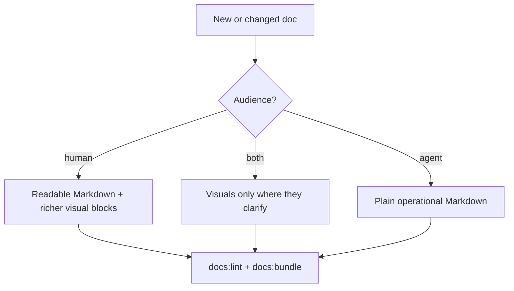

# Developer docs environment

## Doel

Deze repo gebruikt `docs/` niet alleen als documentatiemap, maar ook als lokale
Obsidian vault. De docs moeten daarom prettig werken in plain Markdown, VS Code
en Obsidian.

```text
╭────────────────────────────────────────────────────────────╮
│ BUDIO DOCS WORKSTATION                                     │
├────────────────────────────────────────────────────────────┤
│ REQUIRED   VS Code built-in Markdown + repo files          │
│ PRESENT    Mark Sharp, markdownlint, Obsidian MD           │
│ PLUS       Mermaid preview in VS Code                      │
│ VAULT      docs/ with docs/.obsidian configuration         │
╰────────────────────────────────────────────────────────────╯
```

## Basis: geen extra plugin verplicht

Standaard moet iedere `.md` leesbaar blijven in:

- VS Code source view
- VS Code built-in Markdown Preview
- Obsidian
- ChatGPT uploadcontext

Gebruik daarom geen HTML/CSS/animatie die nodig is om de inhoud te begrijpen.

## VS Code extensies

Aanbevolen extensies staan in `.vscode/extensions.json`.

Gebruik:

- `davidanson.vscode-markdownlint` voor Markdown linting
- `willasm.obsidian-md-vsc` voor Obsidian-achtige links in VS Code
- `bierner.markdown-mermaid` als plus voor Mermaid-rendering in VS Code preview
- `expo.vscode-expo-tools` voor app-development

Mark Sharp (`jonathan-yeung.mark-sharp`) is aanwezig en mag gebruikt worden,
maar is niet de standaard aanname voor docs-rendering. Als Mark Sharp minder
prettig voelt, gebruik dan de VS Code Markdown Preview met Mermaid-support als
stabielere default.

Installatiecontrole:

```bash
code --list-extensions | sort | rg "markdown|mermaid|obsidian|mark"
```

Optionele Mermaid-preview installatie:

```bash
code --install-extension bierner.markdown-mermaid
```

## Obsidian vault

Open in Obsidian de map:

```text
docs/
```

De vault-config staat in:

```text
docs/.obsidian/
```

Daarmee blijven graph, properties en Markdown-routing repo-lokaal. Gebruik
`docs/README.md` als vault-ingang.

## Schrijfregel voor visuele docs

Human-facing docs mogen een Budio Terminal-smaaklaag krijgen. Agent-only docs
blijven sober.


