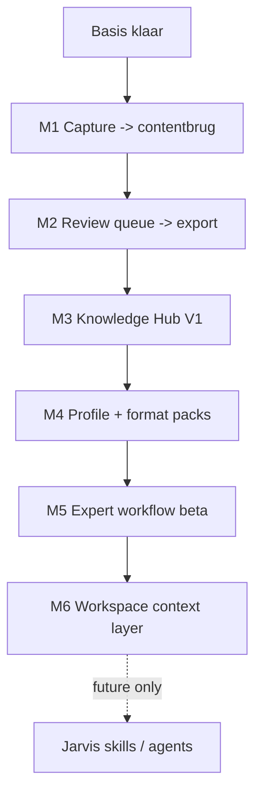

# DO NOT EDIT - GENERATED FILE

# Budio Roadmap Planning Pack

Build Timestamp (UTC): 2026-04-27T14:43:09.972Z
Source Commit: 0b5c2d3

Doel: uploadklare roadmapbundle voor maandblokken, epicniveau planning en post-basis roadmap review.
Dit bestand is niet leidend; de handmatig onderhouden bronbestanden blijven leidend.

## Bronbestanden
- docs/project/20-planning/70-post-basis-6-month-roadmap.md
- docs/dev/roadmap-planning-workflow.md
- docs/project/20-planning/_templates/month-block-roadmap-template.md
- docs/project/20-planning/_templates/epic-roadmap-item-template.md
- docs/project/20-planning/10-roadmap-phases.md
- docs/project/20-planning/30-now-next-later.md

## Leesregel
- Dit is een uploadartefact en geen canonieke bron voor repo-uitvoering.
- Canonieke roadmap- en workflowbronnen blijven de handmatige files in `docs/project/20-planning/**` en `docs/dev/**`.
- Gebruik dit pack wanneer iemand zonder projectcontext de roadmap, maandvolgorde, ROI en templates snel moet begrijpen.

## Gebruik
- Voor post-basis roadmapreview: upload dit bestand samen met `docs/upload/chatgpt-project-context.md`.
- Voor nieuwe of herziene maandroadmaps: gebruik de templates uit dit pack en werk de canonieke bronfiles bij.

---

## Post-Basis 6-Maandenroadmap

---
title: Post-basis 6-maandenroadmap
audience: human
doc_type: roadmap
source_role: operational
visual_profile: budio-terminal
upload_bundle: 50-budio-roadmap-planning-pack.md
---

# Post-basis 6-maandenroadmap - concept

## Status en leesregel

Dit is een concept-roadmap voor de periode nadat de basis klaar is.
Het is richtinggevend voor sequencing en productplanning, niet automatisch een set actieve taken.

```text
╔════════════════════════════════════════════════════════════════════╗
║ BUDIO ROADMAP CONSOLE                                            ║
╠════════════════════════════════════════════════════════════════════╣
║ MODE       post-basis concept                                    ║
║ UNIT       maandblokken op epicniveau                            ║
║ GOAL       buildbare volgorde voor testbare gebruikerswaarde     ║
║ FILTER     must-have eerst, nice-to-have alleen als ruimte helpt ║
╚════════════════════════════════════════════════════════════════════╝
```

Basis klaar betekent minimaal:

- 1.2B outputkwaliteit is expliciet genoeg voor beta-gebruik
- 1.2E private-beta readiness heeft voldoende runtimebewijs
- kernlus capture -> dagboeklaag -> reflecties blijft stabiel
- AIQS-basis en bestaande hardeningtaken blokkeren de volgende productlaag niet meer

## Strategische keuze

Na de basis bouwen we niet breder, maar scherper:

- eerst een builder/podcast wedge bewijzen
- daarna pas kennislaag, formats, workflow en Jarvis-ready structuur verdiepen
- geen publieke Jarvis-launch als shortcut

## Onderbouwing

Deze roadmap gebruikt een lichte combinatie van bewezen roadmapprincipes:

- doelen per maand in plaats van losse featurelijsten, geinspireerd door de GO Product Roadmap van Roman Pichler
- thema-roadmaps in plaats van sprintdetail, zoals ProductPlan beschrijft
- doel/uitkomst/werk-terug redeneren uit Atlassian roadmap guidance
- RICE-denken van Intercom als sanity-check op impact, confidence en effort
- Opportunity Solution Tree-denken van Product Talk om kans, probleem en oplossing gescheiden te houden

Bronnen:

- [Roman Pichler - GO Product Roadmap](https://www.romanpichler.com/tools/the-go-product-roadmap/)
- [Atlassian - Create a project roadmap](https://www.atlassian.com/agile/project-management/create-project-roadmap)
- [ProductPlan - Organize your roadmap by themes](https://www.productplan.com/learn/organize-your-roadmap-by-themes)
- [Intercom - RICE prioritization](https://www.intercom.com/blog/rice-simple-prioritization-for-product-managers/)
- [Product Talk - Opportunity Solution Trees](https://www.producttalk.org/opportunity-solution-trees/)

## Niet bouwen in deze roadmap

- Geen publieke Jarvis-launch.
- Geen brede Pro/Business/Private uitbreiding.
- Geen billing/credits/usage-economie.
- Geen zware sprint/cycle-machine als hoofdlaag.
- Geen brede scheduler/autopost-flow voordat de builder/podcast wedge bewezen is.

## Hoofdlijn

```text
┌────────────┐
│ Basis klaar│
└─────┬──────┘
      ▼
┌────────────────────────────────────────┐
│ M1 Capture naar eerste contentbrug     │
├────────────────────────────────────────┤
│ M2 Output review queue en export       │
├────────────────────────────────────────┤
│ M3 Knowledge Hub V1                    │
├────────────────────────────────────────┤
│ M4 Builder/podcast profile + packs     │
├────────────────────────────────────────┤
│ M5 Podcast/solo expert workflow beta   │
├────────────────────────────────────────┤
│ M6 Workspace + Jarvis-ready structuur  │
└────────────────────────────────────────┘
```



## Dependency flow

```text
Stabiele basis
  -> contentbrug
  -> review/export bewijs
  -> broncontext
  -> format/podcast herhaalbaarheid
  -> beta workflow
  -> workspace + Jarvis-ready contextlaag
```

## Must-have versus nice-to-have

```text
+---------+--------------------------------------+--------------------------------------+
| Maand   | Must-have                            | Nice-to-have                         |
+---------+--------------------------------------+--------------------------------------+
| M1      | entry -> output intent -> draft      | meerdere kanalen tegelijk            |
| M2      | review queue + export                | publishing/scheduler                 |
| M3      | source hub + citations               | brede document intelligence          |
| M4      | profile + format packs               | marketplace van formats              |
| M5      | podcast beta workflow                | autopost clips                       |
| M6      | workspace views + contextlaag        | publieke Jarvis                      |
+---------+--------------------------------------+--------------------------------------+
```

## Maand 1 - Capture Naar Eerste Contentbrug

### Doel

Maak van bestaande dagboek- en momentinput een eerste bewuste brug naar content-output voor builders/podcasters.
De gebruiker moet niet opnieuw vanaf een lege prompt beginnen.

### Waarom deze maand

De basis heeft al capture, daglaag en reflecties.
De grootste strategische gap is dat die context nog niet leidt tot een concrete builder-output.
Deze maand bewijst of Budio van persoonlijke context naar bruikbare publicatievoorbereiding kan bewegen.

### Eindgebruikerswaarde

De gebruiker kan een moment, dag of reflectie aanwijzen en daar een eerste contentrichting uit halen, zoals een post-idee, talking point of episode-angle.
Het voelt als hergebruik van eigen context, niet als generieke AI-output.

### Budio-ROI

Dit levert het eerste bewijs voor de publieke wedge: Budio helpt makers sneller van eigen input naar concrete contentvoorbereiding.
Het verhoogt strategische differentiatie zonder meteen scheduler, billing of teamfeatures te bouwen.

### Must-have epics

| Epic | Wat moet het kunnen | Waarom belangrijk | Afhankelijkheid |
| --- | --- | --- | --- |
| Output intent kiezen | Een gebruiker kiest vanuit een moment/dag het doel: post, talking point, podcast angle of outline. | Maakt output expliciet zonder open chat te introduceren. | Stabiele entry/day detail flow. |
| Eerste draft op basis van eigen context | Het systeem maakt een korte concept-output met bronverwijzing naar de gekozen input. | Bewijst de contentbrug en houdt output source-grounded. | AIQS/outputkwaliteit basis. |
| Review-first resultaat | Output landt als concept met duidelijke reviewstatus, niet als automatisch gepubliceerde content. | Voorkomt premature autopost en houdt vertrouwen hoog. | Bestaande edit/review patronen. |

### Nice-to-have epics

| Epic | Wat voegt het toe | Waarom niet must-have |
| --- | --- | --- |
| Meerdere kanaalvarianten | Een concept kan tegelijk als LinkedIn, newsletter of podcast-hook worden herschreven. | Eerst moet één sterke outputbrug bewezen worden. |
| Tone quick-picks | Snelle toonkeuze zoals helder, persoonlijk of scherp. | Kan wachten tot we echte reviewfeedback zien. |

### Rollout en testlogica

Start met founder/testers die al eigen capture-data hebben.
Goed genoeg wanneer testers zonder arrow-prompt of leeg scherm een bruikbare eerste output kunnen maken en snappen waar die op gebaseerd is.

### Niet bouwen in deze maand

Geen scheduler, geen autopost, geen brede contentkalender en geen publieke Jarvis-interface.

## Maand 2 - Output Review Queue En Export

### Doel

Maak gegenereerde concepten beheersbaar: bewaren, vergelijken, verbeteren, afkeuren en exporteren.

### Waarom deze maand

Maand 1 bewijst creatie.
Maand 2 bewijst workflow: gebruikers moeten niet losse outputs verliezen of direct moeten publiceren.

### Eindgebruikerswaarde

De gebruiker heeft één plek om concepten terug te vinden, te reviewen en klaar te maken voor publicatie buiten Budio.
Export is belangrijker dan publiceren binnen Budio.

### Budio-ROI

Reviewdata laat zien welke outputs waardevol zijn en waar kwaliteit tekortschiet.
Dit voedt AIQS, formatkeuzes en latere productbeslissingen.

### Must-have epics

| Epic | Wat moet het kunnen | Waarom belangrijk | Afhankelijkheid |
| --- | --- | --- | --- |
| Output review queue | Concepten krijgen status zoals nieuw, in review, goedgekeurd of afgewezen. | Maakt outputproductie beheersbaar zonder sprintmachine. | Maand 1 concept-output. |
| Source peek | Vanuit een concept kan de gebruiker snel de gebruikte entry/dag/reflectie zien. | Houdt vertrouwen en context vast. | Bronkoppeling uit M1. |
| Markdown/copy export | Goedgekeurde output kan schoon worden gekopieerd of als Markdown worden geëxporteerd. | Geeft direct nut zonder publishing-infra. | Review queue. |

### Nice-to-have epics

| Epic | Wat voegt het toe | Waarom niet must-have |
| --- | --- | --- |
| Simpele batch export | Meerdere goedgekeurde concepten in één export. | Eerst individuele review/export bewijzen. |
| Feedbacklabels | Gebruiker labelt waarom output goed of slecht is. | Waardevol, maar kan na basisreview volgen. |

### Rollout en testlogica

Test met 5-10 echte outputconcepten per gebruiker.
Goed genoeg wanneer de gebruiker concepten terugvindt, begrijpt, verbetert en buiten Budio kan gebruiken zonder extra uitleg.

### Niet bouwen in deze maand

Geen automatische publicatie, geen contentkalender als hoofdlaag en geen zware cycle/sprint-statussen.

## Maand 3 - Knowledge Hub V1

### Doel

Voeg een compacte bronlaag toe zodat output niet alleen op dagboekcontext leunt, maar ook op expliciete kennisbronnen.

### Waarom deze maand

Na review/export weten we welke outputtypes waarde hebben.
Daarna pas is het logisch om bronnen toe te voegen, omdat we weten waarvoor die bronnen nodig zijn.

### Eindgebruikerswaarde

De gebruiker kan belangrijke bronnen toevoegen of aanwijzen en ziet dat outputs beter onderbouwd zijn met context en citations.

### Budio-ROI

Dit vergroot differentiatie: Budio wordt geen generieke generator, maar een brongetrouwe contextmachine voor makers.
Het bouwt voort op AIQS in plaats van een losse knowledge-base te worden.

### Must-have epics

| Epic | Wat moet het kunnen | Waarom belangrijk | Afhankelijkheid |
| --- | --- | --- | --- |
| Source library V1 | Gebruiker kan beperkte bronnen toevoegen of registreren voor builder/podcast-output. | Legt fundament voor kennisgestuurde output. | Review/export flow uit M2. |
| Citation-aware output | Concepten tonen compacte bronverwijzingen of contextsignalen. | Vertrouwen en herleidbaarheid. | AIQS/grounding checks. |
| Source peek | Bronnen zijn snel previewbaar zonder context-switch. | Past bij rustige, preview-first UX. | Source library. |

### Nice-to-have epics

| Epic | Wat voegt het toe | Waarom niet must-have |
| --- | --- | --- |
| Brede documenttypen | PDF, audio, foto en webbronnen allemaal tegelijk. | Te breed voor V1; eerst klein bronbewijs. |
| Semantische zoekervaring | Vrij zoeken door alle bronnen. | Waardevol later, maar outputflow is belangrijker. |

### Rollout en testlogica

Begin met enkele bronsoorten en echte builder/podcast-bronnen.
Goed genoeg wanneer bronnen zichtbaar betere en beter herleidbare outputs opleveren.

### Niet bouwen in deze maand

Geen brede document intelligence-suite en geen publieke second-brain positionering.

## Maand 4 - Builder/Podcast Profile En Format Packs

### Doel

Maak herhaalbare output mogelijk via profielen, formats en stijlkeuzes.
De gebruiker moet minder vaak dezelfde context uitleggen.

### Waarom deze maand

Na M1-M3 weten we welke outputs werken en welke bronnen nuttig zijn.
Dan pas kunnen vaste formats en profielen waardevol worden in plaats van premature configuratie.

### Eindgebruikerswaarde

De gebruiker legt eenmalig positionering, doelgroep, toon en favoriete outputformats vast.
Nieuwe outputs sluiten daarna beter aan zonder telkens opnieuw promptwerk.

### Budio-ROI

Profielen en format packs verhogen herhaalgebruik en maken de builder/podcast wedge verkoopbaarder.
Ze vormen ook een later fundament voor pricing, maar zonder nu billing te bouwen.

### Must-have epics

| Epic | Wat moet het kunnen | Waarom belangrijk | Afhankelijkheid |
| --- | --- | --- | --- |
| Builder/podcast profile | Vaste context voor doelgroep, propositie, toon en expertisegebied. | Vermindert herhaling en verbetert outputconsistentie. | Reviewfeedback uit M2-M3. |
| Format packs V1 | Enkele vaste formats zoals solo episode outline, LinkedIn post, newsletter intro en talking points. | Maakt waarde concreet en testbaar. | Profiel en output queue. |
| Format preview | Gebruiker ziet vooraf wat een format oplevert en waarvoor het bedoeld is. | Voorkomt dashboard- of prompt-chaos. | Format packs. |

### Nice-to-have epics

| Epic | Wat voegt het toe | Waarom niet must-have |
| --- | --- | --- |
| Custom format builder | Gebruiker maakt eigen formats. | Eerst moeten standaardformats bewezen zijn. |
| Team/klantprofielen | Meerdere profielen voor verschillende merken of klanten. | Past later bij Pro/Business, niet nu. |

### Rollout en testlogica

Test met 2-3 archetypes: solo expert, podcastmaker en builder/founder.
Goed genoeg wanneer profiel + format minder correctierondes oplevert dan losse output.

### Niet bouwen in deze maand

Geen marketplace, geen teamspaces en geen brede Business-laag.

## Maand 5 - Podcast/Solo Expert Workflow Beta

### Doel

Bundel capture, bronnen, formats en review tot één end-to-end workflow voor podcastmakers en solo experts.

### Waarom deze maand

Pas nu zijn de noodzakelijke bouwstenen aanwezig: outputbrug, review/export, broncontext en formats.
Deze maand bewijst of de wedge echt als productflow werkt.

### Eindgebruikerswaarde

De gebruiker kan van idee en bronnen naar een aflevering-outline, talking points, show notes en publicatievoorbereiding.
Het blijft review-first en source-grounded.

### Budio-ROI

Dit is het scherpste validatiemoment voor retentie en commerciële waarde.
Als deze workflow niet aanslaat, is brede opschaling te vroeg.

### Must-have epics

| Epic | Wat moet het kunnen | Waarom belangrijk | Afhankelijkheid |
| --- | --- | --- | --- |
| Episode/project workspace | Eén lichte werkruimte voor een aflevering of solo expert asset. | Verbindt losse outputs tot een echte workflow. | M1-M4 capabilities. |
| Outline + talking points | Genereert outline en talking points uit eigen context en bronnen. | Kernwaarde voor podcast/builder wedge. | Source hub + format packs. |
| Show notes/export pack | Maakt een exporteerbaar pakket met show notes, summary en post-ideeën. | Direct bruikbaar buiten Budio. | Review queue/export. |

### Nice-to-have epics

| Epic | Wat voegt het toe | Waarom niet must-have |
| --- | --- | --- |
| Clip-ideeën | Ideeën voor short clips of quotes. | Nuttig, maar pas na outline/show notes. |
| Gastvoorbereiding | Specifieke guest prep flow. | Later uitbreiden als solo expert flow bewijs heeft. |

### Rollout en testlogica

Beta met kleine groep makers die echt een aflevering of expertstuk voorbereiden.
Goed genoeg wanneer de workflow tijd bespaart, betere structuur oplevert en buiten Budio gebruikt wordt.

### Niet bouwen in deze maand

Geen autopost, geen full scheduler en geen brede customer-support suite.

## Maand 6 - Workspace En Jarvis-Ready Structuur

### Doel

Breng structuur aan rond intake, views, beslissingen en uitvoering zodat Budio later Jarvis-compatible wordt zonder Jarvis nu publiek te maken.

### Waarom deze maand

Na de wedge-beta weten we welke werkobjecten bestaan: bronnen, outputs, episodes, reviews, beslissingen en vervolgacties.
Pas dan is workspace-structuur waardevol en geen abstract intern systeem.

### Eindgebruikerswaarde

De gebruiker krijgt overzicht: wat is nieuw, wat wacht op review, wat is klaar voor export, en welke bron of beslissing hoort erbij.

### Budio-ROI

Dit verbetert interne snelheid en legt de contextlaag voor toekomstige Jarvis-skills/agents.
Het voorkomt dat Jarvis bovenop rommelige data en losse workflows wordt gebouwd.

### Must-have epics

| Epic | Wat moet het kunnen | Waarom belangrijk | Afhankelijkheid |
| --- | --- | --- | --- |
| Workspace views | Saved views voor inbox, review, sources, outputs en episode/project work. | Maakt werk vindbaar en bestuurbaar. | M1-M5 objecten. |
| Decision view | Belangrijke keuzes rond formats, bronnen en outputrichting zijn zichtbaar en herleidbaar. | Helpt planning en productontwikkeling. | Review/source metadata. |
| Jarvis-ready context layer | Objecten krijgen genoeg context en status om later door Jarvis/agents gebruikt te worden. | Bouwt toekomstfundament zonder publieke Jarvis-belofte. | Workspace views. |

### Nice-to-have epics

| Epic | Wat voegt het toe | Waarom niet must-have |
| --- | --- | --- |
| Slack/GitHub event ingest | Interne workflow-events automatisch binnenhalen. | Eerst workspace-objectmodel stabiel maken. |
| Agent quick actions | Jarvis-achtige assistive acties op objects. | Pas na stabiele structuurlaag. |

### Rollout en testlogica

Eerst intern/founder-only en met beta-outputdata.
Goed genoeg wanneer de workspace minder contextverlies geeft en vervolgwerk sneller te prioriteren is.

### Niet bouwen in deze maand

Geen publieke Jarvis, geen brede automationlaag en geen enterprise workspace.

## Volgordecontrole

```text
Kan M2 zonder M1? Nee, review queue heeft concept-output nodig.
Kan M3 voor M2? Liever niet, bronnen hebben pas waarde als output/review scherp is.
Kan M4 voor M3? Beperkt, maar formats worden sterker met bron- en reviewbewijs.
Kan M5 voor M4? Nee, beta workflow heeft formats/profiel nodig.
Kan M6 eerder? Alleen intern, maar productmatig is structuur pas logisch na echte wedge-objecten.
```

## Vervolg

De basis-roadmap wordt apart uitgewerkt met dezelfde templates.
Deze post-basis roadmap blijft de conceptlijn voor wat er na de basis gebouwd wordt.

---

## Roadmap Planning Workflow

---
title: Roadmap planning workflow
audience: agent
doc_type: workflow
source_role: operational
visual_profile: plain
upload_bundle: 50-budio-roadmap-planning-pack.md
---

# Roadmap planning workflow

## Doel

Een vaste, goedkope workflow voor maandroadmaps op epicniveau.
De workflow helpt om strategie te vertalen naar bouwbare maandblokken zonder direct in taskniveau, sprintceremonies of brede productfantasie te vallen.

## Wanneer gebruiken

Gebruik deze workflow bij:

- nieuwe concept-roadmaps
- bestaande roadmap herzien
- maandblokken of fasering uitleggen aan iemand zonder projectcontext
- uploadklare planningpacks maken voor ChatGPT Projects of externe review

Gebruik deze workflow niet voor:

- losse bugfixes
- concrete implementatietaken
- taskboard-herordening zonder strategische impact

## Bronnenvolgorde

1. `docs/project/README.md`
2. `docs/project/master-project.md`
3. `docs/project/product-vision-mvp.md`
4. `docs/project/current-status.md`
5. `docs/project/open-points.md`
6. `docs/project/20-planning/**`
7. relevante ideas/research uit `docs/project/30-research/**` en `docs/project/40-ideas/**`

Regel:

- gebruik `docs/upload/**` nooit als bron
- gebruik generated docs nooit als canonieke bron
- wijzig actieve strategie/planning alleen met expliciete gebruikersvraag of expliciet overlegbesluit

## Uitvoerblokken

De agent bepaalt zelf de efficiëntste blokken op basis van huidige agent/model, scope, risico en repo-state.

Standaard voor roadmapwerk:

```text
1. Context
   lees alleen relevante canonieke docs en bestaande planning

2. Structuur
   kies maandblokken, template en visualisatievorm

3. Roadmap
   schrijf epicniveau: doel, must-have, nice-to-have, ROI, volgorde

4. Uploadpack
   zorg dat bundler/uploadartefact de roadmap kan meenemen

5. Verify
   docs lint, docs bundle, bundle verify en taskflow verify
```

Vraag de gebruiker alleen om fasering wanneer er een echte product-, planning- of architectuurtradeoff is.
Vraag niet om toestemming voor simpele blokindeling.

## Roadmapvorm

Elke maand moet bevatten:

- duidelijke titel
- strategisch doel
- eindgebruikerswaarde
- Budio-ROI
- must-have epics
- nice-to-have epics
- technische afhankelijkheden
- rolloutvolgorde
- test- of pilotlogica
- waarom deze maand nu komt

Elke epic blijft:

- buildbaar
- high-level
- niet op taskniveau
- gekoppeld aan gebruikerswaarde of Budio-ROI

## Prioriteringsregels

Gebruik een lichte combinatie van:

- doel-naar-feature mapping, geinspireerd door de GO Product Roadmap van Roman Pichler
- thema-roadmaps in plaats van losse featurelijsten, zoals ProductPlan adviseert
- doel/uitkomst/werk-terug redeneren, zoals Atlassian roadmap guidance beschrijft
- RICE-denken van Intercom als sanity-check op impact, confidence en effort
- Opportunity Solution Tree-denken van Product Talk om probleem, kans en oplossing niet te verwarren

Bronnen:

- [Roman Pichler - GO Product Roadmap](https://www.romanpichler.com/tools/the-go-product-roadmap/)
- [Atlassian - Create a project roadmap](https://www.atlassian.com/agile/project-management/create-project-roadmap)
- [ProductPlan - Organize your roadmap by themes](https://www.productplan.com/learn/organize-your-roadmap-by-themes)
- [Intercom - RICE prioritization](https://www.intercom.com/blog/rice-simple-prioritization-for-product-managers/)
- [Product Talk - Opportunity Solution Trees](https://www.producttalk.org/opportunity-solution-trees/)

## Visualisatie

Gebruik eenvoudige ASCII wanneer dat de roadmap sneller scanbaar maakt.

Goede vormen:

- tijdlijn
- dependency flow
- must-have versus nice-to-have matrix
- rolloutfunnel

Geen zware diagramtooling nodig zolang Markdown leesbaar blijft.

## Acceptatiecriteria

Een roadmap is pas goed genoeg wanneer:

- iemand zonder projectcontext begrijpt waarom de maanden zo zijn ingedeeld
- must-have en nice-to-have expliciet gescheiden zijn
- de volgorde technisch en gebruikersmatig logisch is
- niet-bouwen expliciet benoemd is
- Jarvis niet stiekem publieke scope wordt
- de roadmap uploadklaar beschikbaar is via `docs/upload/**`

---

## Maandblok Roadmap Template

---
title: Maandblok roadmap template
audience: both
doc_type: template
source_role: operational
visual_profile: budio-terminal
upload_bundle: 50-budio-roadmap-planning-pack.md
---

# Template - Maandblok Roadmap

Gebruik dit template voor één maandblok op epicniveau.
Verwijder instructieregels wanneer je een echte roadmap schrijft.

## Maand {nummer} - {titel}

### Doel

Beschrijf in 1-2 zinnen welke uitkomst deze maand moet opleveren.

### Waarom deze maand

- Waarom komt dit nu in de volgorde?
- Welke eerdere maand of basisvoorwaarde maakt dit mogelijk?
- Welk risico ontstaat als dit later komt?

### Eindgebruikerswaarde

- Wat kan de gebruiker na deze maand concreet beter, sneller of betrouwbaarder?

### Budio-ROI

- Wat levert dit Budio op: bewijs, retentie, snelheid, differentiatie, leerdata, of verkoopbaarheid?

### Must-have epics

| Epic | Wat moet het kunnen | Waarom belangrijk | Afhankelijkheid |
| --- | --- | --- | --- |
| `<epic titel>` | `<gedrag op epicniveau>` | `<user/business reden>` | `<basis of vorige maand>` |

### Spec-readiness per must-have epic

- User outcome:
- Happy flow:
- Belangrijkste non-happy flows:
- UX/copy richting:
- Data/IO impact:
- Eerste task die spec-ready moet zijn:

### Nice-to-have epics

| Epic | Wat voegt het toe | Waarom niet must-have |
| --- | --- | --- |
| `<epic titel>` | `<extra waarde>` | `<reden om uit te stellen als nodig>` |

### Rollout en testlogica

- Welke groep test dit eerst?
- Wat bewijst dat de maand goed genoeg is?
- Welke feedback bepaalt of nice-to-have wel of niet wordt opgepakt?

### Niet bouwen in deze maand

- Benoem expliciet wat bewust buiten deze maand blijft.

---

## Epic Roadmap Item Template

---
title: Epic roadmap item template
audience: both
doc_type: template
source_role: operational
visual_profile: plain
upload_bundle: 50-budio-roadmap-planning-pack.md
---

# Template - Epic Roadmap Item

Gebruik dit template wanneer een roadmap-epic los uitgewerkt moet worden zonder naar taskniveau te zakken.

## Epic: {titel}

### Korte omschrijving

Beschrijf het gedrag op productniveau in 2-4 zinnen.

### Gebruikersprobleem

- Welk concreet probleem lost dit op?

### Functionele capability

- Wat moet het systeem kunnen?
- Welke output of toestand ziet de gebruiker?
- Welke bestaande flow wordt versterkt?

### Flow en failure states

- Happy flow op epicniveau:
- Belangrijkste non-happy flows:
- Empty/loading/error/retry states:

### UX / copy richting

- Welke bestaande UX- of copybron is leidend?
- Welke producttaal of labels staan vast?

### Waarom prioriteit

- User value:
- Budio ROI:
- Timing:

### Must-have

- Capability die nodig is voor de epic om waarde te leveren.

### Nice-to-have

- Capability die waarde toevoegt, maar niet nodig is voor de eerste bruikbare versie.

### Afhankelijkheden

- Technisch:
- Product:
- Data/AI:

### Acceptatie op epicniveau

- Hoe weten we dat deze epic op maandniveau voldoende is?

### Promotie naar tasks

- Welke P1 tasks zijn nodig voor de eerste werkende versie?
- Welke nice-to-have tasks blijven P2?
- Welke task moet eerst spec-ready gemaakt worden?

---

## Roadmap Fases

# Roadmap phases (lean)

## Doel

Eén overzicht van projectfases met status, zonder detail-overload.

## Obsidian links

- Planning hub
- Active phase
- Now / Next / Later
- Deviations and decisions
- Current status
- Open points

## Fasekaart

| Fase | Doel | Status |
| --- | --- | --- |
| Fase 1 (kernlus) | capture -> dagboeklaag -> reflecties bouwen | afgerond als basis |
| Fase 1.2 (hardening) | stabiliteit, kwaliteit, UX, vertrouwen, beta-readiness | afgerond in delen / blijft onderhoudsspoor |
| Fase 2A (Jarvis intern) | founder-only local-first intelligence in app + workspace | idee/research lane (geen actieve bouwtaak) |
| Fase 2B (Knowledge Hub + AIQS) | source ingest, grounding, citations en quality loop | later na Fase 3 (high-prio idee) |
| Fase 3 (publieke wedge) | builders/podcasters: kennisgestuurde outputworkflows | next (uitvoeringsprioriteit boven 2B) |
| Fase 4 (opschaling) | bredere productisering/commerciële lagen | later |

## Regel

- Alleen `planning/20-active-phase.md` bepaalt wat nu actief focusgebied is.

---

## Now Next Later

---
title: Now Next Later
audience: human
doc_type: planning
source_role: operational
visual_profile: budio-terminal
upload_bundle: 10-budio-core-product-and-planning.md
---

# Now / Next / Later

## Doel

Lean focusbord voor kanban-achtige planning zonder overgedetailleerde sprintadministratie.

```text
┌──────────────────────────────────────────────────────────────┐
│ BUDIO PLANNING RADAR                                         │
├───────────────┬──────────────────────────────────────────────┤
│ NOW           │ bewijs, basis, AIQS, lopende fase            │
│ NEXT          │ builder/podcast wedge + Knowledge Hub prep   │
│ LATER         │ Jarvis public, Pro, billing, scheduler       │
└───────────────┴──────────────────────────────────────────────┘
```


## Obsidian links

- Planning hub
- Active phase
- Budio Workspace plugin focus
- Deviations and decisions
- Current status
- Open points
- Ideas workspace

## Now

- Plan A (primair): AIQS-basis en lopende faseafspraken afronden met bewijs.
- 1.2B en 1.2E afronding als onderhoudsspoor binnen de huidige fase.
- Plan B (secondary): Jarvis internal-only researchlane als idee/epic-candidate (geen bouwtaak), max 1 dag per week.
- Budio Workspace plugin gebruiken als dagelijkse uitvoeringslaag met prioriteit op Plan A.

## Next

- Fase 3 builders/podcasters uitvoeren als eerstvolgende prioriteit.
- Knowledge Hub (hoog-prio) inhoudelijk voorbereiden als epic-candidate voor fase na Fase 3.
- Scope en evaluatiecriteria voor Knowledge Hub + AIQS concretiseren (grounding/citations/relevance) zonder taakpromotie in Q2.
- Competitor benchmark sprint (Wispr Flow + NotebookLM) plannen als researchspoor na AIQS-live (harde gate, geen `Now`-bouwscope).
- Jarvis interne workflowuitbreiding alleen binnen afgesproken researchcapaciteit.

## Later

- Mogelijke externalisatie van Jarvis pas na expliciet strategisch besluit.
- Verdere productisering van Knowledge Hub + AIQS als brede kennisbanklaag.
- Brede Pro-laag, Business/Private en commerciële operatie opschalen op basis van bewijs.
- Scheduler/autopost pas oppakken als builder/podcast wedge bewezen is.

## Parking lot

- Nieuwe ideeën eerst kort in `docs/project/40-ideas/00-ideas-inbox.md`.
