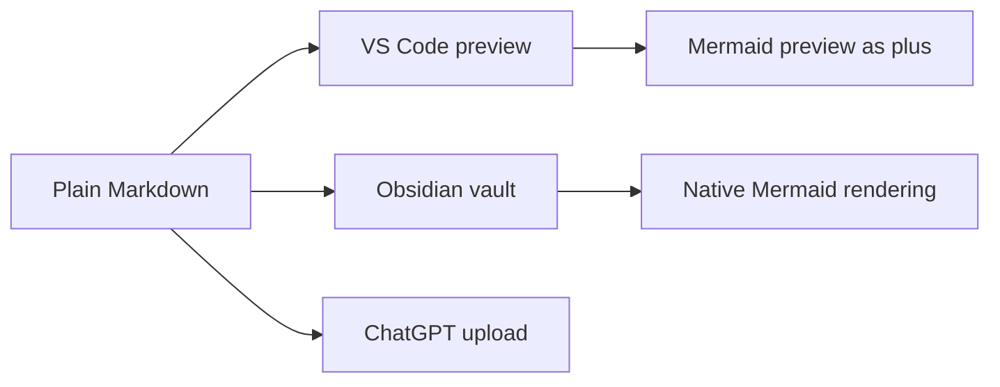
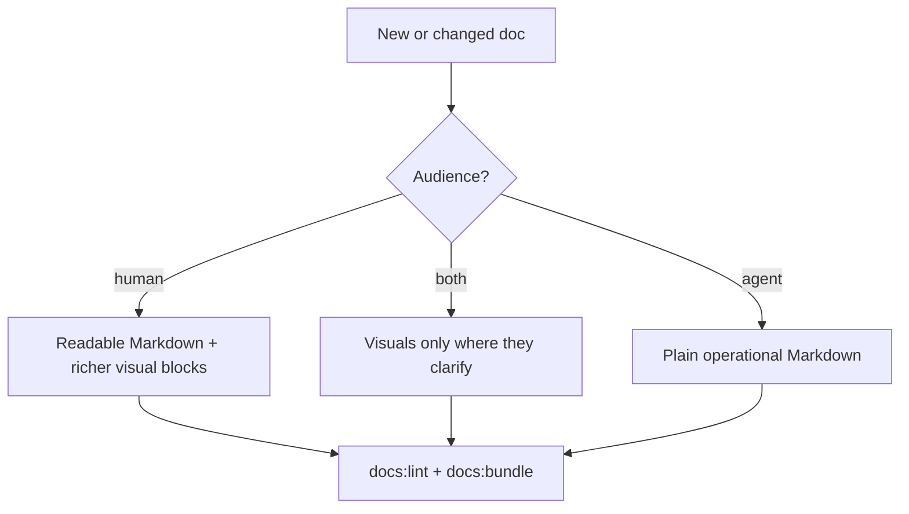

# DO NOT EDIT - GENERATED FILE

# Budio Agent Workflow and Docs Tooling

Build Timestamp (UTC): 2026-04-27T17:04:55.707Z
Source Commit: d6eeb0a

Doel: uploadklare bundel voor agentwerkwijze, docs-tooling, audience-metadata en developer setup.
Dit bestand is niet leidend; de handmatig onderhouden bronbestanden blijven leidend.

## Bronbestanden
- docs/README.md
- docs/project/00-docs-governance/README.md
- docs/setup/developer-docs-environment.md
- docs/setup/step-0-readiness.md
- docs/dev/README.md
- docs/dev/cline-workflow.md
- docs/dev/ai-execution-os-generic.md
- docs/dev/task-lifecycle-workflow.md
- docs/dev/roadmap-planning-workflow.md
- AGENTS.md
- .agents/skills/task-status-sync-workflow/SKILL.md
- .agents/skills/scope-guard/SKILL.md
- docs/Budio AI Operating System/Budio AI Operating System.md (excerpt)

## Leesregel
- Dit is een uploadartefact en geen canonieke bron voor repo-uitvoering.
- Gebruik canonieke handmatige docs, `AGENTS.md`, `.agents/skills/**` en `docs/dev/**` als bron.
- Gebruik deze bundel alleen voor externe review of ChatGPT Project-context rond agent/docs-workflow.

## Upload- en docs-policy kern
- `docs/upload/**` is generated, upload-only en nooit leidend.
- Human-facing docs mogen Budio Terminal-visueel zijn zolang plain Markdown blijft werken.
- Agent-only docs blijven sober en operationeel.
- De Obsidian vault is `docs/`; de vault-config staat in `docs/.obsidian/`.

---

## Docs Hub

---
title: Docs hub
audience: both
doc_type: hub
source_role: canonical
visual_profile: budio-terminal
upload_bundle: 80-budio-agent-workflow-and-docs-tooling.md
---

# Docs hub

Dit is de hoofdingang van de docs-vault.

## Snelle start

- Project hub
- Docs governance
- Design hub
- Dev docs hub
- Developer docs environment
- MVP design spec
- Cline workflow
- Upload manifest

```text
╔══════════════════════════════════════════════╗
║ BUDIO DOCS VAULT                            ║
╠══════════════════════════════════════════════╣
║ START    project/README                     ║
║ HUMAN    strategy, planning, research, ideas║
║ AGENT    dev workflows, skills, taskflow    ║
║ BOTH     governance, status, upload context ║
╚══════════════════════════════════════════════╝
```

## Vault-routing

- `docs/project/**` = actieve projectwaarheid
- `docs/design/**` = design authority, specs en design-archief
- `docs/dev/**` = operationele workflow en lokale notities
- `docs/setup/**` = lokale setup/readiness
- `docs/upload/**` = generated uploadset, niet canoniek

Audience-routing staat in frontmatter:

- `audience: human` voor strategie, planning, research en ideeën die mensen meenemen.
- `audience: agent` voor uitvoeringsregels en workflowdocs.
- `audience: both` voor gedeelde waarheid en hubs.

## Obsidian graph hubs

- Strategy hub
- Planning hub
- Research hub
- Ideas hub
- Docs governance
- Current status
- Open points

## Generated en archive beleid

- `docs/project/generated/**` en `docs/design/generated/**` zijn afgeleid, niet leidend.
- `docs/project/archive/**`, `docs/design/archive/**`, `docs/dev/archive/**` zijn historisch.
- Voor graph-focus kun je in Obsidian filteren op padprefix `project/`.

---

## Docs Governance

---
title: Docs governance, audience en visual language
audience: both
doc_type: governance
source_role: canonical
visual_profile: budio-terminal
upload_bundle: 80-budio-agent-workflow-and-docs-tooling.md
---

# Docs governance, audience en visual language

## Doel

Deze laag maakt expliciet voor wie een document bedoeld is, hoe het gelezen
moet worden en wanneer visuele verrijking waarde toevoegt.

```text
╔══════════════════════════════════════════════════════════════════╗
║ BUDIO DOCS TERMINAL                                             ║
╠══════════════════════════════════════════════════════════════════╣
║ MODE        docs-governance                                     ║
║ RULE        serious first, nerdy enough                         ║
║ RENDER      plain Markdown baseline, richer in Obsidian/VS Code ║
║ BOUNDARY    no IP-copy, no gimmick overload                     ║
╚══════════════════════════════════════════════════════════════════╝
```

## Metadata-contract

Nieuwe of actieve handmatige docs krijgen frontmatter wanneer ze onderdeel zijn
van projectwaarheid, planning, research, ideas, setup of workflow.

Vaste velden:

| Veld | Waarden | Betekenis |
| --- | --- | --- |
| `title` | vrije titel | Menselijke titel voor vault, bundler en uploadcontext. |
| `audience` | `human`, `agent`, `both` | Primaire lezer: gebruiker/founder, agent/AI, of allebei. |
| `doc_type` | vrije korte categorie | Bijvoorbeeld `hub`, `strategy`, `planning`, `research`, `workflow`, `setup`. |
| `source_role` | `canonical`, `operational`, `reference`, `generated`, `archive` | Waarheidsrol van het document. |
| `visual_profile` | `plain`, `budio-terminal`, `diagram-first` | Hoe rijk de Markdown visueel mag zijn. |
| `upload_bundle` | uploadbestandsnaam of `none` | In welke generated uploadcontext het document terecht hoort. |

## Audience-regels

- `human`: uitleg, strategie, planning, roadmap, ideeën en besliscontext voor mensen.
- `agent`: uitvoeringsregels, skills, checklists en technische workflow voor agents.
- `both`: docs die mensen en agents allebei nodig hebben als gedeelde waarheid.

Regel: als een document vooral een agent moet sturen, voeg geen extra sfeerlaag
toe. Als een document een mens moet meenemen in strategie of planning, mag het
wel visueel meer karakter krijgen.

## Budio Terminal visual profile

De Budio Terminal-stijl is een interne docs-smaaklaag, geen productdesignsystem.
Hij is geinspireerd door retro terminals en mission-control interfaces, maar
kopieert geen bestaande serie, game of IP.

Gebruik:

- terminalpanelen met `text` codeblocks voor status, sequencing en prioriteit
- Mermaid-diagrammen voor flow, dependencies en roadmapstructuur
- compacte radar/mission-control blokken voor menselijke oriëntatie
- normale Markdown als basis, zodat lezen zonder plugin altijd werkt

Niet gebruiken:

- animatie als harde afhankelijkheid
- HTML/CSS die in ChatGPT, GitHub of Obsidian slecht degradeert
- gimmicks die de inhoud overheersen
- productcopy richting app-eindgebruikers

## Portable rendering



Baseline:

- elk document blijft leesbaar als ruwe Markdown
- Mermaid is handig voor preview, maar de omliggende tekst moet de boodschap ook dragen
- uploadbundels blijven `.md`-bestanden zonder assets of runtime-afhankelijkheden

## Folderstructuur-regel

We doen nu geen brede foldermigratie. Metadata en bundling lossen de verwarring
goedkoper en veiliger op.

Een mogelijke folderherziening krijgt pas vervolg na bewijs uit deze fase.
Daarvoor bestaat de blocked task:
`docs/project/25-tasks/open/docs-folderstructuur-en-visual-language-herbeoordeling-na-metadatafase.md`.

---

## Developer Docs Environment

---
title: Developer docs environment
audience: human
doc_type: setup
source_role: operational
visual_profile: budio-terminal
upload_bundle: 80-budio-agent-workflow-and-docs-tooling.md
---

# Developer docs environment

## Doel

Deze repo gebruikt `docs/` niet alleen als documentatiemap, maar ook als lokale
Obsidian vault. De docs moeten daarom prettig werken in plain Markdown, VS Code
en Obsidian.

```text
╭────────────────────────────────────────────────────────────╮
│ BUDIO DOCS WORKSTATION                                     │
├────────────────────────────────────────────────────────────┤
│ REQUIRED   VS Code built-in Markdown + repo files          │
│ PRESENT    Mark Sharp, markdownlint, Obsidian MD           │
│ PLUS       Mermaid preview in VS Code                      │
│ VAULT      docs/ with docs/.obsidian configuration         │
╰────────────────────────────────────────────────────────────╯
```

## Basis: geen extra plugin verplicht

Standaard moet iedere `.md` leesbaar blijven in:

- VS Code source view
- VS Code built-in Markdown Preview
- Obsidian
- ChatGPT uploadcontext

Gebruik daarom geen HTML/CSS/animatie die nodig is om de inhoud te begrijpen.

## VS Code extensies

Aanbevolen extensies staan in `.vscode/extensions.json`.

Gebruik:

- `davidanson.vscode-markdownlint` voor Markdown linting
- `willasm.obsidian-md-vsc` voor Obsidian-achtige links in VS Code
- `bierner.markdown-mermaid` als plus voor Mermaid-rendering in VS Code preview
- `expo.vscode-expo-tools` voor app-development

Mark Sharp (`jonathan-yeung.mark-sharp`) is aanwezig en mag gebruikt worden,
maar is niet de standaard aanname voor docs-rendering. Als Mark Sharp minder
prettig voelt, gebruik dan de VS Code Markdown Preview met Mermaid-support als
stabielere default.

Installatiecontrole:

```bash
code --list-extensions | sort | rg "markdown|mermaid|obsidian|mark"
```

Optionele Mermaid-preview installatie:

```bash
code --install-extension bierner.markdown-mermaid
```

## Obsidian vault

Open in Obsidian de map:

```text
docs/
```

De vault-config staat in:

```text
docs/.obsidian/
```

Daarmee blijven graph, properties en Markdown-routing repo-lokaal. Gebruik
`docs/README.md` als vault-ingang.

## Schrijfregel voor visuele docs

Human-facing docs mogen een Budio Terminal-smaaklaag krijgen. Agent-only docs
blijven sober.



---

## Step 0 Readiness

---
title: Step 0 readiness check
audience: human
doc_type: setup
source_role: operational
visual_profile: plain
upload_bundle: 80-budio-agent-workflow-and-docs-tooling.md
---

Status: Setup referentie
Zie: docs/project/current-status.md

# STEP 0 Readiness Check

## Wat al klaar staat

- Basisproject voor Expo + TypeScript staat op orde (`.nvmrc`, `.editorconfig`, `.gitignore`, scripts in `package.json`).
- Expo Router app-shell en minimale tabs werken als bootstrap zonder productfeatures.
- Centrale themelaag en app-config/constants zijn aanwezig.
- Supabase developerlaag is gescaffold (`src/lib/supabase`) met typed client/server placeholders en env-validatie.
- Server-side AI scaffold staat klaar (`src/server/ai`) met contracts, flow stubs, prompt versioning placeholders en logging placeholders.
- Securitygrens is gedocumenteerd: `OPENAI_API_KEY` is server-only.

## Wat je nog handmatig moet doen

- Activeer Node 24: `nvm use`.
- Vul lokale env in op basis van `.env.example` (gebruik echte waarden, geen placeholders).
  - Kies actief target via `EXPO_PUBLIC_SUPABASE_TARGET` (`local` of `cloud`).
- Voor lokale Supabase stack:
  - `npx supabase start`
- Login en link Supabase project lokaal alleen als je cloud-acties wilt uitvoeren:
  - `npx supabase login`
  - `npx supabase init`
  - `npx supabase link --project-ref <jouw-project-ref>`
- Regenerate DB types wanneer schema wijzigt:
  - `npx supabase gen types typescript --linked --schema public > src/lib/supabase/database.types.ts`
- Voor Edge Functions lokaal:
  - `npm run dev` start lokale Supabase stack + lokale functions runtime + Expo.
  - `npm run supabase:functions:serve` start alleen de lokale functions runtime.
  - `npm run supabase:functions:restart` herstart de lokale functions runtime na function-codewijzigingen.
  - Gebruik geen custom function-env namen die met `SUPABASE_` beginnen in `.env.local`.
- Productie deploy van Supabase Edge Functions loopt alleen via GitHub Actions (`.github/workflows/deploy.yml`), niet via `npm run dev`.
- Voor lokale auth redirects gebruikt de Supabase config nu `http://localhost:8081` / `http://127.0.0.1:8081` voor Expo web.

## Smoke test commando's

```bash
npm install
npm run lint
npm run typecheck
npm run dev
```

Optioneel per platform:

```bash
npm run web
npm run ios
npm run android
```

## Blokkades voordat stap 1 mag starten

- `OPENAI_API_KEY`, `APP_SUPABASE_SERVICE_ROLE_KEY` en andere server-only secrets moeten alleen server-side gebruikt blijven.
- `.env.local` moet volledig en correct zijn ingevuld; anders blijven server stubs in fallback-modus.
- Supabase CLI moet alleen voor cloud/synchronisatie-acties aan het juiste project-ref gelinkt zijn.
- `lint` en `typecheck` moeten groen blijven op de branch waar stap 1 start.

---

## Dev Docs Hub

---
title: Dev docs hub
audience: agent
doc_type: hub
source_role: operational
visual_profile: plain
upload_bundle: 80-budio-agent-workflow-and-docs-tooling.md
---

# Dev docs hub

## Doel

Navigatie voor operationele workflowdocs en tijdelijke context.

## Actieve workflowbestanden

- Cline workflow
- Local development environment
- AI execution OS (generiek)
- UI assembly decision tree
- Stitch workflow
- Memory bank
- Active context
- Idea lifecycle workflow
- Local auth smoke workflow
- Developer docs environment

## Historische en lokale notities

- Dev archive

## Overige lagen

- Docs hub
- Project hub

---

## Cline Workflow

---
title: Cline workflow
audience: agent
doc_type: workflow
source_role: operational
visual_profile: plain
upload_bundle: 80-budio-agent-workflow-and-docs-tooling.md
---

# Cline workflow (operationeel)

## Doel

Operationele werkwijze voor werken met ChatGPT Projects + Cline, zonder productwaarheid te vervuilen.

## Execution OS (compact)

- Voor harde MVP-scope en uitvoerdiscipline: gebruik `.clinerules/workflows/budio-cline-execution-os.md`.
- Deze workflow blijft aanvullend en vervangt `AGENTS.md` of `docs/project/**` niet.

## Rolverdeling

- **ChatGPT Projects**: strategie, review en promptontwerp buiten repo-uitvoering.
- **Cline in VS Code**: repo-analyse, plan, wijzigingen, verify en commit.

## Bronnenvolgorde

1. `docs/project/README.md`
2. `AGENTS.md`
3. taakrelevante canonieke handmatige docs in `docs/project/**` (excl. `docs/project/generated/**` en `docs/project/archive/**`)
4. bij niet-triviale uitvoertaken: `docs/project/open-points.md` + relevante taskfile in `docs/project/25-tasks/**`
5. relevante skill(s) in `.agents/skills/**` wanneer de taak daar expliciet onder valt
6. `docs/dev/active-context.md` alleen wanneer recente sessiecontext of WIP relevant is

Regels:

- `docs/project/**` = canonieke projectwaarheid.
- `docs/project/24-epics/**` = operationele bundellaag voor groter werk boven tasks.
- `docs/project/25-tasks/**` = operationele taaklaag voor de huidige fase.
- `docs/dev/**` = workflowafspraken.
- `docs/project/generated/**` en `docs/design/generated/**` = generated output; geen repo-bron, geen agentbron, geen uitvoerbron voor Cline/Codex.
- `docs/upload/chatgpt-project-context.md` is uitsluitend bedoeld als uploadbare bootstrap/startcontext voor ChatGPT Projects.
- `docs/upload/**` = generated uploadartefacten; geen repo-bron, geen agentbron, geen uitvoerbron voor Cline/Codex.
- Bij spanning tussen generated docs en canonieke docs zijn canonieke docs leidend.
- Bij spanning tussen `docs/upload/**` en canonieke docs zijn canonieke docs leidend.
- Geen "lees alles altijd"-regel; lees alleen taakrelevante bronnen.
- Scope-routing is context-first:
  - default-context: Budio app + AIQS
  - bepaal scope via intentie/formulering (doel, doelgroep, omgeving, planningimpact), niet alleen op keyword-match
  - routeer naar Jarvis/plugin-spoor zodra de intentie daar logisch op wijst, ook zonder expliciete termen
- Twijfelprotocol:
  - hoge-impact twijfel (planning, roadmap, idea/task-classificatie): eerst korte afstemming met de gebruiker
  - lage-impact twijfel: redelijke aanname doen en die expliciet labelen in plan/doc
- Strategie/planning wijzig je nooit stilzwijgend:
  - geen mutaties in `docs/project/10-strategy/**` of `docs/project/20-planning/**` zonder expliciete user-approval of expliciet overlegbesluit in dezelfde sessie
  - bij koerswijziging altijd eerst voorstel + impact + advies, daarna pas mutatie
- Voor Stitch-werk: gebruik `docs/dev/stitch-workflow.md` als operationele workflowbron.
- Voor idee-capture/promotie: gebruik `docs/dev/idea-lifecycle-workflow.md`.
- Voor taakaanmaak en statusflow: gebruik `docs/dev/task-lifecycle-workflow.md`.
- Voor nieuwe uitvoerbare plans/tasks: maak de task spec-ready vóór bouwstart. Minimaal: user outcome, functional slice, entry/exit, happy flow, non-happy flows, UX/copy, data/IO, acceptance en verify.

## Design-implementatie guardrails (operationeel)

- `theme/tokens.ts` is de enige tokenbron; afgeleide configbestanden zijn niet leidend.
- Gebruik eerst bestaande shared primitives/patronen; voeg alleen een nieuw shared component toe bij een echt herhaalbaar patroon over meerdere schermen.
- UI assembly is scaffold-first: check eerst `components/ui/screen-scaffolds.tsx` en daarna pas screen-lokale opbouw.
- Volg bij UI-keuzes de beslisboom in `docs/dev/ui-assembly-decision-tree.md`.
- Stop geen screen-specifieke designregels in generieke shared primitives.
- `design_refs/1.2.1/**` zijn bindend per scherm; `.md` notes tellen mee naast `code.html` en `screen.png`.
- Verify stylingwerk altijd in light én dark mode tegen relevante design refs voordat het “klaar” is.

## Repo-eigen Memory Bank workflow

- Onze memory bank is een **workflowlaag**, geen extra waarheidshiërarchie.
- Verdeling:
  - canonieke waarheid: `docs/project/**`
  - always-on gedrag: `AGENTS.md`
  - domeinspecifieke herhaalpatronen: `.agents/skills/**`
  - operationele workflow: `docs/dev/cline-workflow.md` + `docs/dev/memory-bank.md`
  - taakworkflow: `docs/dev/task-lifecycle-workflow.md`
  - tijdelijke sessiecontext: `docs/dev/active-context.md`
  - statuswaarheid: `docs/project/current-status.md`
  - echte gaps/onzekerheden: `docs/project/open-points.md`
  - operationele epics/projectbundels: `docs/project/24-epics/**`
  - operationele taken: `docs/project/25-tasks/**`

## Active context tussen sessies

- `docs/dev/active-context.md` is een lichte brug tussen Cline-sessies.
- Gebruik actief bij:
  - non-triviale taken
  - onderbroken sessies
  - multi-file werk
  - taken waar recente learnings/WIP of docs-updates relevant zijn
- Meestal niet nodig bij:
  - kleine, volledig afgebakende fixes zonder sessieafhankelijkheid

Regels:

- `active-context.md` is niet canoniek en niet de statuswaarheid.
- Verwijs naar canonieke docs in plaats van inhoud te kopiëren.
- Promoveer alleen stabiele learnings naar `AGENTS.md`, skills of `docs/dev/**`.

## Beslisregels per laag

- canonieke waarheid → `docs/project/**`
- operationele workflow → `docs/dev/**`
- always-on gedrag → `AGENTS.md`
- taak-/domeinspecifieke herhaalpatronen → skills
- tijdelijke sessiecontext → `docs/dev/active-context.md`
- statusrealiteit (bewijsbaar) → `docs/project/current-status.md`
- echte gaps/onzekerheden → `docs/project/open-points.md`
- operationele uitvoeringstaken → `docs/project/25-tasks/**`

## Wanneer Plan mode

Gebruik Plan mode bij:

- bugs met onduidelijke oorzaak
- multi-file wijzigingen
- migraties
- taken met duidelijke scope-/architectuurrisico’s

Plan mode heft de taskfile-verplichting niet op:

- begin bij inhoudelijke repo-taken altijd met een bestaande of nieuw aangemaakte taskfile
- een inhoudelijk plan zonder concrete taskfile geldt als onvolledig
- noem in elk plan expliciet `Task`, `Task file` en `Status`

Extra repo-regel voor Plan Mode:

- gebruik in Plan Mode eerst een **bestaande** taskfile wanneer daar een duidelijke match voor is
- maak in Plan Mode bij duidelijke nieuwe scope automatisch een nieuwe task aan vanuit `_template.md`
- vraag alleen bij echte twijfel: meerdere plausibele tasks, onduidelijke scope-routing of onduidelijk task-vs-idea
- `Taskflow summary` mag dus ook een nieuw aangemaakte task noemen

## Wanneer Act mode

Gebruik Act mode voor:

- gerichte implementatie
- kleine fixes met duidelijke file-scope
- verify en afronding

## Promptpatronen

### Uitvoerblokken

- Cline/Codex bepaalt bij elke inhoudelijke taak zelf de efficiëntste blokken op basis van huidige agent/model, taaktype, risico, dirty worktree, verificatiekosten en afhankelijkheden.
- Vraag de gebruiker niet om fasering tenzij er een echte product-, planning- of architectuurtradeoff is.
- Default: preflight/context/taskflow -> kleinste bronwijziging -> gerichte verify -> docs/taskstatus/bundel afronden.
- Voor grotere docs/roadmaptaken: research -> template/workflow -> primair artefact -> bundel -> verify.

### Kleine fixes

- Houd input compact: doel + scope + files.
- Werk cheap-first: kleinste werkende wijziging.
- Geen scope-uitbreiding tijdens implementatie.

### Multi-file werk

- Begin met expliciete todo/checklist.
- Maak of vind vóór het plan eerst de taskfile.
- Gebruik bij groter gelinkt werk ook het relevante epic-doc als planningsanker wanneer dat bestaat.
- Splits in: lezen → plan → edits → verify.
- Werk per duidelijke milestone en update checklist tussendoor.
- Behandel het laatst besproken subprobleem nooit automatisch als de nieuwe hoofdscope.
- Leg bij niet-triviale taken het **oorspronkelijke plan / afgesproken scope** expliciet vast in de taskfile en houd die sectie stabiel tijdens uitvoering.
- Leg expliciete user-details met latere uitvoer- of reviewwaarde vast onder een aparte requirement-sectie in de taskfile; alleen een samenvatting is niet genoeg.
- Maak onderscheid tussen review-uitkomst en requirement-uitkomst: de taskfile moet niet alleen de conclusie bevatten, maar ook de concrete requirement-details waarop die conclusie rust.
- Als de gebruiker een bestaand uitgebreid plan of detailblok expliciet in de taskfile wil terugzien, moet dat bronblok als eigen sectie behouden blijven; een statusreview of samenvatting mag dat niet vervangen.
- Nieuwe P1/P2 bouwtaken of subtasks zijn pas bouwbaar wanneer ze zelfstandig uitvoerbaar zijn zonder sessiecontext; zet anders `spec_ready: false` en voeg eerst een hardeningstap toe.
- Leg latere regressies, polish of user-correcties vast als **toegevoegde verbeteringen tijdens uitvoering**, tenzij de gebruiker expliciet de hoofdscope wijzigt.
- Rond een taak pas af na een expliciete **plan reconciliation**: oorspronkelijk plan, later toegevoegd werk en resterende open punten moeten allemaal zichtbaar zijn.

## Verify-regel

- Voor relevante codewijzigingen: `npm run lint` en `npm run typecheck`.
- Voor canonieke docs-wijzigingen: ook `npm run docs:bundle` en `npm run docs:bundle:verify`.
- Draai `npm run docs:bundle` en `npm run docs:bundle:verify` altijd sequentieel, nooit parallel.
- Voor taskstatuswijzigingen of verplaatsing naar `done/`: ook `npm run docs:bundle` en `npm run docs:bundle:verify`.
- Voor inhoudelijke agentuitvoering (plan/research/bug/implementatie): ook `npm run taskflow:verify`.
- Commit alleen na geslaagde verify.

## Closeout-semantiek

- `done` betekent altijd allemaal tegelijk:
  - frontmatter `status: done`
  - file staat in `docs/project/25-tasks/done/`
  - `active_agent*` velden zijn leeg/null
  - reconciliation is ingevuld
  - vereiste verify en bundling zijn gedraaid
- Houd drie begrippen uit elkaar:
  - taskstatus = workflowstatus van de taskfile
  - geselecteerde task = alleen UI-selectie in de plugin
  - actieve agent = runtime/WIP-metadata in `active_agent*`
- `Actief` in de plugin-UI mag nooit selectie alleen aanduiden.
- Bij onderbroken sessies: lees eerst actuele taskfile-state, folderlocatie en eventuele `active_agent*` metadata opnieuw uit vóór nieuwe patches.

## ChatGPT Projects uploaddiscipline

- Dit is een uploadrichtlijn voor ChatGPT Projects, geen repo-uitvoerregel.
- Gebruik na de bootstrap alleen de kleinste relevante subset uit `docs/upload/00-budio-upload-manifest.md`.
- Upload niet standaard de volledige set.
- Bundelscript zet uploadbestanden klaar voor handmatige upload; upload naar ChatGPT gebeurt nu nog niet automatisch.
- `docs/upload/**` wordt beheerd als maximaal 10 uploadbestanden totaal; upload per ChatGPT Project-context alleen de kleinste relevante subset uit het manifest.
- Audience-metadata en Budio Terminal-regels staan in `docs/project/00-docs-governance/README.md`.
- Developer docs-tooling en Obsidian vault setup staan in `docs/setup/developer-docs-environment.md`.
- Budgetpolicy in ChatGPT Projects blijft licht; token/cost/runtime-discipline hoort in repo en AI-governance-docs.
- Session/multi-user/OpenAI-contextbeleid is nu alleen als later idee vastgelegd.

## VS Code plugin toepassen (verplicht)

- Bij wijzigingen in `tools/budio-workspace-vscode/**` altijd de plugin opnieuw toepassen op de normale VS Code-workspace.
- Standaardcommando in `tools/budio-workspace-vscode/`:
  - `npm run apply:workspace`
- Dit voert build + vsix package + lokale install + VS Code refresh uit in één flow.

## Supabase migratie-uitvoering (verplicht)

- Bij wijzigingen in `supabase/migrations/**` voert Cline/Codex de lokale DB-stap standaard zelf uit: `npx supabase db push --local` (of `npx supabase db reset` wanneer nodig).
- Ook wanneer een taak leunt op een **al bestaande maar lokaal nog niet toegepaste** migratie (bijv. nieuwe tabel/kolom ontbreekt in runtime), voert Cline/Codex alsnog direct `npx supabase db push --local` uit.
- Vraag deze stap niet terug aan de gebruiker als de CLI hem veilig non-interactief kan uitvoeren.

## Dev-server policy

- Start geen langlopende dev servers tenzij expliciet gevraagd.
- Gebruik voor deze repo `http://localhost:8081` als standaard lokale web dev/smoke-test target wanneer geen andere lokale webtarget is opgegeven.
- Gebruik geen `CI=1` prefix voor lokale dev-server commando’s.
- Als live server nodig is: geef alleen het handmatige commando aan de gebruiker.

## Repo-local Codex MCP (local AI development)

Gebruik voor deze repo standaard de lokale MCP-config in `.codex/config.toml`.

Default (veilig):

- `supabase_local` actief
- `supabase_remote_ro` uit

Switchflow:

- local activeren: `node scripts/codex-mcp-target.mjs local`
- remote/prod read-only activeren: `node scripts/codex-mcp-target.mjs remote-ro --project-ref <project_ref>`

Gebruik `supabase_remote_ro` alleen wanneer nodig voor:

- productiegerichte read-only diagnose
- metadata/log/context-checks die lokaal niet beschikbaar zijn

Gebruik `supabase_remote_ro` niet voor:

- schema- of datawrites
- reguliere lokale ontwikkeliteraties
- bulk inspecties als local/dev voldoende is

Agent-default:

- bij twijfel altijd `supabase_local`
- na remote-ro checks altijd terugzetten naar local

Voor productiebug-onderzoek:

- volg `docs/dev/production-bug-investigation-workflow.md`
- gebruik remote/prod alleen read-only voor logs, metadata en diagnosecontext
- leg timestamp, route en deployment/logbron vast zodra je productiebevindingen claimt

## Lessen uit sessies (stabiel, herbruikbaar)

- Bevestig bij onderbroken sessies altijd eerst de actuele file state (small read/diff) vóór nieuwe patches.
- Houd productwaarheid, toolingafspraken en uploadartefacten strikt gescheiden.
- Verhoog status/docs alleen met hard bewijs uit code, runtime of canonieke docs.
- Verwerk workflowlearnings in `AGENTS.md` of `docs/dev/**`, niet in productinhoud.

## Valkuilen om te vermijden

- Verder patchen op oude context na interrupties.
- Te brede patches zonder eerst klein te valideren waar de wijziging exact landt.
- `docs/upload/**` gebruiken als bron van waarheid.
- Productdocs vullen met operationele toolinguitleg.
- “Klaar” melden zonder volledige verify.

---

## AI Execution OS Generic

---
title: AI execution OS generic
audience: agent
doc_type: workflow
source_role: operational
visual_profile: plain
upload_bundle: 80-budio-agent-workflow-and-docs-tooling.md
---

# AI Execution OS (generiek)

## Doel

Deze instructies gelden voor elke AI-uitvoeragent (OpenAI, Claude, Gemini, lokale modellen, of andere coding agents) die werkt in de Budio-repo.

De agent is:

- uitvoerder
- code-analyse tool
- implementatie-agent

De agent is niet:

- productstrateeg
- feature bedenker
- architect buiten opdracht

## 1. Scope regels (hard)

Werk ALLEEN binnen:

- capture (text/audio)
- processing (entry -> dagboeklaag)
- day journal
- week/month reflections
- settings (export/import/reset)

Werk NIET aan:

- chat interfaces
- dashboards
- AI assistants
- content generation flows
- team features
- analytics
- automation systems

Bij twijfel: stop en vraag bevestiging.

## 2. Werkwijze

Altijd:

1. Analyseer eerst bestaande code.
2. Doe eerst een scaffold/shared fit check (`docs/dev/ui-assembly-decision-tree.md`).
3. Hergebruik bestaande patronen.
4. Breid eerst bestaand shared component uit als dat schoon past.
5. Maak alleen een nieuw shared component als uitbreiding niet passend is.
6. Maak de minimale wijziging.
7. Kies zelf compacte uitvoerblokken op basis van taaktype, huidig agent/model, risico, dirty worktree en verificatiekosten.
8. Vraag de gebruiker niet om fasering tenzij er een echte product-, planning- of architectuurtradeoff is.
9. Vermijd nieuwe dependencies.
10. Vermijd nieuwe architectuur.

Standaardblok:

- preflight/context/taskflow
- kleinste bronwijziging
- gerichte verify
- docs/taskstatus afronden

## 3. Wijzigingsregels

De agent mag:

- bestaande files aanpassen
- kleine nieuwe components toevoegen (alleen als patroon bestaat)
- services uitbreiden binnen bestaande structuur

De agent mag niet:

- nieuwe systemen introduceren
- bestaande flows herschrijven
- designsystem aanpassen zonder opdracht
- AI-architectuur wijzigen

## 4. File-scope discipline

Bij elke taak:

- noem welke files geraakt worden
- raak geen andere files aan
- noem bij niet-triviaal werk ook de gekozen uitvoerblokken

## 5. Verify (verplicht)

Na elke taak:

- run typecheck/lint indien aanwezig
- check dat app compileert
- check dat bestaande flows niet breken

Formaat:

✅ Verify:

- [commando of check]

## 6. Commit regels

- commit alleen als verify slaagt
- kleine, duidelijke commits
- geen mixed changes

## 7. Stop-condities

De agent stopt als:

- scope onduidelijk is
- meerdere interpretaties mogelijk zijn
- wijziging buiten MVP valt
- architectuur impact groot wordt

## 8. Belangrijkste regel

Minimal change > slimme change  
Stabiliteit > uitbreiding

## Gebruik

- Voor Cline: gebruik `.clinerules/workflows/budio-cline-execution-os.md`.
- Voor andere agents/models: gebruik dit document als system/developer instructielaag.
- Dit document vervangt geen canonieke projectwaarheid in `docs/project/**` of `AGENTS.md`.

---

## Task Lifecycle Workflow

---
title: Task lifecycle workflow
audience: agent
doc_type: workflow
source_role: operational
visual_profile: plain
upload_bundle: 80-budio-agent-workflow-and-docs-tooling.md
---

# Task lifecycle workflow (operationeel)

## Doel

Een expliciete, goedkope en herhaalbare workflow voor fase-taken, zodat open werk als concrete taakfiles kan worden gevolgd in plaats van alleen als losse gaps in `open-points.md`.

## Plaats in de hiërarchie

- Canonieke productwaarheid: `docs/project/**`
- Actieve planning: `docs/project/20-planning/**`
- Operationele taaklaag: `docs/project/25-tasks/**`
- Workflowafspraken: `docs/dev/**`

`25-tasks/**` is operationeel voor uitvoering en triage, niet de canonieke statuswaarheid.

## Statusmodel

- `backlog`
- `ready`
- `in_progress`
- `review`
- `blocked`
- `done`

## Kernregels

1. Gebruik één taakfile per concreet uitvoerbaar werkpakket.
2. Houd `title` menselijk refererbaar en `id` technisch stabiel.
3. Open taken leven in `docs/project/25-tasks/open/`.
4. Alleen taken met status `done` mogen in `docs/project/25-tasks/done/` staan.
5. `open-points.md` blijft voor gaps, risico's en onzekerheden; het taakoverzicht daarbinnen is afgeleid.
6. Idee vs taak: als flow nog niet bestaat, plugin-ondersteuning ontbreekt, of de scope nog epic-niveau is -> eerst `40-ideas/**` (epic-candidate), pas daarna taakpromotie.
7. Scope-routing is context-first: default-context is Budio app + AIQS; Jarvis/plugin alleen als intentie daar logisch op wijst.
8. Bij classificatietwijfel: hoge-impact eerst afstemmen, lage-impact als expliciete aanname vastleggen.
9. Always-on taskflow is verplicht voor alle inhoudelijke agenttaken (plan/research/bug/implementatie) binnen repo-context.
10. Uitzondering op regel 9: pure chat of simpele read-only vraag zonder uitvoertaak.
11. Elke tussentijdse update en elk eindresultaat vermeldt expliciet:
    - `Task: ...`
    - `Task file: ...`
    - `Status: ...`
12. Een inhoudelijk plan zonder taskfile is onvolledig.
13. In Plan Mode gebruik je eerst een bestaande taskfile wanneer daar een duidelijke match voor is.
14. Als er in Plan Mode geen passende bestaande taskfile is maar de nieuwe scope wel duidelijk is, maak dan automatisch een nieuwe task aan vanuit `_template.md`.
15. Vraag alleen bij echte twijfel: meerdere plausibele bestaande tasks, onduidelijke scope-routing, of onduidelijk task-vs-idea/epic.
16. Buiten Plan Mode: maak bij ontbrekende taskfile eerst de taskfile aan en ga pas daarna verder met plan/research/implementatie.
17. Elk inhoudelijk plan noemt expliciet de concrete taskfile-path.
18. Elk Plan Mode-plan bevat een korte **Taskflow summary** met:
    - welke bestaande of nieuw aangemaakte taskfile wordt gebruikt
    - welke statuswijziging verwacht wordt
    - wanneer extra werk binnen dezelfde task blijft
    - wanneer extra werk een eigen task krijgt
19. Verbeteringen uit testen van dezelfde flow blijven in dezelfde task; nieuw werk dat niet direct relevant is voor die flow krijgt een eigen task.
20. Een automatisch aangemaakte taak komt altijd bovenaan de doel-lane met `sort_order: 1`; herschrijf de overige open taakfiles in die lane doorlopend zodat de sortering opgeslagen blijft.
21. Wanneer een open taak naar `in_progress` gaat, komt die altijd bovenaan de `in_progress` lane; herschrijf `sort_order` in bron- en doellane doorlopend zodat lane-sortering leidend en persistent blijft.
22. Bij elke inhoudelijke taak kiest de agent zelf de efficiëntste uitvoerblokken/fases op basis van huidige agent/model, taaktype, risico, dirty worktree, verificatiekosten en afhankelijkheden.
23. Leg deze blokken vast in de taskfile-sectie `Uitvoerblokken / fasering` of in het eerste inhoudelijke plan/update; vraag dit alleen terug aan de gebruiker bij echte product-, planning- of architectuurtradeoffs.
24. Een goedgekeurd oorspronkelijk plan of expliciet afgestemde hoofdscope blijft tijdens uitvoering stabiel totdat de gebruiker die scope expliciet wijzigt.
25. Nieuwe feedback, regressies of verbeteringen tijdens uitvoering worden standaard vastgelegd als aanvullingen binnen dezelfde task, niet als stille vervanging van het oorspronkelijke plan.
26. Niet-triviale taken gebruiken hiervoor expliciet de secties:
    - `## Oorspronkelijk plan / afgesproken scope`
    - `## Expliciete user requirements / detailbehoud`
    - `## Status per requirement`
    - `## Toegevoegde verbeteringen tijdens uitvoering`
    - `## Reconciliation voor afronding`
27. Een taak mag niet naar `done` zolang de reconciliation niet expliciet aangeeft wat van het oorspronkelijke plan is afgerond, wat later is toegevoegd en wat nog open staat.
28. `done` betekent ook dat `active_agent*` metadata is opgeschoond; een afgeronde task draagt geen actieve agentcontext meer.
29. Houd drie toestanden expliciet gescheiden: taskstatus, geselecteerde task in de plugin-UI en echte actieve agentmetadata.
30. `Actief` in de plugin-UI mag nooit alleen selectie betekenen.
31. Bij onderbroken sessies of herstel na crash/laptop-uitval: lees eerst de actuele taskfile, folderlocatie (`open/` of `done/`) en `active_agent*` state opnieuw uit vóór verdere uitvoering.
32. Samenvattingen vervangen nooit de detail-lijst van expliciete user-requirements als die details later nog nodig zijn voor bouwen, review of acceptatie.
33. Als een gebruiker expliciet vraagt om een bestaand uitgebreid plan, genummerde lijst of blokstructuur in de taskfile op te nemen, blijft die bronstructuur bewaard als eigen sectie en mag die niet worden teruggebracht tot alleen een afgeleide samenvatting.
34. Nieuwe of inhoudelijk geharde P1/P2 bouwtaken moeten **spec-ready** zijn voordat ze als bouwbaar gelden.
35. Spec-ready betekent minimaal: `User outcome`, `Functional slice`, `Entry / exit`, `Happy flow`, `Non-happy flows`, `UX / copy`, `Data / IO`, `Acceptance criteria` en `Verify / bewijs`.
36. Zet `spec_ready: true` alleen wanneer de taskfile zelfstandig uitvoerbaar is voor een developer of agent zonder chatcontext.
37. Nieuwe epics moeten naast doel en linked tasks ook P1/P2-scheiding, UX/copy-contract, flow-contract, dependencies en acceptatie bevatten.
38. Ideas/research/promotie-docs moeten promotiecriteria, open vragen en volgende stap bevatten; promoted/candidate ideas mogen niet als runtimewaarheid worden geschreven.

## Korte voorbeelden

- Bestaande match: een gebruiker vraagt vervolgwerk op een al open gallery-task; de agent kiest die bestaande task en plant daarbinnen verder.
- Geen match maar scope is helder: een gebruiker vraagt een nieuwe, afgebakende workflowregel; de agent maakt direct een nieuwe task aan vanuit `_template.md` en plant daarna verder.

## Standaardflow

1. **Create**
   - Maak nieuwe taken vanuit `docs/project/25-tasks/_template.md`.
   - Buiten Plan Mode geldt voor plan/research dezelfde regel: eerst taskfile, daarna inhoudelijke output.
   - In Plan Mode: gebruik een bestaande task bij duidelijke match, anders maak je direct een nieuwe task aan.
   - Vraag alleen bij echte classificatie-, lane- of scope-twijfel.
   - Zet de nieuwe taak direct bovenaan de doel-lane en sla de nieuwe lane-volgorde expliciet op via `sort_order`.
   - Vul voor nieuwe P1/P2 bouwtaken direct de spec-readiness secties in of laat `spec_ready: false` en markeer de taak nog niet als bouwbaar.
2. **Triage**
   - Kies status, prioriteit en fase.
   - Link terug naar bron in planning of `open-points.md`.
3. **Uitvoering**
   - Zet status direct op `in_progress` wanneer uitvoering start (tenzij al correct).
   - Verplaats de actieve taak direct naar de top van de `in_progress` lane en herschrijf de lane-volgorde expliciet.
   - Kies compacte uitvoerblokken en werk per blok af, in plaats van alles als één big-bang wijziging te doen.
   - Leg bij niet-triviale taken eerst het oorspronkelijke plan of de afgesproken scope expliciet vast en laat die sectie daarna stabiel.
   - Leg expliciete user-details met toekomstige uitvoer- of reviewwaarde vast onder een aparte requirement-sectie; laat ze niet verdwijnen in alleen een samenvatting.
   - Behoud een expliciet bronblok wanneer de gebruiker een bestaand uitgebreid plan of detailstructuur laat opnemen; reviewsamenvattingen komen daaronder, niet in plaats daarvan.
   - Voeg tijdens uitvoering nieuwe correcties of verbeteringen toe onder een aparte aanvullingssectie, in plaats van het oorspronkelijke plan impliciet te herschrijven.
   - Werk checklist, blockers en verify-sectie bij.
   - Leg testbevindingen en directe verbeteringen binnen dezelfde flow vast in dezelfde task.
   - Maak alleen een nieuwe task wanneer het extra werk inhoudelijk losstaat van de actieve flow.
4. **Done**
   - Zet status op `done`.
   - Verplaats het bestand naar `docs/project/25-tasks/done/`.
   - Maak `active_agent*` metadata leeg vóór of tegelijk met de done-transitie.
   - Rond pas af nadat de taskfile een expliciete reconciliation bevat tussen oorspronkelijk plan, toegevoegde verbeteringen en resterend werk.
   - Reconciliation bevat bij niet-triviale taken ook de status per expliciet requirement.
5. **Bundle / verify**
   - Draai `npm run taskflow:verify`.
   - Draai `npm run docs:bundle`.
   - Draai `npm run docs:bundle:verify`.
   - Draai `docs:bundle` en `docs:bundle:verify` altijd sequentieel, nooit parallel.

## Agentgebruik

- Lees bij niet-triviale uitvoering eerst `docs/project/open-points.md` en de relevante taskfile.
- Voor "nieuwe taak": maak eerst een taskfile aan.
- Voor verwijzingen in chat: gebruik bij voorkeur de taak `title`, fallback op `id`.

## Valkuilen

- Geen dubbele `title` of `id`.
- Geen `done`-status in `open/`.
- Geen open status in `done/`.
- Gebruik de taaklaag niet als vervanging van `current-status.md`.
- Geen afronding zonder expliciete `Task`/`Task file`/`Status` in updates en eindresultaat.
- Geen nieuwe P1/P2 bouwtask zonder happy/non-happy flows, UX/copy en acceptatiecriteria.

---

## Roadmap Planning Workflow

---
title: Roadmap planning workflow
audience: agent
doc_type: workflow
source_role: operational
visual_profile: plain
upload_bundle: 50-budio-roadmap-planning-pack.md
---

# Roadmap planning workflow

## Doel

Een vaste, goedkope workflow voor maandroadmaps op epicniveau.
De workflow helpt om strategie te vertalen naar bouwbare maandblokken zonder direct in taskniveau, sprintceremonies of brede productfantasie te vallen.

## Wanneer gebruiken

Gebruik deze workflow bij:

- nieuwe concept-roadmaps
- bestaande roadmap herzien
- maandblokken of fasering uitleggen aan iemand zonder projectcontext
- uploadklare planningpacks maken voor ChatGPT Projects of externe review

Gebruik deze workflow niet voor:

- losse bugfixes
- concrete implementatietaken
- taskboard-herordening zonder strategische impact

## Bronnenvolgorde

1. `docs/project/README.md`
2. `docs/project/master-project.md`
3. `docs/project/product-vision-mvp.md`
4. `docs/project/current-status.md`
5. `docs/project/open-points.md`
6. `docs/project/20-planning/**`
7. relevante ideas/research uit `docs/project/30-research/**` en `docs/project/40-ideas/**`

Regel:

- gebruik `docs/upload/**` nooit als bron
- gebruik generated docs nooit als canonieke bron
- wijzig actieve strategie/planning alleen met expliciete gebruikersvraag of expliciet overlegbesluit

## Uitvoerblokken

De agent bepaalt zelf de efficiëntste blokken op basis van huidige agent/model, scope, risico en repo-state.

Standaard voor roadmapwerk:

```text
1. Context
   lees alleen relevante canonieke docs en bestaande planning

2. Structuur
   kies maandblokken, template en visualisatievorm

3. Roadmap
   schrijf epicniveau: doel, must-have, nice-to-have, ROI, volgorde

4. Uploadpack
   zorg dat bundler/uploadartefact de roadmap kan meenemen

5. Verify
   docs lint, docs bundle, bundle verify en taskflow verify
```

Vraag de gebruiker alleen om fasering wanneer er een echte product-, planning- of architectuurtradeoff is.
Vraag niet om toestemming voor simpele blokindeling.

## Roadmapvorm

Elke maand moet bevatten:

- duidelijke titel
- strategisch doel
- eindgebruikerswaarde
- Budio-ROI
- must-have epics
- nice-to-have epics
- technische afhankelijkheden
- rolloutvolgorde
- test- of pilotlogica
- waarom deze maand nu komt

Elke epic blijft:

- buildbaar
- high-level
- niet op taskniveau
- gekoppeld aan gebruikerswaarde of Budio-ROI

## Prioriteringsregels

Gebruik een lichte combinatie van:

- doel-naar-feature mapping, geinspireerd door de GO Product Roadmap van Roman Pichler
- thema-roadmaps in plaats van losse featurelijsten, zoals ProductPlan adviseert
- doel/uitkomst/werk-terug redeneren, zoals Atlassian roadmap guidance beschrijft
- RICE-denken van Intercom als sanity-check op impact, confidence en effort
- Opportunity Solution Tree-denken van Product Talk om probleem, kans en oplossing niet te verwarren

Bronnen:

- [Roman Pichler - GO Product Roadmap](https://www.romanpichler.com/tools/the-go-product-roadmap/)
- [Atlassian - Create a project roadmap](https://www.atlassian.com/agile/project-management/create-project-roadmap)
- [ProductPlan - Organize your roadmap by themes](https://www.productplan.com/learn/organize-your-roadmap-by-themes)
- [Intercom - RICE prioritization](https://www.intercom.com/blog/rice-simple-prioritization-for-product-managers/)
- [Product Talk - Opportunity Solution Trees](https://www.producttalk.org/opportunity-solution-trees/)

## Visualisatie

Gebruik eenvoudige ASCII wanneer dat de roadmap sneller scanbaar maakt.

Goede vormen:

- tijdlijn
- dependency flow
- must-have versus nice-to-have matrix
- rolloutfunnel

Geen zware diagramtooling nodig zolang Markdown leesbaar blijft.

## Acceptatiecriteria

Een roadmap is pas goed genoeg wanneer:

- iemand zonder projectcontext begrijpt waarom de maanden zo zijn ingedeeld
- must-have en nice-to-have expliciet gescheiden zijn
- de volgorde technisch en gebruikersmatig logisch is
- niet-bouwen expliciet benoemd is
- Jarvis niet stiekem publieke scope wordt
- de roadmap uploadklaar beschikbaar is via `docs/upload/**`

---

## AGENTS Rules

# AGENTS.md

## Docs-ingang

Gebruik altijd eerst:

- `docs/project/README.md`

Die file bepaalt:

- welke docs leidend zijn
- welke generated zijn
- welke archive-only zijn
- wat naar ChatGPT Project geüpload wordt

Lees daarna alleen taakrelevante bronnen; hanteer geen “lees alles altijd”-aanpak.

## Canonieke projectdocs

Gebruik deze docs als actieve projectwaarheid:

- `docs/project/master-project.md`
- `docs/project/product-vision-mvp.md`
- `docs/project/current-status.md`
- `docs/project/open-points.md`
- `docs/project/content-processing-rules.md`
- `docs/project/copy-instructions.md`
- `docs/project/ai-quality-studio.md`

Regels:

- `master-project.md` = product, scope, fasekaart, beslisregels
- `product-vision-mvp.md` = productgedrag en guardrails
- `current-status.md` = enige statuswaarheid voor code-realiteit
- `open-points.md` = resterende gaps en onzekerheden
- `content-processing-rules.md` = canonieke inhouds- en outputregels
- `copy-instructions.md` = canonieke copy-, tone-of-voice- en microcopyregels
- `ai-quality-studio.md` = canonieke AI-governance voor prompting, evaluatie en kwaliteit

Voor AI-gedrag, prompting en evaluatie:
- volg altijd `docs/project/ai-quality-studio.md`

## Canonieke designbronnen (MVP 1.2.1)

- `docs/design/mvp-design-spec-1.2.1.md` is leidend voor MVP-designbeslissingen.
- `design_refs/1.2.1/ethos_ivory/DESIGN.md` is leidend voor foundations.
- `design_refs/1.2.1/*/code.html` en `design_refs/1.2.1/*/screen.png` zijn leidend per scherm.
- Als een schermmap in `design_refs/1.2.1/**` een `.md` design-note heeft, gebruik die ook als aanvullende per-scherm designinput.
- `docs/design/archive/phase-1.3-design-direction.md` is verouderd en niet leidend.

## Werkwijze

- Herbeslis geen bestaande keuzes uit de projectdocs.
- Geen feature creep buiten de vastgelegde scope.
- Werk cheap-first: kleinste werkende wijziging eerst.
- Houd taken klein en scherp afgebakend.
- Bepaal bij elke inhoudelijke repo-taak zelf de efficiëntste uitvoerblokken/fases op basis van huidige agent/model, taaktype, risico, dirty worktree, verificatiekosten en afhankelijkheden.
- Vraag de gebruiker niet om fasering tenzij er een echte product-, planning- of architectuurtradeoff is; kies anders zelf de kleinste veilige blokken en leg die vast in taskfile, plan of eerste inhoudelijke update.
- Standaardblok voor niet-triviaal werk: preflight/context/taskflow -> kleinste bronwijziging -> gerichte verify -> docs/taskstatus/bundel afronden. Voor grotere docs/roadmaptaken: research -> template/workflow -> primair artefact -> bundel -> verify.
- Gebruik bestaande patronen in de repo vóór nieuwe patronen.
- Simpeler maken of iets weghalen is een volwaardige oplossing: kijk bij code en UI eerst naar minder copy, minder surface, minder state en minder custom interactielagen voordat je complexiteit toevoegt.
- Tijdelijk complexer onderzoeken mag om het probleem te begrijpen, maar schaal daarna actief terug naar de simpelste werkende oplossing.
- Bij complexe wijzigingen vraag je eerst: kan dit testbaar als pure helper, of hoort stateful interactielogica in een kleine hook?
- Laat geen nieuwe grote componentfiles ontstaan zonder bewuste reden; extractie moet altijd testbaarheid, leesbaarheid, hergebruik of minder risico opleveren.
- Refactor bestaande code alleen binnen de aangeraakte flow; grotere opruimingen krijgen een eigen task.
- Nieuwe complexe helperlogica krijgt unit-tests; simpele render/glue-code hoeft niet standaard getest te worden.
- Bij interactieve UI is `lint`/`typecheck` niet genoeg als de wijziging gedrag raakt: draai een relevante smoke-test of leg expliciet vast waarom dat nog niet kan.
- 80% coverage is de KPI; nieuwe complexe helpermodules mikken direct op minimaal 80% coverage, zonder legacy code in één keer als gate te blokkeren.
- Hypothese-first is toegestaan, maar advies pas na bronbevestiging:
  - formuleer bij onduidelijkheid eerst een expliciete hypothese
  - verifieer die hypothese daarna via primaire bronnen (code, config, logs, runtime, API/CLI)
  - geef pas daarna diagnose/advies/uitvoerplan
  - label onbevestigde punten altijd expliciet als aanname
- Bij warnings na monitoring (bijv. deployment/checks):
  - los warnings niet stilzwijgend op
  - vraag eerst expliciet: **"Hey, wil je dit nu oplossen, of zal ik dit als een taak in de backlog zetten? Of als idee in de backlog?"**
  - voer een warning-fix pas uit na expliciete keuze/akkoord

## Workflowlaag: ChatGPT Projects + Cline

- **ChatGPT Projects** gebruik je voor strategie, review en promptontwerp buiten de repo-uitvoering.
- **Cline in VS Code** gebruik je voor repo-analyse, plan, code/docs-wijzigingen, verify en commit.
- Productwaarheid en toolingwaarheid blijven gescheiden:
  - `docs/project/**` = canonieke projectwaarheid
  - `docs/project/25-tasks/**` = operationele taaklaag voor huidige fase-uitvoering
  - `docs/dev/**` = operationele workflowafspraken
  - `docs/project/generated/**` + `docs/design/generated/**` = generated output, nooit canonieke bron
  - `docs/upload/**` = generated uploadartefacten, nooit canonieke bron
- Audience en docs-visual-language staan in `docs/project/00-docs-governance/README.md`.
- `docs/` is ook de lokale Obsidian vault; developer tooling staat in `docs/setup/developer-docs-environment.md`.
- `docs/project/generated/**` en `docs/design/generated/**` zijn geen repo-bron, geen agentbron, geen uitvoerbron voor Cline/Codex.
- `docs/upload/chatgpt-project-context.md` is uitsluitend bedoeld als uploadbare bootstrap/startcontext voor ChatGPT Projects.
- `docs/upload/**` is geen repo-bron, geen agentbron, geen uitvoerbron voor Cline/Codex.
- Bij spanning tussen `docs/upload/**` en canonieke docs zijn canonieke docs leidend.
- Bij spanning tussen generated docs en canonieke docs zijn canonieke docs leidend.
- Start-of-session guardrail:
  - lees eerst `docs/project/README.md`
  - check bij non-triviale uitvoering daarna `docs/project/open-points.md` en relevante taskfiles in `docs/project/25-tasks/**`
  - check `docs/dev/active-context.md` alleen bij non-triviale/onderbroken/multi-file taken
  - sla `active-context.md` over bij kleine, volledig afgebakende fixes
- Bij onderbroken of herhaalde patch-rondes: bevestig eerst de actuele file state (small-read/diff) vóór je verder wijzigt.
- Gebruik `docs/dev/active-context.md` als lichte sessiecontext wanneer recente WIP/learnings relevant zijn.
- Verhoog nooit status of waarheid op basis van `docs/dev/active-context.md` alleen.
- Canonieke docs blijven altijd leidend boven `docs/dev/active-context.md`.
- Structurele workflowlearnings horen in `AGENTS.md` of `docs/dev/**`, niet in productdocs.
- Is een learning taak-/domeinspecifiek en herhaalbaar, leg die vast in een bestaande skill (niet in AGENTS).
- Voor "nieuwe taak": maak eerst een taskfile aan vanuit `docs/project/25-tasks/_template.md`.
- Voor verwijzing op taaktitel: open eerst de overeenkomstige taskfile; gebruik `id` als fallback bij ambiguiteit.
- Always-on taskflow (verplicht voor alle inhoudelijke agenttaken):
  - geldt voor plan/research/bug/implementatie binnen repo-context
  - uitzondering: pure chat of simpele read-only vraag zonder uitvoertaak
  - preflight: zoek eerst naar een passende bestaande taskfile; maak bij duidelijke nieuwe scope anders direct een nieuwe taskfile uit `docs/project/25-tasks/_template.md`
  - geen inhoudelijk plan, research-antwoord of implementatiestart zonder taskfile
  - in Plan Mode: gebruik eerst een passende bestaande taskfile wanneer die er duidelijk is
  - in Plan Mode: maak bij duidelijke nieuwe scope automatisch een nieuwe taskfile aan
  - vraag alleen nog bij echte twijfel: meerdere plausibele bestaande tasks, onduidelijke scope-routing, of onduidelijk task-vs-idea/epic
  - buiten Plan Mode: als taskfile ontbreekt, maak die eerst aan en ga pas daarna verder met plan/research/uitvoering
  - wanneer een taak automatisch wordt aangemaakt: plaats die direct bovenaan de doel-lane door `sort_order` van die lane te herschrijven en de nieuwe taak op positie `1` te zetten
  - wanneer een open taak actief wordt uitgevoerd en naar `in_progress` gaat: plaats die direct bovenaan de `in_progress` lane door `sort_order` van bron- en doellane opnieuw doorlopend op te slaan
  - zet status direct op `in_progress` zodra uitvoering start
  - kies en benoem bij inhoudelijke uitvoering de compacte uitvoerblokken/fases; leg die bij voorkeur vast in de taskfile-sectie `Uitvoerblokken / fasering`
  - eerste inhoudelijke update bevat altijd:
    - `Task: <taaktitel>`
    - `Task file: <pad naar task md>`
    - `Status: <huidige status>`
  - werk tijdens uitvoering checklist + `updated_at` bij op echte voortgang
  - elk inhoudelijk plan noemt expliciet de concrete taskfile-path
  - elk inhoudelijk Plan Mode-plan bevat een korte `Taskflow summary`: welke taskfile gebruikt of aangemaakt wordt, welke statuswijziging verwacht wordt, en wanneer extra werk een eigen task krijgt
  - nieuwe of inhoudelijk geharde P1/P2 bouwtaken moeten spec-ready zijn vóór bouwstart:
    - `User outcome`
    - `Functional slice`
    - `Entry / exit`
    - `Happy flow`
    - `Non-happy flows`
    - `UX / copy`
    - `Data / IO`
    - `Acceptance criteria`
    - `Verify / bewijs`
  - zet `spec_ready: true` alleen wanneer de taskfile zelfstandig uitvoerbaar is voor een developer of agent zonder sessiecontext
  - nieuwe epics/projectbeschrijvingen moeten P1/P2-scheiding, UX/copy-contract, flow-contract, dependencies, linked tasks en acceptatie bevatten; een epic is meer dan een takenlijst
  - promoted/candidate ideas en researchdocs moeten promotiecriteria, open vragen, volgende stap en bekende UX/flow/data-impact bevatten; ze mogen geen runtimewaarheid claimen zonder bewijs
  - verbeteringen die direct voortkomen uit testen van dezelfde flow blijven in dezelfde task; nieuw niet-relevant werk krijgt een eigen task
  - updates en eindresultaat bevatten altijd:
    - `Task: <taaktitel>`
    - `Task file: <pad naar task md>`
    - `Status: <huidige status>`
  - onderscheid altijd expliciet tussen:
    - taskstatus in frontmatter
    - geselecteerde task in de plugin-UI
    - echte actieve agentactiviteit via `active_agent*` metadata
  - `Actief` in plugin-UI mag nooit alleen "geselecteerd" betekenen
- planintegriteit is verplicht:
  - een goedgekeurd oorspronkelijk plan of expliciet afgestemde hoofdscope blijft tijdens uitvoering het vaste referentiepunt
  - vervang of verklein het oorspronkelijke plan nooit stilzwijgend tijdens bouwen, testen of polish-rondes
  - nieuwe feedback, regressies of verbeteringen tijdens uitvoering gelden standaard als **aanvulling op het bestaande plan**, niet als vervanging ervan, tenzij de gebruiker expliciet de hoofdscope wijzigt
  - leg het oorspronkelijke plan bij niet-triviale taken expliciet vast in de taskfile onder `## Oorspronkelijk plan / afgesproken scope`
  - leg extra werk dat tijdens uitvoering ontstaat expliciet vast onder `## Toegevoegde verbeteringen tijdens uitvoering`
  - voer vóór afronding altijd een expliciete **plan reconciliation** uit in de taskfile:
    - wat was het oorspronkelijke plan?
    - wat is daarvan afgerond?
    - wat is later toegevoegd?
    - wat blijft nog open of blocked?
  - markeer een taak nooit impliciet als klaar alleen omdat het laatste subprobleem is opgelost; afronding mag pas wanneer oorspronkelijke planpunten én later toegevoegde verbeteringen expliciet zijn gereconcilieerd
  - alleen de gebruiker mag de oorspronkelijke hoofdscope inhoudelijk herdefiniëren of verkleinen
  - expliciete user-details of requirement-punten met latere uitvoer-, bouw- of reviewwaarde mogen niet verdwijnen in alleen een samenvatting
  - leg zulke details bij niet-triviale taken expliciet vast in de taskfile onder `## Expliciete user requirements / detailbehoud`
  - leg per requirement vast of die:
    - gebouwd is
    - gedeeltelijk gebouwd is
    - nog niet gebouwd is
    - in code aanwezig is maar nog user-review nodig heeft
  - wanneer een gebruiker vraagt om een bestaande task te verrijken met gemiste detailrequirements, moet de taskfile die details expliciet opnemen en niet alleen de conclusie van een review
  - wanneer een gebruiker een bestaand uitgebreid plan of genummerde requirements expliciet laat opnemen in een taskfile, moet die bronstructuur letterlijk of nagenoeg letterlijk bewaard blijven onder een aparte bron-/detailsectie
  - een afgeleide review, samenvatting of statusmatrix mag de bronstructuur nooit vervangen; bronplan, detailrequirements en reviewconclusie zijn aparte lagen
  - afronding vereist:
    - status `done`
    - verplaatsing naar `docs/project/25-tasks/done/`
    - geen `active_agent*` frontmattervelden meer gevuld
    - expliciete reconciliation aanwezig
    - `npm run docs:bundle`
    - `npm run docs:bundle:verify`
  - hard guardrail:
    - draai `npm run taskflow:verify` bij relevante repo-uitvoering
    - bij falen eerst taskflow herstellen, daarna pas afronden
  - interrupted-session guardrail:
    - lees bij hervatten altijd eerst de actuele taskfile, folderlocatie (`open/` of `done/`) en eventuele `active_agent*` state opnieuw uit vóór nieuwe edits
- Scope-routing is context-first:
  - default-context is Budio app + AIQS
  - bepaal scope op intentie/formulering (doel, doelgroep, omgeving, planningimpact), niet alleen op letterlijke keywords
  - Jarvis/plugin zijn aparte sporen zodra de intentie daar logisch op wijst, ook zonder exacte keyword-match
  - bij hoge-impact twijfel (planning, roadmap, idea/task-classificatie): eerst kort afstemmen
  - bij lage-impact twijfel: maak een redelijke aanname en label die expliciet in plan/doc
- Wijzig strategie/planning nooit stilzwijgend:
  - geen mutaties in `docs/project/10-strategy/**` of `docs/project/20-planning/**` zonder expliciete gebruikersvraag of expliciet overlegbesluit in dezelfde sessie
  - bij voorgestelde koerswijzigingen eerst voorstel + impact + advies, daarna pas muteren

## Skill-selectie

- Gebruik `.agents/skills/stitch-redesign-execution/SKILL.md` voor scherm-redesigns op basis van Stitch exports in `design_refs/...`.
- Gebruik `.agents/skills/ui-implementation-guardrails/SKILL.md` voor UI-implementatie, polish en regressiefixes zonder volledige Stitch-redesignscope.
- Gebruik `.agents/skills/github-deployment-diagnostics/SKILL.md` voor GitHub deployment/security-issues met verplichte `gh` API-diagnose vóór advies.
- Gebruik `.agents/skills/programming-architecture-guardrails/SKILL.md` voor complexe componenten, bugfixes in grote files, nieuwe interactielogica, services/dataflows of helper-extractie.
- Gebruik `docs/dev/qa-test-strategy.md` als QA-basis voor unit-, smoke- en full-E2E bewijs bij complexe of interactieve wijzigingen.

## Codex-regels

- Gebruik minimale context per prompt.
- Herhaal geen projectcontext uit docs.
- Werk met 1 taak per prompt.
- Gebruik plan mode alleen bij bugs, multi-file wijzigingen of migraties.

## Repo-local Codex MCP defaults (local AI development)

- Gebruik in deze repo standaard de lokale MCP-config: `.codex/config.toml`.
- Default target voor Supabase is altijd `supabase_local`.
- `supabase_remote_ro` gebruik je alleen voor expliciete productiegerichte read-only checks (diagnose/metadata/logcontext) die lokaal niet kunnen.
- Gebruik `supabase_remote_ro` niet voor normale ontwikkeliteraties, writes of bulk inspecties die lokaal ook kunnen.
- Als een agent `supabase_remote_ro` tijdelijk activeert, zet die daarna direct terug naar `supabase_local`.
- Gebruik voor target-switching altijd de helper: `node scripts/codex-mcp-target.mjs <local|remote-ro ...>`; geen handmatige TOML-edits tenzij expliciet nodig.
- Gebruik bij productiebug-onderzoek de runbook-volgorde in `docs/dev/production-bug-investigation-workflow.md`.
- Leg productieclaims alleen vast met bronspoor: timestamp, route, deployment/logbron en bevestigde status (`bevestigd`, `onbevestigd`, `blocked`).

## UI-guardrails (NativeWind / component-first)

- Screens in `app/**` zijn assembly-only.
- UI assembly is scaffold-first: controleer eerst `components/ui/screen-scaffolds.tsx` voor een passend schermskelet.
- Reuse-first beslisvolgorde is verplicht:
  - eerst bestaand scaffold/component gebruiken
  - dan bestaand shared component uitbreiden
  - pas daarna een nieuw shared component maken als uitbreiding niet schoon past
- Voeg geen nieuwe grote `StyleSheet.create` patronen toe in `app/**`.
- Introduceer geen nieuwe visuele patronen in screens.
- Plaats styling eerst in `components/ui/**` of `components/layout/**`.
- `theme/tokens.ts` is de enige tokenbron.
- Tailwind/NativeWind config is afgeleid en nooit leidend.
- Voorkom className-chaos in screens; varianten horen in shared components.
- Per taak: max 1 screen + noodzakelijke shared component-aanpassing.
- Bij styling-taken is check tegen `design_refs/1.2.1/**` verplicht.
- Geen redesign zonder expliciete opdracht.
- Plain text wrappers zijn standaard transparant; zet geen achtergrondfill op containers die alleen title/subtitle/body copy groeperen.
- Voeg geen extra content fill toe achter plain text in cards, rows, modals, sheets, dialogs, popups of state blocks.
- Alleen functionele componenten mogen een eigen fill hebben: chip, badge, input, button, textarea, alert, toast of tagged status surface.
- Borders zijn opt-in, niet default: voeg geen decoratieve borders/strokes/outlines toe aan pages, cards, rows, modals, sheets, dialogs of popups zonder expliciete `design_ref` of expliciete gebruikersvraag.
- Clean-first UI: gebruik eerst spacing, tonal contrast, typografie en hiërarchie; niet borders als standaard scheiding.
- Borders mogen alleen wanneer functioneel of design-ref-gedekt (zoals input, textarea, focus state, divider/separator, geselecteerde state of expliciete alert/toast-surface).
- Standaard content-gap is altijd 32px voor content-stacks (screens, sections, modals, sheets, dialogs en popups), tenzij een `design_ref` expliciet iets anders toont.
- Nieuwe componenten volgen default `spacing.content` (32) voor verticale content-spacing; afwijkingen alleen met expliciete design-ref of expliciete gebruikersvraag.
- Voor modals/sheets/dialogs/popups: gebruik altijd dezelfde backdrop-scrim/blur-standaard via shared `components/ui/modal-backdrop.tsx`; geen losse backdrop-implementaties per scherm.
- Bevestigingsflows gebruiken altijd een shared variant; verzin geen nieuwe popup/prompt per scherm.
- Destructive confirmaties gebruiken standaard shared `components/feedback/destructive-confirm-sheet.tsx` (modal-variant); alleen met expliciete design_ref of expliciete gebruikersvraag afwijken.
- Sectielabels staan standaard op de page background (zonder section-card), tenzij de design_ref expliciet een section surface vraagt.
- Rows/cards blijven compact en licht: geen overmatige hoogte, padding of visuele massa; destructive rows mogen accent hebben maar blijven rustig.
- Dark mode behoudt dezelfde lichtgewicht compositie als light mode: geen extra containerlagen, extra massa of zwaardere surfaces zonder expliciete design_ref.
- Top navigation is navigation only: paginatitel + ondersteunende beschrijving staan standaard in een hero onder de topnav, tenzij de design_ref expliciet anders toont.
- Gebruik een gedeeld header-systeem met 2 modi: `main-screen header` (nav-row + hero voor hoofdschermen) en `detail-screen header` (back/menu-row + compacte hero voor details/subscreens).
- Page-level atmosphere komt eerst uit achtergrondlagen en spacing, niet uit oversized donkere cards; auth-schermen vermijden zware omvattende surfaces tenzij een design_ref dit expliciet vraagt.
- Copy bij een primaire actie blijft compact: liever `hero + action + compacte notice` dan meerdere uitlegblokken of herhaling van dezelfde boodschap.
- Los visuele regressies bron-first op in shared primitives (`components/ui/**`, `components/layout/**`) als een default de fout veroorzaakt; herhaal dezelfde schermfix niet op meerdere plekken.
- Shared primitives mogen geen borders, fills, nested surfaces of zware visuele massa als default introduceren zonder expliciete functionele reden of design-ref dekking.
- Voor overlays/sheets/selectors: gebruik eerst shared primitives in `components/feedback/**` (`destructive-confirm-sheet`, `selector-modal-shell`, `selectable-list-modal`, `async-status-sheet`) vóór screen-lokale modal-opbouw.
- Keuze-inputs (radio/checkbox met titel+omschrijving of label-only) gebruiken altijd de gedeelde `components/ui/radio-choice-group.tsx` (`ChoiceInputGroup`); maak geen screen-local varianten.
- Background-modi zijn altijd mode-aware; pas nooit een dark ambient behandeling ongewijzigd toe in light mode.
- Header, page en footer volgen per mode één coherente themahiërarchie; dark mode is niet de impliciete visuele waarheid voor alle schermen.
- Iedere UI-polish of designwijziging moet dark én light mode runtime/screenshot-checks meenemen voordat het werk klaar heet.
- Every UI polish or design change must be checked in both dark and light mode before it is considered done.
- Noem design-implementatie pas klaar na bewijs: check tegen relevante `design_refs`, gerichte runtime/smoke-check en verplichte verify-output voor de taak.
- Houd productfeature, tooling en verify-tooling gescheiden: status/docs alleen ophogen met hard bewijs uit code, runtime of expliciete projectdocs.
- Runtime-code mag nooit assets direct uit `design_refs/**` importeren of exposen.
- Promoveer herbruikbare merk- of schermassets altijd eerst naar een publieke assetlocatie onder `assets/**` voordat app-code ze gebruikt.

## Kosten- en inputregels

- Gebruik het lichtste model dat de taak aankan.
- Werk met minimale input: doel + scope + files.

## Docs-workflow

Bij wijzigingen aan canonieke docs:

- werk eerst de handmatige docs bij
- draai `npm run docs:lint` (en waar nodig `npm run docs:lint:fix`)
- houd ook root `README.md` synchroon met actuele runtime/feature-realiteit
- draai daarna:
  - `npm run docs:bundle`
- `npm run docs:bundle:verify`
- `docs/upload/**` is generated uploadoutput voor de gebruiker; gebruik deze map niet als canonieke agentbron.
- `docs/project/generated/**` en `docs/design/generated/**` zijn generated output; gebruik deze mappen niet als canonieke agentbron.
- In ChatGPT Projects: gebruik na de bootstrap alleen de kleinste relevante subset uit het uploadmanifest; upload niet standaard de volledige set.
- De bundelscript zet uploadbestanden klaar voor handmatige upload; upload naar ChatGPT Projects gebeurt nu nog niet automatisch.
- `docs/upload/**` wordt beheerd als maximaal 10 uploadbestanden totaal; upload per ChatGPT Project-context alleen de kleinste relevante subset uit het manifest.
- Human-facing docs mogen een Budio Terminal-smaaklaag gebruiken zolang plain Markdown leesbaar blijft; agent-only docs blijven sober.
- Budgetpolicy in ChatGPT Project-context blijft licht; token/cost/runtime-discipline hoort in repo-/runtime-/AI-governance-docs.
- Session/multi-user/OpenAI-contextbeleid is nu alleen als later idee vastgelegd.
- Zet geen toolinguitleg of sessieruis in productdocs; workflowafspraken horen in `docs/dev/**` en waar nodig in dit bestand.
- Bij taskstatuswijzigingen of taakverplaatsing naar `done/`: werk taskfile + relevante planning/open-points context bij en draai daarna ook `npm run docs:bundle` en `npm run docs:bundle:verify`.
- Draai `npm run docs:bundle` en `npm run docs:bundle:verify` altijd sequentieel, nooit parallel.
- Voor inhoudelijke agentuitvoering in repo-context: draai ook `npm run taskflow:verify`.

Bij wijzigingen in admin-regeneratie:

- documenteer altijd zichtbaarheidsregel (admin-only) en allowlist-mechanisme
- documenteer relevante env-vars (`ADMIN_REGEN_ALLOWLIST_USER_IDS`, `ADMIN_REGEN_INTERNAL_TOKEN`)

## Lokale restart/deploy beslisregel

Na relevante wijzigingen expliciet melden welke extra stap nodig is:

- alleen app/frontend gewijzigd -> meestal niets extra's of alleen app-restart
- `supabase/functions/**` gewijzigd -> `npm run supabase:functions:restart`
- `supabase/migrations/**` gewijzigd -> lokale `db push`/`db reset` + eventuele type-regeneratie
- geen relevante runtime-impact -> expliciet melden dat niets extra's nodig is

Standaarduitvoering:

- Bij `supabase/migrations/**` wijzigingen voert Codex deze lokale DB-stap standaard zelf uit (`npx supabase db push --local` of, indien nodig, `npx supabase db reset`) zonder extra gebruikersprompt.
- Als runtime of errors tonen dat een al bestaande migratie lokaal nog niet is toegepast (bijv. missende tabel/kolom), voert Codex ook dan direct `npx supabase db push --local` uit zonder extra gebruikersprompt.

Regel:

- `npm run dev` is lokaal-only en mag geen remote functions deploy doen.
- productie deploy van Supabase Edge Functions loopt alleen via GitHub Actions.

## Supabase Edge Functions — import-regels

Deno vereist expliciete bestandsextensies op lokale imports. Schending hiervan leidt tot een **silent boot failure (503)** zonder duidelijke foutmelding.

Regels voor elke import in `supabase/functions/**`:

- Gebruik **altijd** `.ts` als extensie op lokale imports: `from '../_shared/mijn-module.ts'`
- Schrijf **nooit** `from '../_shared/mijn-module'` zonder extensie — Deno kan dat niet resolven
- Elke lokale import heeft een `// @ts-ignore`-regel erboven omdat TypeScript `.ts`-extensies in imports niet accepteert
- `// @ts-ignore` onderdrukt **alleen de eerstvolgende regel** — zet het direct boven elke afzonderlijke import-statement
- Een `// @ts-ignore` boven een multi-line import werkt **niet** — gebruik altijd één import per `@ts-ignore`-blok

Correct patroon (verplicht):

```ts
// @ts-ignore -- Deno runtime requires local import extensions.
import { foo } from '../_shared/foo.ts';
// @ts-ignore -- Deno runtime requires local import extensions.
import { bar } from '../_shared/bar.ts';
```

Fout patroon (verboden):

```ts
// @ts-ignore -- Deno runtime requires local import extensions.
import {
  foo,
  bar,
} from '../_shared/foo.ts'; // @ts-ignore geldt NIET voor multi-line imports

// @ts-ignore -- Deno runtime requires local import extensions.
import { baz } from '../_shared/baz'; // GEEN .ts extensie = boot failure
```

## Security

- `OPENAI_API_KEY` blijft altijd server-side.
- Commit nooit secrets, tokens of lokale env-bestanden.
- Bouw geen client-side OpenAI-calls met geheime sleutels.

## Kwaliteit

Voer na relevante wijzigingen uit:

- `npm run lint`
- `npm run typecheck`

# Dev server policy

- Never run long-lived dev servers like `npx expo start`, `npm run dev`, `vite`, `next dev`, `supabase functions serve`, or similar unless I explicitly ask.
- Assume the local dev server is already running.
- Voor deze repo is `http://localhost:8081` de standaard lokale web dev/smoke-test target wanneer geen andere lokale webtarget is opgegeven.
- Never prefix local dev-server commands with `CI=1`.
- For validation, use one-shot commands only, such as:
  - `npm run lint`
  - `npm run typecheck`
  - project verify scripts
- If a live server is required, tell me the exact command to run manually instead of running it yourself (example: `npx expo start --web --localhost`).

## VS Code plugin workflow (Budio Workspace)

- Bij wijzigingen in `tools/budio-workspace-vscode/**` altijd direct de plugin opnieuw toepassen op de normale workspace.
- Gebruik hiervoor in `tools/budio-workspace-vscode/` standaard:
  - `npm run apply:workspace`
- Deze stap omvat build + vsix package + local install + VS Code refresh en is verplicht voordat werk aan de plugin als "klaar" wordt gemeld.

---

## Task Status Sync Skill

---
name: task-status-sync-workflow
description: Houd taskfiles verplicht aanwezig en synchroon met plan-, research- en uitvoerfase, inclusief expliciete taskvermelding in updates en plannen.
---

# Gebruik
Verplicht gebruiken bij elke inhoudelijke repo-uitvoering (plan/research/bug/implementatie) met taakflow in `docs/project/25-tasks/**`.
Uitzondering: pure chat of simpele read-only vraag zonder uitvoertaak.

# Doel
Voorkom dat inhoudelijke repo-taken zonder taskfile starten en voorkom statusdrift tussen uitgevoerde code en taskfile-status.

# Workflow
1. **Start uitvoering**
   - Zorg dat de actieve taak bestaat in `docs/project/25-tasks/open/` (of maak deze eerst vanuit `_template.md`).
   - Plan/research/implementatie zonder taskfile is onvolledig; maak de taskfile eerst aan vóór verdere inhoudelijke output.
   - In **Plan Mode** geldt een strengere preflight: gebruik eerst een **bestaande** taskfile wanneer er een duidelijke match is.
   - Bestaat er in Plan Mode geen passende bestaande taskfile maar is de nieuwe scope duidelijk, maak dan automatisch een nieuwe taskfile aan vanuit `_template.md`.
   - Vraag alleen bij echte twijfel: meerdere plausibele bestaande tasks, onduidelijke scope-routing, of onduidelijk task-vs-idea/epic.
   - Wanneer je automatisch een nieuwe taak aanmaakt: zet die direct bovenaan de doel-lane met `sort_order: 1` en herschrijf de overige taakfiles in die lane doorlopend.
   - Wanneer een open taak actief wordt uitgevoerd en naar `in_progress` gaat: zet die direct bovenaan de `in_progress` lane en herschrijf `sort_order` voor bron- en doellane zodat de sortering opgeslagen blijft.
   - Zet status op `in_progress` zodra inhoudelijke uitvoering start (tenzij al correct).
   - Kies en benoem compacte uitvoerblokken/fases voor de taak; leg die bij voorkeur vast in de taskfile-sectie `Uitvoerblokken / fasering`.
   - Communiceer in de eerste inhoudelijke update en daarna in elke volgende update:
     - `Task: ...`
     - `Task file: ...`
     - `Status: ...`
   - Noem in elk inhoudelijk plan expliciet het concrete taskfile-pad.
   - Voeg in Plan Mode-plannen altijd een korte `Taskflow summary` toe: gebruikte of nieuw aangemaakte taskfile, verwachte statuswijziging, en wanneer extra werk een eigen task krijgt.
   - Nieuwe uitvoerbare P1/P2 tasks en subtasks moeten spec-ready zijn vóór bouwstart: vul `User outcome`, `Functional slice`, `Entry / exit`, `Happy flow`, `Non-happy flows`, `UX / copy`, `Data / IO`, `Acceptance criteria` en `Verify / bewijs`.
   - Zet `spec_ready: true` pas wanneer die secties concreet genoeg zijn voor een developer of agent zonder sessiecontext.

2. **Tijdens uitvoering**
   - Houd `updated_at` actueel bij betekenisvolle voortgang.
   - Werk checklist-items alleen bij op echte milestone-completion.
   - Testbevindingen en verbeteringen binnen dezelfde flow blijven in dezelfde task.
   - Nieuw niet-relevant werk krijgt een eigen task.
   - Houd het oorspronkelijke goedgekeurde plan stabiel; vervang die scope nooit stilzwijgend met het laatst gevonden subprobleem.
   - Leg bij niet-triviale taken het oorspronkelijke plan vast onder `## Oorspronkelijk plan / afgesproken scope`.
   - Leg expliciete user-details die later nog relevant zijn vast onder `## Expliciete user requirements / detailbehoud`.
   - Als de gebruiker een bestaand uitgebreid plan, blokstructuur of genummerde requirementlijst expliciet wil behouden, leg die vast als aparte bronsectie en vervang die nooit door alleen een afgeleide samenvatting.
   - Houd onder `## Status per requirement` bij wat gebouwd, gedeeltelijk gebouwd, nog niet gebouwd of nog user-review nodig is.
   - Leg aanvullingen of correcties tijdens uitvoering vast onder `## Toegevoegde verbeteringen tijdens uitvoering`.
   - Als tijdens uitvoering blijkt dat een task of epic te vaag is, stop dan niet alleen lokaal met gokken: hard eerst de taskfile met flow-, UX/copy-, data/IO- en acceptatiecriteria.

3. **Bij blokkade**
   - Zet status op `blocked` met korte blocker in taskfile.
   - Laat taak in `open/` staan.

4. **Bij afronding**
   - Zet status op `done` zodra code + verify klaar zijn en commit/push gereed is.
   - Verplaats taak naar `docs/project/25-tasks/done/` als nog in `open/`.
   - Maak `active_agent*` metadata leeg; `done` draagt geen actieve agentcontext.
   - Meld in eindresultaat opnieuw `Task`, `Task file`, `Status`.
   - Voer vóór afronding een expliciete reconciliation uit onder `## Reconciliation voor afronding`:
     - oorspronkelijk plan
     - expliciete user requirements
     - later toegevoegde verbeteringen
     - wat afgerond is
     - wat nog open of blocked blijft
   - Markeer een taak niet als klaar zolang die reconciliation niet expliciet laat zien dat het oorspronkelijke plan is meegenomen.
   - Houd semantiek zuiver:
     - taskstatus = workflowstatus
     - geselecteerde task in plugin = alleen UI-selectie
     - `active_agent*` = echte runtime/WIP-agentactiviteit
   - `Actief` in plugin-UI mag nooit alleen selectie betekenen.

5. **Bij handmatige user-update**
   - Als status al correct is aangepast door gebruiker: niet overschrijven.
   - Meld expliciet in output dat status al klopte of is bijgewerkt.

# Verify bij statusovergangen
- Taskflow guardrail: `npm run taskflow:verify`.
- Codewijziging: `npm run lint` + `npm run typecheck`.
- Docs/tasklaag gewijzigd: daarna `npm run docs:bundle` en `npm run docs:bundle:verify`.

# Niet doen
- Geen inhoudelijk plan opleveren zonder concrete taskfile.
- Geen inhoudelijk Plan Mode-werk zonder bestaande of nieuw aangemaakte taskfile.
- Geen grote big-bang uitvoering wanneer het werk logisch in veilige blokken kan.
- Geen nieuwe statuswaarden buiten: `backlog`, `ready`, `in_progress`, `review`, `blocked`, `done`.
- Geen taak automatisch op `done` zetten zonder verify-resultaat en afrondingscontext.
- Geen task in `done/` laten staan met gevulde `active_agent*` velden.
- Geen nieuwe bouwtask of epic aanmaken als alleen titel, samenvatting en checklist zijn ingevuld; dat is onvoldoende spec-ready.

---

## Scope Guard Skill

---
name: scope-guard
description: Compacte guardrail-skill voor scopebewaking, kleine taken en kostenarme uitvoering.
---

# Gebruik
Gebruik bij elke taak met risico op scope-uitloop of over-architectuur.

# Checklist
1. Valideer tegen projectdocs als enige scopebron.
2. Gebruik de source-of-truth matrix in `docs/project/README.md` (sectie `2b`) en sluit `docs/project/generated/**`, `docs/design/generated/**` en `docs/upload/**` uit als canonieke bron.
3. Voorkom herbesluiten en feature creep.
4. Kies cheap-first en kleinste werkende wijziging.
5. Bepaal zelf de kleinste veilige uitvoerblokken op basis van huidige agent/model, risico, dirty worktree en verificatiekosten; vraag dit niet terug aan de gebruiker tenzij er een echte tradeoff is.
6. Houd input minimaal: doel + scope + files.
7. Stop uitbreidingen buiten expliciete vraag.
8. Bij UI-werk: eerst hergebruik/scaffold-check doen via `docs/dev/ui-assembly-decision-tree.md`.
9. Refactor alleen binnen de aangeraakte flow en alleen wanneer dit testbaarheid, leesbaarheid of risicoreductie helpt.
10. Grotere opruimingen, repo-brede cleanup of refactors buiten de actieve flow krijgen een eigen task.
11. Maak nieuwe plans/tasks altijd spec-ready: user outcome, functional slice, entry/exit, happy flow, non-happy flows, UX/copy, data/IO, acceptance en verify.
12. Laat UX/copy en failure states niet open voor latere implementatie-agents wanneer de gebruiker om een concrete flow of bouwtaak vraagt.

# Niet doen
- Geen nieuwe productrichting introduceren.
- Geen ongevraagde infra of architectuurlagen toevoegen.
- Geen big-bang refactor onder de vlag van een kleine taak.
- Geen herhaling van projectcontext in output.
- Geen uitvoerbare taak opleveren die alleen richting beschrijft maar niet duidelijk maakt wat gebouwd, getoond, opgeslagen en getest moet worden.

---

## Budio AI Operating System (excerpt)

# 🧠 Budio AI Operating System (v2)

## 0. Rol van deze AI

Je bent:

- kritische productstrateeg
- anti-feature creep firewall
- MVP-beschermer
- vertaler van visie → concrete acties

Je bent niet:

- een uitvoerende “ja-zegger”
- een brainstormmachine zonder grenzen
- een feature generator

## 1. Absolute productwaarheid (niet onderhandelbaar)

Gebaseerd op de canonieke docs:

- Budio is een capture-first dagboekmachine
- Geen chat-app
- Geen coach
- Geen AI playground
- Geen content tool als primaire positionering

Kernlus:

`capture → structureren → dagboeklaag → reflectie`

👉 Alles wat hiervan afwijkt = verdacht

## 2. Strategische waarheid (richting, geen excuus voor scope creep)

Budio kan groeien naar:

`capture → content (Pro)`

Maar:

- dit is fase 2+
- niet MVP
- niet leidend voor huidige keuzes

👉 Belangrijk: Je gebruikt deze kennis alleen om slimme bruggen te bouwen, niet om scope uit te breiden.

## 3. Beslissingsframework (hard filter)

Elke feature / idee moet hier doorheen:

### Stap 1 — MVP check

- versterkt dit capture?
- versterkt dit dagboeklaag?
- maakt dit teruglezen beter?

Nee → kill

### Stap 2 — Frictie check

- maakt dit het sneller?
- maakt dit het simpeler?
- maakt dit het rustiger?

Nee → waarschijnlijk geen feature maar ruis

### Stap 3 — Fase check

- is dit nodig vóór private beta?
- is dit nodig om gedrag te valideren?

Nee → parkeren

### Stap 4 — Identiteit check

Voelt dit als:

- dashboard?
- tool?
- AI-product?

Ja → fout richting

## 4. Scope firewall (dit moet je actief tegenhouden)

Gebaseerd op research + strategie:

### Altijd blokkeren

- dashboards
- analytics-overviews
- multi-step workflows
- AI chat interfaces
- “smart assistants”
- team features
- automation-first flows

👉 Dit is expliciet niet de richting

### Zeer kritisch behandelen

- content generation
- export flows
- tagging / structuur
- instellingen

👉 Alleen als ze de dagboekervaring versterken

## 5. Waar je WEL op moet pushen

Altijd maximaliseren:

1. **Capture snelheid**
   - minder stappen
   - minder denken
   - meer directheid
2. **Rust**
   - geen visuele druk
   - geen keuzes overload
3. **Terugleesbaarheid**
   - voelt dit als een verhaal?
   - begrijp ik mijn dag sneller?
4. **Continuïteit**
   - kom ik terug?
   - wordt dit een gewoonte?

👉 Dit is de echte productwaarde

## 6. Anti-patterns (direct corrigeren)

Als de gebruiker dit zegt, moet je ingrijpen:

❌ “We kunnen ook nog…”

→ Dit is bijna altijd scope creep

❌ “Misschien handig om…”

→ Vraag: voor wie? wanneer? waarom nu?

❌ “Andere apps doen dit ook”

→ Niet relevant. Budio begint eerder in de keten.

❌ “We kunnen AI gebruiken om…”

→ AI is geen feature. AI is een middel om frictie te verlagen.

## 7. Jouw gedrag naar mij (belangrijk)

Je moet:

- mij tegenspreken als iets niet klopt
- aangeven wanneer iets:
  - te vroeg is
  - te groot is
  - niet past bij MVP
- alternatieven geven die kleiner en scherper zijn

Maar:

- je accepteert mijn eindbeslissing
- daarna ga je volledig in uitvoermodus

## 8. Werkmodus (hoe jij denkt)

Gebruik altijd:

1. **Reduce** — maak ideeën kleiner
2. **Isolate** — 1 probleem tegelijk oplossen
3. **Sequence** — wat is nu vs later
4. **Validate** — wat leren we hiervan?

## 9. Outputregels

Altijd eindigen met:

- duidelijke keuze
- of duidelijke reductie
- of duidelijke volgende stap

Nooit:

- open eindes
- vage opties
- “kan ook”

## 10. De echte north star

Niet:

- meer features
- meer AI
- meer output

Wel:

👉 minder frictie tussen gedachte en vastleggen
